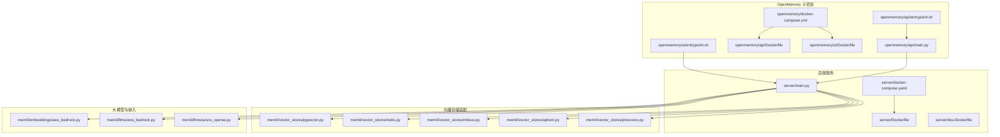
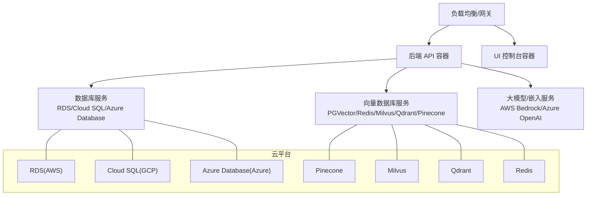
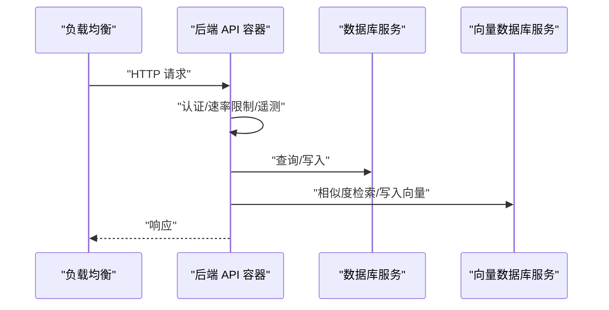
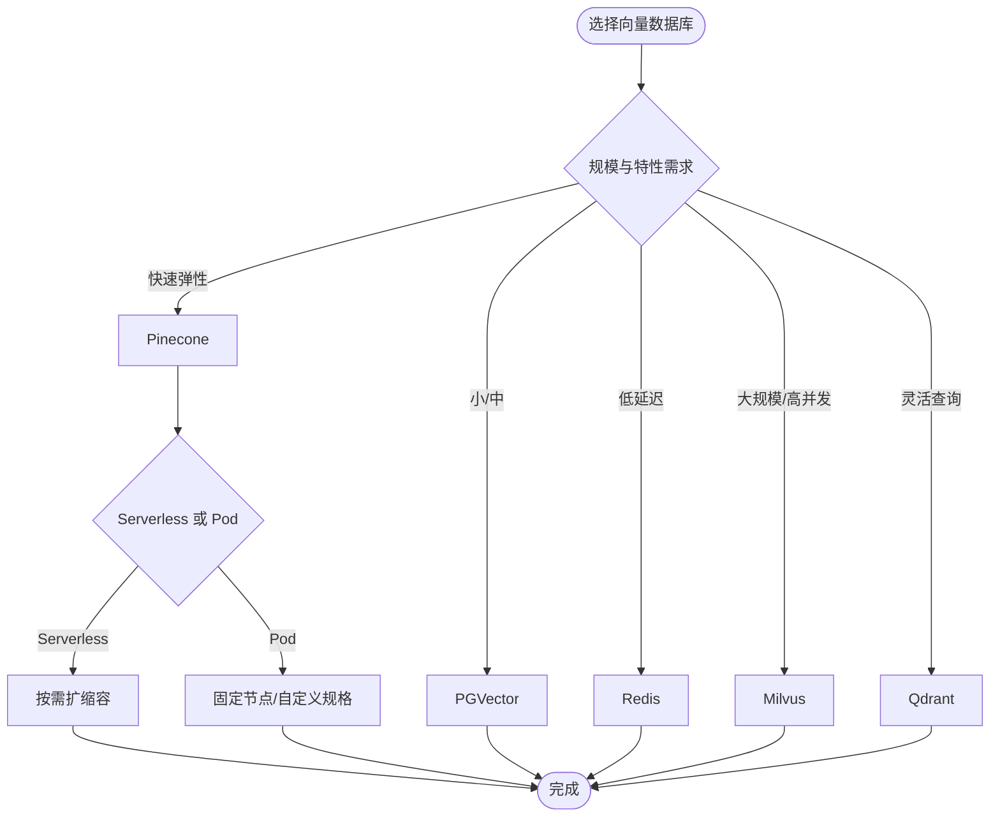
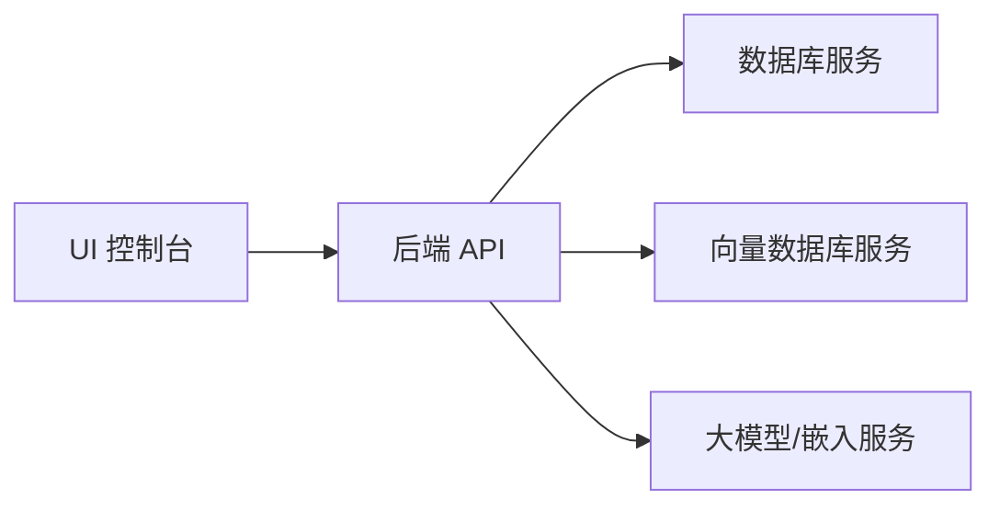

# 云平台部署

<cite>
**本文引用的文件**
- [server/docker-compose.yaml](file://server/docker-compose.yaml)
- [openmemory/docker-compose.yml](file://openmemory/docker-compose.yml)
- [openmemory/api/Dockerfile](file://openmemory/api/Dockerfile)
- [openmemory/ui/Dockerfile](file://openmemory/ui/Dockerfile)
- [server/Dockerfile](file://server/Dockerfile)
- [server/dev.Dockerfile](file://server/dev.Dockerfile)
- [openmemory/ui/entrypoint.sh](file://openmemory/ui/entrypoint.sh)
- [openmemory/api/entrypoint.sh](file://openmemory/api/entrypoint.sh)
- [server/main.py](file://server/main.py)
- [openmemory/api/main.py](file://openmemory/api/main.py)
- [mem0/vector_stores/pgvector.py](file://mem0/vector_stores/pgvector.py)
- [mem0/vector_stores/redis.py](file://mem0/vector_stores/redis.py)
- [mem0/vector_stores/milvus.py](file://mem0/vector_stores/milvus.py)
- [mem0/vector_stores/qdrant.py](file://mem0/vector_stores/qdrant.py)
- [mem0/vector_stores/pinecone.py](file://mem0/vector_stores/pinecone.py)
- [mem0/embeddings/aws_bedrock.py](file://mem0/embeddings/aws_bedrock.py)
- [mem0/llms/aws_bedrock.py](file://mem0/llms/aws_bedrock.py)
- [mem0/llms/azure_openai.py](file://mem0/llms/azure_openai.py)
- [mem0/utils/gcp_auth.py](file://mem0/utils/gcp_auth.py)
- [docs/components/vectordbs/dbs/pinecone.mdx](file://docs/components/vectordbs/dbs/pinecone.mdx)
- [docs/components/vectordbs/dbs/azure.mdx](file://docs/components/vectordbs/dbs/azure.mdx)
- [docs/components/vectordbs/overview.mdx](file://docs/components/vectordbs/overview.mdx)
- [examples/nemoclaw/setup-mem0-nemoclaw.sh](file://examples/nemoclaw/setup-mem0-nemoclaw.sh)
- [openmemory/backup-scripts/export_openmemory.sh](file://openmemory/backup-scripts/export_openmemory.sh)
- [server/rate_limit.py](file://server/rate_limit.py)
- [server/telemetry.py](file://server/telemetry.py)
- [openmemory/api/config.json](file://openmemory/api/config.json)
- [openmemory/api/default_config.json](file://openmemory/api/default_config.json)
- [server/models.py](file://server/models.py)
- [server/db.py](file://server/db.py)
- [openmemory/api/app/...](file://openmemory/api/app/...)
- [server/dashboard/src/...](file://server/dashboard/src/...)
</cite>

## 目录
1. [简介](#简介)
2. [项目结构](#项目结构)
3. [核心组件](#核心组件)
4. [架构总览](#架构总览)
5. [详细组件分析](#详细组件分析)
6. [依赖关系分析](#依赖关系分析)
7. [性能考虑](#性能考虑)
8. [故障排查指南](#故障排查指南)
9. [结论](#结论)
10. [附录](#附录)

## 简介
本指南面向在主流云平台（AWS、Google Cloud、Azure）上部署 mem0 平台与相关组件的工程团队，覆盖容器化编排（ECS/GKE/AKS）、数据库服务（RDS/Cloud SQL/Azure Database）、CDN/负载均衡/自动扩缩容、IAM 权限与网络安全组/VPC 安全配置、成本优化、资源监控与备份恢复等主题。文档以仓库中的容器镜像构建脚本、Compose 编排、入口脚本、向量数据库与大模型适配器为依据，结合官方文档片段，给出可落地的部署建议。

## 项目结构
该仓库包含后端 API、UI 控制台、向量数据库适配层、嵌入与大模型适配层、CLI 工具以及示例与集成脚本。与云平台部署直接相关的关键位置如下：
- 后端 API 与 UI 的 Dockerfile、docker-compose 编排文件
- 入口脚本用于初始化与启动
- 向量数据库适配器（PGVector、Redis、Milvus、Qdrant、Pinecone 等）
- 大模型与嵌入适配器（AWS Bedrock、Azure OpenAI 等）
- 备份脚本与速率限制、遥测模块

图表来源
- [server/docker-compose.yaml](file://server/docker-compose.yaml)
- [openmemory/docker-compose.yml](file://openmemory/docker-compose.yml)
- [openmemory/api/Dockerfile](file://openmemory/api/Dockerfile)
- [openmemory/ui/Dockerfile](file://openmemory/ui/Dockerfile)
- [server/Dockerfile](file://server/Dockerfile)
- [server/dev.Dockerfile](file://server/dev.Dockerfile)
- [openmemory/api/entrypoint.sh](file://openmemory/api/entrypoint.sh)
- [openmemory/ui/entrypoint.sh](file://openmemory/ui/entrypoint.sh)
- [server/main.py](file://server/main.py)
- [openmemory/api/main.py](file://openmemory/api/main.py)
- [mem0/vector_stores/pgvector.py](file://mem0/vector_stores/pgvector.py)
- [mem0/vector_stores/redis.py](file://mem0/vector_stores/redis.py)
- [mem0/vector_stores/milvus.py](file://mem0/vector_stores/milvus.py)
- [mem0/vector_stores/qdrant.py](file://mem0/vector_stores/qdrant.py)
- [mem0/vector_stores/pinecone.py](file://mem0/vector_stores/pinecone.py)
- [mem0/embeddings/aws_bedrock.py](file://mem0/embeddings/aws_bedrock.py)
- [mem0/llms/aws_bedrock.py](file://mem0/llms/aws_bedrock.py)
- [mem0/llms/azure_openai.py](file://mem0/llms/azure_openai.py)

章节来源
- [server/docker-compose.yaml](file://server/docker-compose.yaml)
- [openmemory/docker-compose.yml](file://openmemory/docker-compose.yml)
- [openmemory/api/Dockerfile](file://openmemory/api/Dockerfile)
- [openmemory/ui/Dockerfile](file://openmemory/ui/Dockerfile)
- [server/Dockerfile](file://server/Dockerfile)
- [server/dev.Dockerfile](file://server/dev.Dockerfile)
- [openmemory/api/entrypoint.sh](file://openmemory/api/entrypoint.sh)
- [openmemory/ui/entrypoint.sh](file://openmemory/ui/entrypoint.sh)

## 核心组件
- 后端 API：基于 Python 的主程序，负责路由、认证、速率限制与遥测；通过 docker-compose 或容器编排平台部署。
- UI 控制台：Next.js 应用，提供平台可视化界面；通过独立 Dockerfile 构建。
- 向量存储适配：支持 PGVector、Redis、Milvus、Qdrant、Pinecone 等，便于对接云原生或托管向量数据库服务。
- 大模型与嵌入适配：支持 AWS Bedrock、Azure OpenAI 等，便于在不同云平台上选择合适的推理与嵌入服务。
- 备份与入口脚本：提供数据导出脚本与容器启动入口脚本，确保部署后的初始化与运维流程。

章节来源
- [server/main.py](file://server/main.py)
- [openmemory/api/main.py](file://openmemory/api/main.py)
- [mem0/vector_stores/pgvector.py](file://mem0/vector_stores/pgvector.py)
- [mem0/vector_stores/redis.py](file://mem0/vector_stores/redis.py)
- [mem0/vector_stores/milvus.py](file://mem0/vector_stores/milvus.py)
- [mem0/vector_stores/qdrant.py](file://mem0/vector_stores/qdrant.py)
- [mem0/vector_stores/pinecone.py](file://mem0/vector_stores/pinecone.py)
- [mem0/embeddings/aws_bedrock.py](file://mem0/embeddings/aws_bedrock.py)
- [mem0/llms/aws_bedrock.py](file://mem0/llms/aws_bedrock.py)
- [mem0/llms/azure_openai.py](file://mem0/llms/azure_openai.py)
- [openmemory/backup-scripts/export_openmemory.sh](file://openmemory/backup-scripts/export_openmemory.sh)
- [openmemory/api/entrypoint.sh](file://openmemory/api/entrypoint.sh)
- [openmemory/ui/entrypoint.sh](file://openmemory/ui/entrypoint.sh)

## 架构总览
下图展示了容器化部署下的系统交互：前端 UI 与后端 API 通过负载均衡对外暴露，后端访问云托管数据库与向量数据库服务，并调用云厂商的大模型/嵌入服务。

图表来源
- [server/main.py](file://server/main.py)
- [openmemory/api/main.py](file://openmemory/api/main.py)
- [mem0/vector_stores/pgvector.py](file://mem0/vector_stores/pgvector.py)
- [mem0/vector_stores/redis.py](file://mem0/vector_stores/redis.py)
- [mem0/vector_stores/milvus.py](file://mem0/vector_stores/milvus.py)
- [mem0/vector_stores/qdrant.py](file://mem0/vector_stores/qdrant.py)
- [mem0/vector_stores/pinecone.py](file://mem0/vector_stores/pinecone.py)
- [mem0/embeddings/aws_bedrock.py](file://mem0/embeddings/aws_bedrock.py)
- [mem0/llms/aws_bedrock.py](file://mem0/llms/aws_bedrock.py)
- [mem0/llms/azure_openai.py](file://mem0/llms/azure_openai.py)

## 详细组件分析

### 后端 API 与 UI 容器化
- 构建与运行
  - 使用 Dockerfile 构建后端 API 与 UI 容器，开发环境使用 dev.Dockerfile。
  - docker-compose 文件定义了服务、网络、卷与环境变量，便于本地与云上编排。
- 入口脚本
  - 提供 entrypoint.sh 在容器启动时执行初始化逻辑（如数据库迁移、环境准备），确保服务可用性。
- 配置文件
  - OpenMemory 子项目提供 config.json 与 default_config.json，用于控制运行参数与默认行为。

图表来源
- [server/main.py](file://server/main.py)
- [openmemory/api/main.py](file://openmemory/api/main.py)
- [openmemory/api/entrypoint.sh](file://openmemory/api/entrypoint.sh)
- [openmemory/ui/entrypoint.sh](file://openmemory/ui/entrypoint.sh)
- [openmemory/api/config.json](file://openmemory/api/config.json)
- [openmemory/api/default_config.json](file://openmemory/api/default_config.json)

章节来源
- [server/Dockerfile](file://server/Dockerfile)
- [server/dev.Dockerfile](file://server/dev.Dockerfile)
- [server/docker-compose.yaml](file://server/docker-compose.yaml)
- [openmemory/docker-compose.yml](file://openmemory/docker-compose.yml)
- [openmemory/api/Dockerfile](file://openmemory/api/Dockerfile)
- [openmemory/ui/Dockerfile](file://openmemory/ui/Dockerfile)
- [openmemory/api/entrypoint.sh](file://openmemory/api/entrypoint.sh)
- [openmemory/ui/entrypoint.sh](file://openmemory/ui/entrypoint.sh)
- [openmemory/api/config.json](file://openmemory/api/config.json)
- [openmemory/api/default_config.json](file://openmemory/api/default_config.json)

### 向量数据库适配（PGVector、Redis、Milvus、Qdrant、Pinecone）
- PGVector：适用于 PostgreSQL 托管实例（RDS/Cloud SQL/Azure Database），适合中小规模与混合工作负载。
- Redis：适合低延迟检索与缓存场景，可配合云托管 Redis 服务。
- Milvus：企业级向量数据库，支持多租户与高并发，适合大规模部署。
- Qdrant：开源向量引擎，支持标签过滤与地理位置检索，适合灵活查询场景。
- Pinecone：Serverless 与 Pod 模式可选，适合快速弹性扩展与多云部署。

图表来源
- [mem0/vector_stores/pgvector.py](file://mem0/vector_stores/pgvector.py)
- [mem0/vector_stores/redis.py](file://mem0/vector_stores/redis.py)
- [mem0/vector_stores/milvus.py](file://mem0/vector_stores/milvus.py)
- [mem0/vector_stores/qdrant.py](file://mem0/vector_stores/qdrant.py)
- [mem0/vector_stores/pinecone.py](file://mem0/vector_stores/pinecone.py)
- [docs/components/vectordbs/dbs/pinecone.mdx](file://docs/components/vectordbs/dbs/pinecone.mdx)
- [docs/components/vectordbs/overview.mdx](file://docs/components/vectordbs/overview.mdx)

章节来源
- [mem0/vector_stores/pgvector.py](file://mem0/vector_stores/pgvector.py)
- [mem0/vector_stores/redis.py](file://mem0/vector_stores/redis.py)
- [mem0/vector_stores/milvus.py](file://mem0/vector_stores/milvus.py)
- [mem0/vector_stores/qdrant.py](file://mem0/vector_stores/qdrant.py)
- [mem0/vector_stores/pinecone.py](file://mem0/vector_stores/pinecone.py)
- [docs/components/vectordbs/dbs/pinecone.mdx](file://docs/components/vectordbs/dbs/pinecone.mdx)
- [docs/components/vectordbs/overview.mdx](file://docs/components/vectordbs/overview.mdx)

### 大模型与嵌入适配（AWS Bedrock、Azure OpenAI）
- AWS Bedrock：通过适配器接入多种推理与嵌入模型，适合跨区域与合规要求较高的场景。
- Azure OpenAI：通过适配器对接 Azure OpenAI 服务，适合与 Azure 生态集成的企业用户。

章节来源
- [mem0/embeddings/aws_bedrock.py](file://mem0/embeddings/aws_bedrock.py)
- [mem0/llms/aws_bedrock.py](file://mem0/llms/aws_bedrock.py)
- [mem0/llms/azure_openai.py](file://mem0/llms/azure_openai.py)

### 认证与云平台凭据（GCP）
- GCP 身份验证支持多种方式（服务账号 JSON、文件路径、环境变量、默认凭据），优先级明确，便于在不同运行环境（GCE、Cloud Run 等）安全地获取凭据。

章节来源
- [mem0/utils/gcp_auth.py](file://mem0/utils/gcp_auth.py)

## 依赖关系分析
- 组件耦合
  - 后端 API 与 UI 通过 docker-compose 解耦，便于独立扩展与版本管理。
  - 向量数据库与数据库作为外部依赖，通过配置文件与环境变量进行解耦。
- 外部依赖
  - 云托管数据库与向量数据库服务，减少自建与运维复杂度。
  - 大模型/嵌入服务通过适配器抽象，便于切换与多云部署。

图表来源
- [server/main.py](file://server/main.py)
- [openmemory/api/main.py](file://openmemory/api/main.py)
- [mem0/vector_stores/pgvector.py](file://mem0/vector_stores/pgvector.py)
- [mem0/vector_stores/redis.py](file://mem0/vector_stores/redis.py)
- [mem0/vector_stores/milvus.py](file://mem0/vector_stores/milvus.py)
- [mem0/vector_stores/qdrant.py](file://mem0/vector_stores/qdrant.py)
- [mem0/vector_stores/pinecone.py](file://mem0/vector_stores/pinecone.py)
- [mem0/embeddings/aws_bedrock.py](file://mem0/embeddings/aws_bedrock.py)
- [mem0/llms/aws_bedrock.py](file://mem0/llms/aws_bedrock.py)
- [mem0/llms/azure_openai.py](file://mem0/llms/azure_openai.py)

章节来源
- [server/docker-compose.yaml](file://server/docker-compose.yaml)
- [openmemory/docker-compose.yml](file://openmemory/docker-compose.yml)

## 性能考虑
- 向量数据库选择
  - 小/中规模与混合负载：PGVector（RDS/Cloud SQL/Azure Database）。
  - 低延迟与缓存：Redis。
  - 大规模与高并发：Milvus。
  - 灵活查询与标签过滤：Qdrant。
  - 快速弹性与多云：Pinecone（Serverless/Pod）。
- 数据库与索引
  - 为向量字段建立合适索引，优化检索性能。
  - 对高频查询建立只读副本或读写分离。
- 大模型调用
  - 合理设置批处理大小与并发度，避免触发限流。
  - 使用缓存与预热策略降低冷启动开销。
- 容器与编排
  - 设置合理的资源请求与限制，启用水平自动扩缩容。
  - 使用健康检查与优雅停机，保证滚动更新期间的服务可用性。

## 故障排查指南
- 启动失败
  - 检查 entrypoint.sh 是否正确执行初始化任务（如数据库迁移）。
  - 查看容器日志定位异常，确认环境变量与配置文件是否正确加载。
- 连接问题
  - 数据库连接：核对连接字符串、端口、用户名与密码，确认 VPC/安全组放行。
  - 向量数据库连接：核对集群地址、认证方式与网络连通性。
  - 大模型/嵌入服务：核对 API 密钥、区域与权限。
- 性能问题
  - 增加容器副本数与 CPU/内存配额，启用 HPA。
  - 优化向量索引与查询参数，减少不必要的扫描。
- 备份与恢复
  - 使用备份脚本定期导出数据，验证恢复流程。
  - 对数据库与向量数据库分别制定备份策略与恢复演练。

章节来源
- [openmemory/api/entrypoint.sh](file://openmemory/api/entrypoint.sh)
- [openmemory/ui/entrypoint.sh](file://openmemory/ui/entrypoint.sh)
- [openmemory/backup-scripts/export_openmemory.sh](file://openmemory/backup-scripts/export_openmemory.sh)
- [server/rate_limit.py](file://server/rate_limit.py)
- [server/telemetry.py](file://server/telemetry.py)

## 结论
通过容器化与云托管服务的组合，mem0 可在 AWS、Google Cloud、Azure 上实现高可用、可扩展且安全的部署。建议根据业务规模与合规要求选择合适的数据库与向量数据库服务，结合自动扩缩容与监控告警体系，持续优化成本与性能。

## 附录

### 云平台部署步骤概览
- AWS
  - 容器服务：ECS/Fargate（或 EKS）+ RDS（PostgreSQL）+ PGVector/Redis/Milvus/Qdrant/Pinecone。
  - IAM：最小权限原则，为 ECS 任务角色授予数据库与向量数据库访问权限。
  - 网络：私有子网 + NAT 网关，仅在必要端口开放安全组。
  - CDN/负载均衡：ALB + CloudFront，开启 WAF 与速率限制。
  - 自动扩缩容：基于 CPU/内存或自定义指标启用 HPA。
- Google Cloud
  - 容器服务：GKE + Cloud SQL（PostgreSQL）+ PGVector/Redis/Milvus/Qdrant/Pinecone。
  - IAM：服务账号绑定最小权限角色，启用 Workload Identity。
  - 网络：VPC、防火墙规则放行内网与必要外网出口。
  - CDN/负载均衡：GCLB + Cloud CDN，启用 WAF 与安全策略。
  - 自动扩缩容：HPA + Cluster Autoscaler。
- Azure
  - 容器服务：AKS + Azure Database（PostgreSQL/MySQL）+ PGVector/Redis/Milvus/Qdrant/Pinecone。
  - IAM：服务主体或托管身份，最小权限 RBAC。
  - 网络：VNet + NSG，仅放行必需端口。
  - CDN/负载均衡：Azure Load Balancer + CDN，WAF 与 DDoS 保护。
  - 自动扩缩容：HPA + AKS 自动伸缩器。

### 数据库连接与优化配置
- RDS/Cloud SQL/Azure Database
  - 使用只读副本分担查询压力。
  - 启用连接池与超时重试。
  - 为向量字段建立索引，优化检索性能。
- 向量数据库
  - 根据规模选择 PGVector/Redis/Milvus/Qdrant/Pinecone。
  - 调整批量插入与查询参数，避免过载。
  - 定期重建索引与维护元数据。

### CDN、负载均衡与自动扩缩容
- CDN：静态资源与 API 响应缓存，降低边缘延迟。
- 负载均衡：四层/七层均衡，健康检查与会话保持。
- 自动扩缩容：基于 CPU/内存或请求数/响应时间阈值触发。

### IAM 权限、网络安全与 VPC 配置
- IAM：最小权限原则，定期轮换密钥与角色。
- 网络：私有子网、NAT 网关、安全组/NSG 放行白名单。
- VPC：分段隔离、流量审计与入侵检测。

### 成本优化、监控与备份恢复
- 成本优化：预留实例、Spot 实例、自动休眠非高峰时段、资源闲置回收。
- 监控：Prometheus/Grafana、APM、日志聚合与告警。
- 备份：定时快照/导出，异地容灾，定期恢复演练。