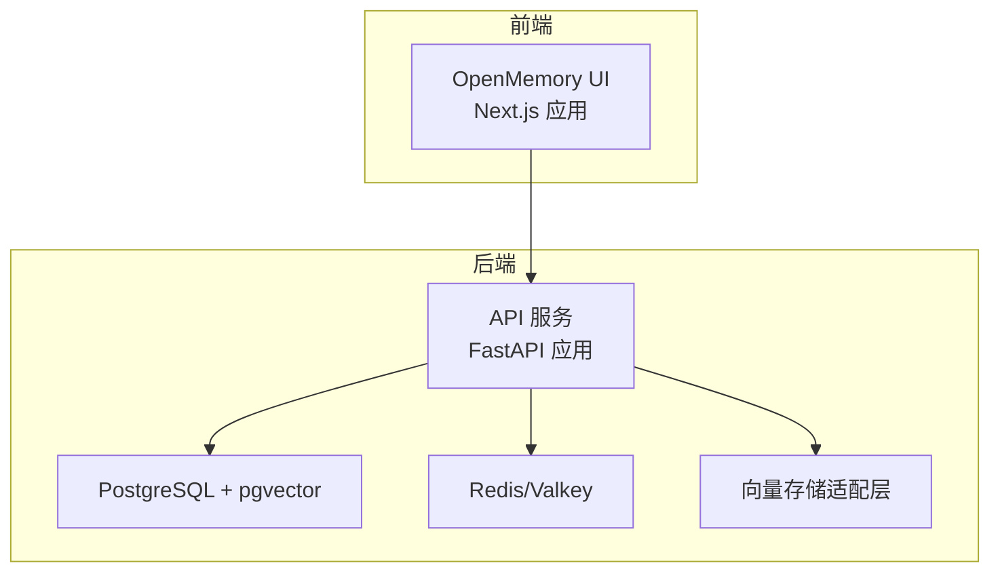
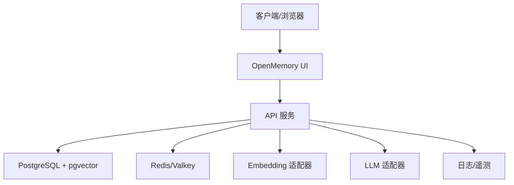
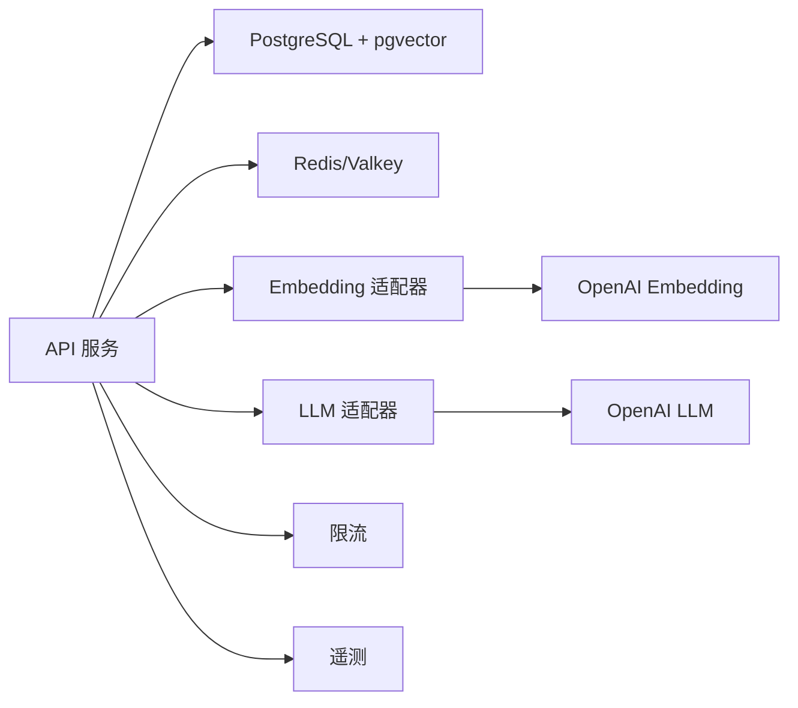

# 生产环境优化

<cite>
**本文引用的文件**
- [openmemory/api/default_config.json](file://openmemory/api/default_config.json)
- [openmemory/api/config.json](file://openmemory/api/config.json)
- [server/docker-compose.yaml](file://server/docker-compose.yaml)
- [openmemory/compose/redis.yml](file://openmemory/compose/redis.yml)
- [openmemory/compose/pgvector.yml](file://openmemory/compose/pgvector.yml)
- [mem0/vector_stores/redis.py](file://mem0/vector_stores/redis.py)
- [mem0/vector_stores/valkey.py](file://mem0/vector_stores/valkey.py)
- [mem0/vector_stores/pgvector.py](file://mem0/vector_stores/pgvector.py)
- [mem0/embeddings/openai.py](file://mem0/embeddings/openai.py)
- [mem0/llms/openai.py](file://mem0/llms/openai.py)
- [mem0/memory/storage.py](file://mem0/memory/storage.py)
- [mem0/memory/main.py](file://mem0/memory/main.py)
- [server/main.py](file://server/main.py)
- [server/db.py](file://server/db.py)
- [server/rate_limit.py](file://server/rate_limit.py)
- [server/telemetry.py](file://server/telemetry.py)
- [openmemory/ui/next.config.mjs](file://openmemory/ui/next.config.mjs)
- [openmemory/ui/Dockerfile](file://openmemory/ui/Dockerfile)
- [openmemory/ui/entrypoint.sh](file://openmemory/ui/entrypoint.sh)
- [openmemory/api/Dockerfile](file://openmemory/api/Dockerfile)
- [openmemory/api/requirements.txt](file://openmemory/api/requirements.txt)
- [openmemory/api/alembic/versions/](file://openmemory/api/alembic/versions/)
- [mem0/memory/notices.py](file://mem0/memory/notices.py)
- [tests/memory/test_notices.py](file://tests/memory/test_notices.py)
- [docs/templates/troubleshooting_playbook_template.mdx](file://docs/templates/troubleshooting_playbook_template.mdx)
</cite>

## 目录
1. [简介](#简介)
2. [项目结构](#项目结构)
3. [核心组件](#核心组件)
4. [架构总览](#架构总览)
5. [详细组件分析](#详细组件分析)
6. [依赖关系分析](#依赖关系分析)
7. [性能考量](#性能考量)
8. [故障排查指南](#故障排查指南)
9. [结论](#结论)
10. [附录](#附录)

## 简介
本指南面向生产环境的性能与稳定性优化，聚焦以下方面：数据库连接池与查询优化、索引策略；缓存层（Redis、Valkey）部署与调优；负载均衡、会话管理与故障转移；监控指标采集、性能基准测试与容量规划；安全加固、漏洞扫描与合规检查；以及应急响应、灾备演练与业务连续性保障。文档基于仓库中的实际实现与配置进行说明，帮助在真实环境中构建高可用、高性能的记忆系统平台。

## 项目结构
该项目包含服务端应用、UI 前端、向量数据库适配层、嵌入模型与大模型适配器、CLI 客户端等模块。生产部署通过 Docker Compose 编排 API、UI、向量数据库与缓存组件。核心目录与职责概览如下：
- openmemory/api：后端 API 服务，包含默认配置、Dockerfile、数据库迁移脚本
- openmemory/ui：前端 Next.js 应用，容器化部署
- mem0/vector_stores：多种向量数据库适配（Redis、Valkey、pgvector 等）
- mem0/embeddings、mem0/llms：嵌入与大模型适配器
- server：平台服务端入口、数据库连接、限流与遥测
- tests：覆盖向量存储、内存功能、通知机制等测试用例

**图表来源**
- [server/docker-compose.yaml](file://server/docker-compose.yaml)
- [openmemory/api/Dockerfile](file://openmemory/api/Dockerfile)
- [openmemory/ui/Dockerfile](file://openmemory/ui/Dockerfile)
- [openmemory/compose/redis.yml](file://openmemory/compose/redis.yml)
- [openmemory/compose/pgvector.yml](file://openmemory/compose/pgvector.yml)

**章节来源**
- [server/docker-compose.yaml](file://server/docker-compose.yaml)
- [openmemory/api/Dockerfile](file://openmemory/api/Dockerfile)
- [openmemory/ui/Dockerfile](file://openmemory/ui/Dockerfile)

## 核心组件
- 向量存储适配层：支持 Redis、Valkey、pgvector 等，负责向量检索与相似度计算
- 嵌入与大模型适配器：统一抽象不同供应商的 Embedding 与 LLM 接口
- 内存管理：提供记忆的增删改查、历史检索、衰减与时间特征等能力
- 数据库与连接池：PostgreSQL + Alembic 迁移，结合连接池参数控制并发与超时
- 缓存层：Redis/Valkey 提升检索与会话相关操作的吞吐
- 限流与遥测：全局速率限制与遥测上报，辅助容量规划与问题定位
- 配置体系：API 默认配置与运行时配置合并，便于生产定制

**章节来源**
- [mem0/vector_stores/redis.py](file://mem0/vector_stores/redis.py)
- [mem0/vector_stores/valkey.py](file://mem0/vector_stores/valkey.py)
- [mem0/vector_stores/pgvector.py](file://mem0/vector_stores/pgvector.py)
- [mem0/embeddings/openai.py](file://mem0/embeddings/openai.py)
- [mem0/llms/openai.py](file://mem0/llms/openai.py)
- [mem0/memory/storage.py](file://mem0/memory/storage.py)
- [server/db.py](file://server/db.py)
- [server/rate_limit.py](file://server/rate_limit.py)
- [server/telemetry.py](file://server/telemetry.py)
- [openmemory/api/default_config.json](file://openmemory/api/default_config.json)
- [openmemory/api/config.json](file://openmemory/api/config.json)

## 架构总览
下图展示生产环境的关键组件交互：前端通过 API 访问后端，后端访问 PostgreSQL + pgvector 存储向量数据，同时利用 Redis/Valkey 缓存热点数据与会话状态；嵌入与大模型适配器为检索与生成提供支撑。

**图表来源**
- [server/main.py](file://server/main.py)
- [openmemory/ui/next.config.mjs](file://openmemory/ui/next.config.mjs)
- [openmemory/compose/pgvector.yml](file://openmemory/compose/pgvector.yml)
- [openmemory/compose/redis.yml](file://openmemory/compose/redis.yml)
- [mem0/embeddings/openai.py](file://mem0/embeddings/openai.py)
- [mem0/llms/openai.py](file://mem0/llms/openai.py)

## 详细组件分析

### 数据库连接池与查询优化
- 连接池参数：在数据库初始化处设置连接池大小、空闲连接数、最大溢出、连接超时与语句超时，避免高并发下的连接争用与超时堆积
- 迁移与版本控制：Alembic 版本化迁移确保数据库结构演进可追踪、可回滚
- 查询优化建议：
  - 对高频检索字段建立合适索引（如文本向量索引、元数据过滤字段索引）
  - 使用分页或游标式分批处理大批量结果
  - 将复杂 JOIN 拆分为多次简单查询，减少锁竞争
  - 利用 EXPLAIN 分析慢查询，识别缺失索引或全表扫描
- 事务与隔离级别：在写密集场景采用读已提交或可重复读，避免长事务持有行锁

**章节来源**
- [server/db.py](file://server/db.py)
- [openmemory/api/alembic/versions/](file://openmemory/api/alembic/versions/)
- [openmemory/compose/pgvector.yml](file://openmemory/compose/pgvector.yml)

### 索引策略
- 向量索引：针对向量维度选择合适的索引类型（如 IVFFlat、HNSW），并根据召回率与延迟目标调整探测数量
- 元数据索引：对常用过滤字段（如组织 ID、项目 ID、标签、时间戳）建立复合索引，提升 WHERE 条件命中率
- 唯一性约束：对主键与唯一标识字段启用唯一索引，保证数据一致性
- 统计信息：定期更新表统计信息，帮助查询优化器做出更优执行计划

**章节来源**
- [mem0/vector_stores/pgvector.py](file://mem0/vector_stores/pgvector.py)
- [openmemory/compose/pgvector.yml](file://openmemory/compose/pgvector.yml)

### 缓存层（Redis/Valkey）部署与调优
- 部署模式：使用独立 Redis/Valkey 实例或集群，开启持久化（RDB/AOF）与备份策略
- 连接与池化：在客户端配置连接池大小、超时与重连策略，避免热点键导致的单点阻塞
- 键空间设计：采用命名空间前缀与 TTL 管理，定期清理过期键；对热点数据设置合理过期时间
- 内存淘汰策略：根据业务特征选择 LFU/LRU 等策略，预留缓冲内存应对突发流量
- 故障转移：Redis Sentinel 或 Redis Cluster 自动故障转移，Valkey 支持类似高可用方案

**章节来源**
- [openmemory/compose/redis.yml](file://openmemory/compose/redis.yml)
- [mem0/vector_stores/redis.py](file://mem0/vector_stores/redis.py)
- [mem0/vector_stores/valkey.py](file://mem0/vector_stores/valkey.py)

### 负载均衡、会话管理与故障转移
- 负载均衡：前置 Nginx/Envoy/HAProxy，启用健康检查与会话亲和（按用户 ID 哈希），避免跨节点状态不一致
- 会话管理：使用无状态 API 设计，将会话状态存储于 Redis/Valkey，确保多实例共享
- 故障转移：数据库与缓存均采用主从/集群架构，配合自动故障转移与读写分离；API 实例水平扩展，结合外部队列（如消息中间件）削峰填谷

**章节来源**
- [server/docker-compose.yaml](file://server/docker-compose.yaml)
- [openmemory/ui/entrypoint.sh](file://openmemory/ui/entrypoint.sh)

### 监控指标采集、性能基准测试与容量规划
- 指标采集：CPU、内存、磁盘 IO、网络带宽、数据库连接数、缓存命中率、请求延迟与错误率、向量检索耗时
- 基准测试：构造典型检索/写入工作负载，测量不同并发下的 P50/P95 延迟与吞吐，确定瓶颈
- 容量规划：基于峰值 QPS、数据增长速率与索引维护成本，推导硬件与实例规模；预留 30%~50% 缓冲

**章节来源**
- [server/telemetry.py](file://server/telemetry.py)
- [mem0/memory/notices.py](file://mem0/memory/notices.py)

### 安全加固、漏洞扫描与合规检查
- 访问控制：强制 HTTPS、最小权限原则、API 密钥轮换与审计日志
- 输入校验：对所有外部输入进行严格校验与限流，防止注入与滥用
- 漏洞扫描：定期对镜像与依赖进行扫描（如 Trivy/Snyk），修复高危与中危漏洞
- 合规检查：数据分类分级、数据留存与删除策略、隐私影响评估（PIA）

**章节来源**
- [server/rate_limit.py](file://server/rate_limit.py)
- [openmemory/api/requirements.txt](file://openmemory/api/requirements.txt)

### 应急响应预案、灾备演练与业务连续性
- 应急响应：建立事件分级与处置流程，明确责任人与沟通渠道；准备快速回滚与降级方案
- 灾备演练：定期进行 RTO/RPO 测试，验证备份恢复与跨区域容灾
- 业务连续性：多可用区部署、自动扩缩容、熔断与降级开关，确保核心功能可用

**章节来源**
- [docs/templates/troubleshooting_playbook_template.mdx](file://docs/templates/troubleshooting_playbook_template.mdx)
- [tests/memory/test_notices.py](file://tests/memory/test_notices.py)

## 依赖关系分析
组件间的耦合与协作关系如下：
- API 服务依赖数据库与缓存，同时通过适配器访问嵌入与大模型
- 向量存储适配层对具体数据库实现解耦，便于替换与扩展
- 限流与遥测贯穿服务端，为容量规划与问题定位提供依据

**图表来源**
- [server/main.py](file://server/main.py)
- [mem0/embeddings/openai.py](file://mem0/embeddings/openai.py)
- [mem0/llms/openai.py](file://mem0/llms/openai.py)
- [server/rate_limit.py](file://server/rate_limit.py)
- [server/telemetry.py](file://server/telemetry.py)

**章节来源**
- [server/main.py](file://server/main.py)
- [mem0/embeddings/openai.py](file://mem0/embeddings/openai.py)
- [mem0/llms/openai.py](file://mem0/llms/openai.py)

## 性能考量
- 连接池与超时：合理设置数据库连接池上限与超时阈值，避免连接泄漏与排队
- 索引与查询：优先使用向量索引与元数据索引组合，减少全表扫描
- 缓存策略：热点数据预热与失效策略，降低后端压力
- 异步与并发：对非 CPU 密集型任务采用异步处理，提高吞吐
- 监控与告警：建立关键指标阈值与告警，及时发现性能退化

[本节为通用指导，无需列出具体文件来源]

## 故障排查指南
- 快速诊断：检查 API 日志、数据库连接数、缓存命中率与慢查询日志
- 常见症状与修复步骤：参考模板化的排障手册，按症状定位原因并给出修复步骤
- 预防措施：完善监控、定期演练与变更评审

**章节来源**
- [docs/templates/troubleshooting_playbook_template.mdx](file://docs/templates/troubleshooting_playbook_template.mdx)
- [tests/memory/test_notices.py](file://tests/memory/test_notices.py)

## 结论
通过合理的数据库连接池与索引策略、高效的缓存层部署、完善的负载均衡与故障转移、全面的监控与基准测试、严格的安全与合规措施，以及完备的应急响应与灾备演练，可以在生产环境中实现稳定、高性能的记忆系统平台。建议以迭代方式持续优化，结合监控数据与业务增长趋势动态调整资源配置。

[本节为总结性内容，无需列出具体文件来源]

## 附录
- 配置文件路径与用途
  - API 默认配置：用于定义运行时默认参数，便于在不同环境间切换
  - 运行时配置：覆盖默认配置，满足生产定制需求
- 容器编排与部署
  - 使用 Docker Compose 编排 API、UI、数据库与缓存组件，确保依赖一致与快速部署

**章节来源**
- [openmemory/api/default_config.json](file://openmemory/api/default_config.json)
- [openmemory/api/config.json](file://openmemory/api/config.json)
- [server/docker-compose.yaml](file://server/docker-compose.yaml)
- [openmemory/ui/Dockerfile](file://openmemory/ui/Dockerfile)
- [openmemory/api/Dockerfile](file://openmemory/api/Dockerfile)