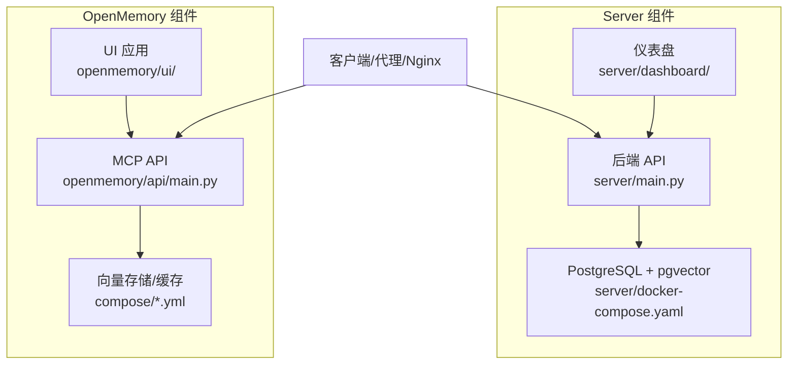
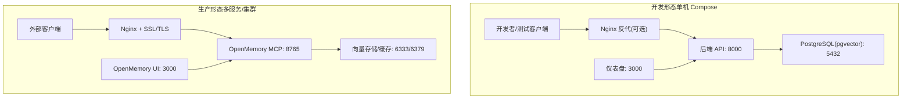
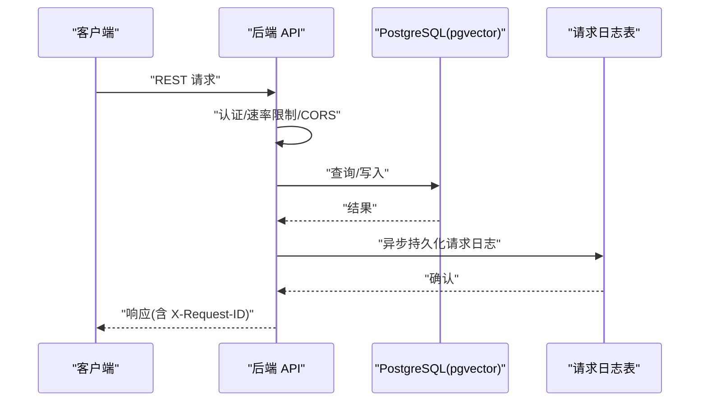
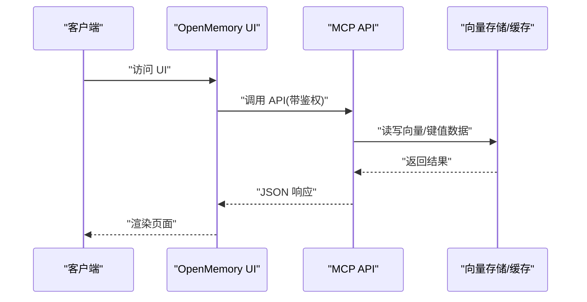
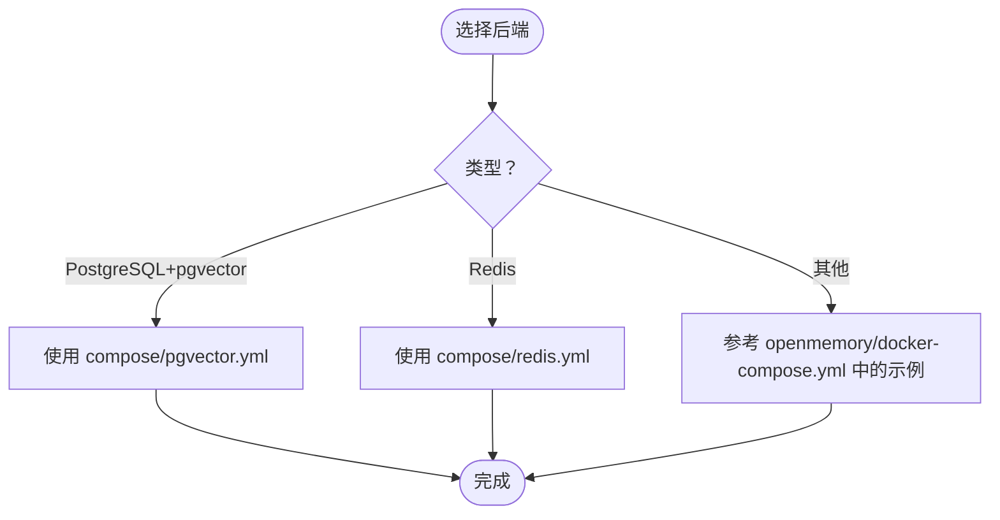
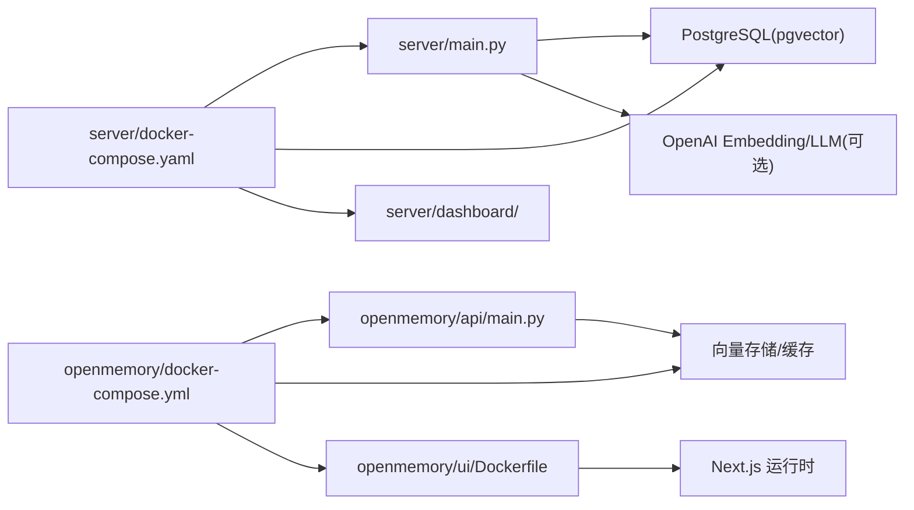

# 自托管部署

<cite>
**本文引用的文件**
- [server/Dockerfile](file://server/Dockerfile)
- [openmemory/api/Dockerfile](file://openmemory/api/Dockerfile)
- [openmemory/ui/Dockerfile](file://openmemory/ui/Dockerfile)
- [server/docker-compose.yaml](file://server/docker-compose.yaml)
- [openmemory/docker-compose.yml](file://openmemory/docker-compose.yml)
- [openmemory/compose/pgvector.yml](file://openmemory/compose/pgvector.yml)
- [openmemory/compose/redis.yml](file://openmemory/compose/redis.yml)
- [server/main.py](file://server/main.py)
- [server/requirements.txt](file://server/requirements.txt)
- [openmemory/api/requirements.txt](file://openmemory/api/requirements.txt)
- [openmemory/api/config.json](file://openmemory/api/config.json)
- [openmemory/api/main.py](file://openmemory/api/main.py)
- [openmemory/ui/entrypoint.sh](file://openmemory/ui/entrypoint.sh)
- [server/init-db.sh](file://server/init-db.sh)
- [server/dev.Dockerfile](file://server/dev.Dockerfile)
- [server/README.md](file://server/README.md)
- [openmemory/README.md](file://openmemory/README.md)
</cite>

## 目录
1. [简介](#简介)
2. [项目结构](#项目结构)
3. [核心组件](#核心组件)
4. [架构总览](#架构总览)
5. [详细组件分析](#详细组件分析)
6. [依赖关系分析](#依赖关系分析)
7. [性能考虑](#性能考虑)
8. [故障排查指南](#故障排查指南)
9. [结论](#结论)
10. [附录](#附录)

## 简介
本指南面向需要在自有服务器或本地环境中部署 Mem0 的用户，覆盖从开发到生产的完整流程。内容包括：
- Docker 镜像构建与容器编排
- 单机与集群部署差异及适用场景
- 数据库初始化、环境变量与密钥管理
- 反向代理与 SSL 证书配置
- 日志管理、健康检查与自动重启
- 性能调优、资源限制与监控告警

## 项目结构
该仓库包含多个可独立部署的服务与示例组合：
- 后端服务（FastAPI）：位于 server/，提供 REST API、认证、速率限制与请求日志持久化
- 前端仪表盘：位于 server/dashboard/，通过 docker-compose 与后端联动
- OpenMemory 子项目：包含独立的 MCP API 服务与 UI，支持多种向量库与缓存后端
- Compose 示例：提供 pgvector、Redis 等常用后端的编排模板

图表来源
- [server/docker-compose.yaml:1-77](file://server/docker-compose.yaml#L1-L77)
- [openmemory/docker-compose.yml:1-37](file://openmemory/docker-compose.yml#L1-L37)
- [openmemory/compose/pgvector.yml:1-12](file://openmemory/compose/pgvector.yml#L1-L12)
- [openmemory/compose/redis.yml:1-13](file://openmemory/compose/redis.yml#L1-L13)

章节来源
- [server/docker-compose.yaml:1-77](file://server/docker-compose.yaml#L1-L77)
- [openmemory/docker-compose.yml:1-37](file://openmemory/docker-compose.yml#L1-L37)

## 核心组件
- 后端 API（server/main.py）
  - 提供 REST 接口、CORS、认证与速率限制
  - 默认使用 PostgreSQL + pgvector 作为向量存储
  - 支持敏感配置脱敏输出，内置请求日志持久化
- 仪表盘（server/dashboard/）
  - Next.js 应用，通过环境变量对接后端 API
- OpenMemory MCP API（openmemory/api/main.py）
  - Uvicorn 进程，提供独立的 MCP 服务
- OpenMemory UI（openmemory/ui/）
  - Next.js 构建产物运行于生产模式
- 向量存储与缓存（compose/*.yml）
  - pgvector、Redis 等示例后端

章节来源
- [server/main.py:144-171](file://server/main.py#L144-L171)
- [server/main.py:106-137](file://server/main.py#L106-L137)
- [openmemory/api/main.py:1-200](file://openmemory/api/main.py#L1-L200)

## 架构总览
下图展示开发与生产两种典型部署形态：

图表来源
- [server/docker-compose.yaml:1-77](file://server/docker-compose.yaml#L1-L77)
- [openmemory/docker-compose.yml:1-37](file://openmemory/docker-compose.yml#L1-L37)

## 详细组件分析

### 后端 API（FastAPI）
- 部署方式
  - 使用 Dockerfile 构建镜像，暴露 8000 端口
  - 开发模式通过 dev.Dockerfile 启动，并在启动前执行数据库迁移
- 认证与安全
  - 支持 JWT、API Key、管理员密钥；默认启用认证
  - JWT_SECRET 必填，否则抛出运行时错误
- 配置与日志
  - 默认配置指向 PostgreSQL + pgvector
  - 请求日志会持久化到数据库，便于审计与追踪
- 健康检查
  - 仪表盘服务提供健康检查端点，可用于编排器探测

图表来源
- [server/main.py:279-307](file://server/main.py#L279-L307)
- [server/main.py:258-277](file://server/main.py#L258-L277)

章节来源
- [server/Dockerfile:1-16](file://server/Dockerfile#L1-L16)
- [server/dev.Dockerfile:1-200](file://server/dev.Dockerfile#L1-L200)
- [server/main.py:88-102](file://server/main.py#L88-L102)
- [server/main.py:106-137](file://server/main.py#L106-L137)
- [server/main.py:279-307](file://server/main.py#L279-L307)

### OpenMemory MCP API 与 UI
- MCP API
  - 使用 uvicorn 启动，监听 8765 端口
  - 通过 env_file 加载密钥与用户信息
- UI
  - 生产模式运行，暴露 3000 端口
  - 通过环境变量 NEXT_PUBLIC_API_URL 指向后端

图表来源
- [openmemory/docker-compose.yml:8-23](file://openmemory/docker-compose.yml#L8-L23)
- [openmemory/ui/Dockerfile:30-52](file://openmemory/ui/Dockerfile#L30-L52)
- [openmemory/api/Dockerfile:1-15](file://openmemory/api/Dockerfile#L1-L15)

章节来源
- [openmemory/docker-compose.yml:1-37](file://openmemory/docker-compose.yml#L1-L37)
- [openmemory/api/Dockerfile:1-15](file://openmemory/api/Dockerfile#L1-L15)
- [openmemory/ui/Dockerfile:1-53](file://openmemory/ui/Dockerfile#L1-L53)

### 数据库与向量存储
- PostgreSQL + pgvector（推荐）
  - 提供稳定的关系型与向量能力
  - compose/pgvector.yml 提供最小可用配置
- Redis（可选）
  - 适合键值缓存与会话存储
  - compose/redis.yml 提供持久化与 AOF 配置示例
- 其他向量库
  - openmemory/docker-compose.yml 中展示了 Qdrant 等替代方案

图表来源
- [openmemory/compose/pgvector.yml:1-12](file://openmemory/compose/pgvector.yml#L1-L12)
- [openmemory/compose/redis.yml:1-13](file://openmemory/compose/redis.yml#L1-L13)
- [openmemory/docker-compose.yml:1-37](file://openmemory/docker-compose.yml#L1-L37)

章节来源
- [openmemory/compose/pgvector.yml:1-12](file://openmemory/compose/pgvector.yml#L1-L12)
- [openmemory/compose/redis.yml:1-13](file://openmemory/compose/redis.yml#L1-L13)

### 仪表盘与前端
- 仪表盘通过环境变量对接后端 API
- 健康检查用于编排器探测
- 开发形态下，仪表盘与后端在同一网络中通信

章节来源
- [server/docker-compose.yaml:52-69](file://server/docker-compose.yaml#L52-L69)

## 依赖关系分析

图表来源
- [server/main.py:106-137](file://server/main.py#L106-L137)
- [openmemory/api/main.py:1-200](file://openmemory/api/main.py#L1-L200)
- [openmemory/docker-compose.yml:1-37](file://openmemory/docker-compose.yml#L1-L37)
- [server/docker-compose.yaml:1-77](file://server/docker-compose.yaml#L1-L77)

章节来源
- [server/main.py:106-137](file://server/main.py#L106-L137)
- [openmemory/api/main.py:1-200](file://openmemory/api/main.py#L1-L200)
- [openmemory/docker-compose.yml:1-37](file://openmemory/docker-compose.yml#L1-L37)
- [server/docker-compose.yaml:1-77](file://server/docker-compose.yaml#L1-L77)

## 性能考虑
- 线程与进程
  - 后端 API 默认以单进程模式运行，适合开发；生产建议使用进程池与反向代理分发
  - OpenMemory MCP 在 compose 中示例使用多 workers，需结合负载与资源评估
- 数据库连接与迁移
  - 开发模式启动前执行迁移，避免冷启动延迟
- 缓存与向量库
  - Redis 作为缓存可降低后端压力；向量库参数（如 top_k、阈值）影响检索性能
- 日志与可观测性
  - 请求日志持久化有助于定位性能瓶颈；建议配合外部日志系统集中收集

章节来源
- [server/dev.Dockerfile:1-200](file://server/dev.Dockerfile#L1-L200)
- [openmemory/docker-compose.yml:22-23](file://openmemory/docker-compose.yml#L22-L23)

## 故障排查指南
- 认证相关
  - JWT_SECRET 未设置会导致启动失败；可在 .env 中生成并设置
  - 若无管理员账户，受保护端点将返回 401；可通过设置 ADMIN_API_KEY 或注册管理员解决
- 数据库健康
  - PostgreSQL 健康检查失败时，检查凭据与网络连通性
  - 初始化脚本需正确挂载至 /docker-entrypoint-initdb.d
- 仪表盘健康
  - 仪表盘健康检查端点用于编排器探测，若不健康请检查后端可达性与端口映射
- 日志与追踪
  - 所有请求携带 X-Request-ID，便于跨服务串联排查

章节来源
- [server/main.py:88-102](file://server/main.py#L88-L102)
- [server/main.py:64-102](file://server/main.py#L64-L102)
- [server/docker-compose.yaml:41-45](file://server/docker-compose.yaml#L41-L45)
- [server/init-db.sh:1-200](file://server/init-db.sh#L1-L200)

## 结论
本指南提供了从开发到生产的自托管部署路径，涵盖容器化、认证、数据库、反向代理与健康检查等关键环节。根据业务规模与稳定性要求，选择合适的后端与编排策略，并持续优化性能与监控。

## 附录

### A. 环境变量与密钥管理
- 后端 API
  - 关键变量：JWT_SECRET、AUTH_DISABLED、ADMIN_API_KEY、POSTGRES_*、HISTORY_DB_PATH、MEM0_DEFAULT_LLM_MODEL、MEM0_DEFAULT_EMBEDDER_MODEL
  - 建议：将敏感变量放入 .env 并由编排器注入；生产环境禁用 AUTH_DISABLED
- OpenMemory
  - API：USER、API_KEY、NEXT_PUBLIC_API_URL、NEXT_PUBLIC_USER_ID
  - UI：NEXT_PUBLIC_API_URL
- 仪表盘
  - NEXT_PUBLIC_API_URL、API_INTERNAL_URL、NEXT_PUBLIC_INSTANCE_NAME

章节来源
- [server/main.py:106-137](file://server/main.py#L106-L137)
- [openmemory/docker-compose.yml:11-34](file://openmemory/docker-compose.yml#L11-L34)
- [server/docker-compose.yaml:22-30](file://server/docker-compose.yaml#L22-L30)

### B. 反向代理与 SSL 配置（Nginx）
- 域名绑定
  - 将域名解析到服务器 IP
- 反向代理
  - 将 80/443 转发至后端 API（8000）与 UI（3000/8765）
- SSL 证书
  - 使用 acme 或商业证书；确保证书链完整
- 健康检查
  - 可在 Nginx 层对后端健康端点进行探测

[本节为通用实践说明，无需源码引用]

### C. 单机部署 vs 集群部署
- 单机部署（开发/小规模）
  - 使用 docker-compose 将所有组件放在同一主机，便于调试
  - 适合本地开发、演示与小团队协作
- 集群部署（生产）
  - 多节点、多副本、独立数据库与向量存储
  - 强调高可用、弹性伸缩与隔离性

[本节为概念性对比，无需源码引用]

### D. 数据库初始化与迁移
- 开发形态
  - 启动前执行数据库迁移，确保模式一致
- 生产形态
  - 使用独立的初始化脚本或 CI/CD 流水线执行迁移
  - 对历史数据进行备份与校验

章节来源
- [server/docker-compose.yaml:20-21](file://server/docker-compose.yaml#L20-L21)
- [server/init-db.sh:1-200](file://server/init-db.sh#L1-L200)

### E. 健康检查与自动重启
- 仪表盘健康检查端点可用于编排器探测
- 建议为各服务配置 restart 策略与超时重试
- 结合外部监控系统实现告警与自动恢复

章节来源
- [server/docker-compose.yaml:65-69](file://server/docker-compose.yaml#L65-L69)
- [openmemory/docker-compose.yml:1-37](file://openmemory/docker-compose.yml#L1-L37)

### F. 镜像构建与制品管理
- 后端 API
  - 基于 Python 3.12 slim，安装 requirements.txt 后复制应用代码
- OpenMemory API/UI
  - API 基于 uvicorn；UI 使用 pnpm 构建并在生产模式运行
- 建议
  - 固定基础镜像版本，启用只读根文件系统与非 root 用户
  - 使用多阶段构建减少镜像体积

章节来源
- [server/Dockerfile:1-16](file://server/Dockerfile#L1-L16)
- [openmemory/api/Dockerfile:1-15](file://openmemory/api/Dockerfile#L1-L15)
- [openmemory/ui/Dockerfile:1-53](file://openmemory/ui/Dockerfile#L1-L53)