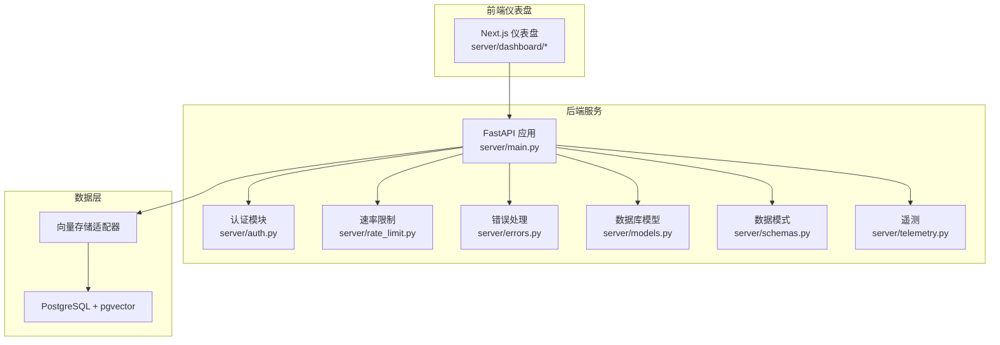
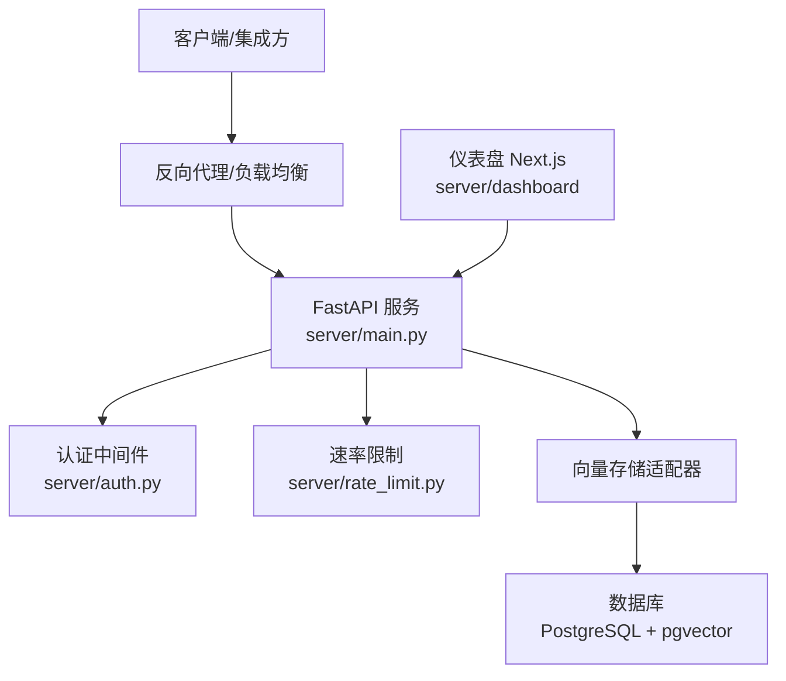
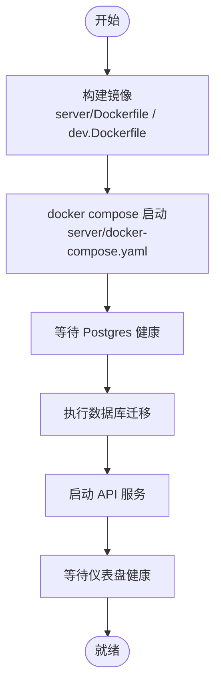
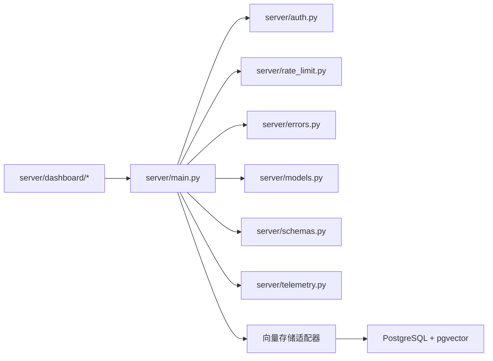

# 部署指南

<cite>
**本文引用的文件**
- [server/Dockerfile](file://server/Dockerfile)
- [server/dev.Dockerfile](file://server/dev.Dockerfile)
- [server/docker-compose.yaml](file://server/docker-compose.yaml)
- [server/requirements.txt](file://server/requirements.txt)
- [server/main.py](file://server/main.py)
- [server/README.md](file://server/README.md)
- [server/init-db.sh](file://server/init-db.sh)
- [server/Makefile](file://server/Makefile)
- [openmemory/api/Dockerfile](file://openmemory/api/Dockerfile)
- [openmemory/ui/Dockerfile](file://openmemory/ui/Dockerfile)
- [openmemory/docker-compose.yml](file://openmemory/docker-compose.yml)
- [openmemory/api/requirements.txt](file://openmemory/api/requirements.txt)
- [openmemory/backup-scripts/export_openmemory.sh](file://openmemory/backup-scripts/export_openmemory.sh)
- [server/rate_limit.py](file://server/rate_limit.py)
- [server/auth.py](file://server/auth.py)
- [server/errors.py](file://server/errors.py)
- [server/models.py](file://server/models.py)
- [server/schemas.py](file://server/schemas.py)
- [server/telemetry.py](file://server/telemetry.py)
- [server/dashboard/Dockerfile](file://server/dashboard/Dockerfile)
- [server/dashboard/package.json](file://server/dashboard/package.json)
- [server/dashboard/next.config.mjs](file://server/dashboard/next.config.mjs)
- [server/dashboard/tsconfig.json](file://server/dashboard/tsconfig.json)
- [server/dashboard/components.json](file://server/dashboard/components.json)
- [server/dashboard/tailwind.config.ts](file://server/dashboard/tailwind.config.ts)
- [server/dashboard/postcss.config.js](file://server/dashboard/postcss.config.js)
- [server/dashboard/entrypoint.sh](file://server/dashboard/entrypoint.sh)
- [server/dashboard/public/...](file://server/dashboard/public/)
- [server/dashboard/src/...](file://server/dashboard/src/)
- [server/dashboard/.dockerignore](file://server/dashboard/.dockerignore)
- [server/dashboard/.eslintrc.json](file://server/dashboard/.eslintrc.json)
- [server/dashboard/.gitignore](file://server/dashboard/.gitignore)
- [server/dashboard/next.config.mjs](file://server/dashboard/next.config.mjs)
- [server/dashboard/package.json](file://server/dashboard/package.json)
- [server/dashboard/pnpm-lock.yaml](file://server/dashboard/pnpm-lock.yaml)
- [server/dashboard/pnpm-workspace.yaml](file://server/dashboard/pnpm-workspace.yaml)
- [server/dashboard/tsconfig.json](file://server/dashboard/tsconfig.json)
- [server/dashboard/tailwind.config.ts](file://server/dashboard/tailwind.config.ts)
- [server/dashboard/postcss.config.js](file://server/dashboard/postcss.config.js)
- [server/dashboard/entrypoint.sh](file://server/dashboard/entrypoint.sh)
- [server/dashboard/public/...](file://server/dashboard/public/)
- [server/dashboard/src/...](file://server/dashboard/src/)
- [server/dashboard/.dockerignore](file://server/dashboard/.dockerignore)
- [server/dashboard/.eslintrc.json](file://server/dashboard/.eslintrc.json)
- [server/dashboard/.gitignore](file://server/dashboard/.gitignore)
- [server/dashboard/next.config.mjs](file://server/dashboard/next.config.mjs)
- [server/dashboard/package.json](file://server/dashboard/package.json)
- [server/dashboard/pnpm-lock.yaml](file://server/dashboard/pnpm-lock.yaml)
- [server/dashboard/pnpm-workspace.yaml](file://server/dashboard/pnpm-workspace.yaml)
- [server/dashboard/tsconfig.json](file://server/dashboard/tsconfig.json)
- [server/dashboard/tailwind.config.ts](file://server/dashboard/tailwind.config.ts)
- [server/dashboard/postcss.config.js](file://server/dashboard/postcss.config.js)
- [server/dashboard/entrypoint.sh](file://server/dashboard/entrypoint.sh)
- [server/dashboard/public/...](file://server/dashboard/public/)
- [server/dashboard/src/...](file://server/dashboard/src/)
- [server/dashboard/.dockerignore](file://server/dashboard/.dockerignore)
- [server/dashboard/.eslintrc.json](file://server/dashboard/.eslintrc.json)
- [server/dashboard/.gitignore](file://server/dashboard/.gitignore)
- [server/dashboard/next.config.mjs](file://server/dashboard/next.config.mjs)
- [server/dashboard/package.json](file://server/dashboard/package.json)
- [server/dashboard/pnpm-lock.yaml](file://server/dashboard/pnpm-lock.yaml)
- [server/dashboard/pnpm-workspace.yaml](file://server/dashboard/pnpm-workspace.yaml)
- [server/dashboard/tsconfig.json](file://server/dashboard/tsconfig.json)
- [server/dashboard/tailwind.config.ts](file://server/dashboard/tailwind.config.ts)
- [server/dashboard/postcss.config.js](file://server/dashboard/postcss.config.js)
- [server/dashboard/entrypoint.sh](file://server/dashboard/entrypoint.sh)
- [server/dashboard/public/...](file://server/dashboard/public/)
- [server/dashboard/src/...](file://server/dashboard/src/)
- [server/dashboard/.dockerignore](file://server/dashboard/.dockerignore)
- [server/dashboard/.eslintrc.json](file://server/dashboard/.eslintrc.json)
- [server/dashboard/.gitignore](file://server/dashboard/.gitignore)
- [server/dashboard/next.config.mjs](file://server/dashboard/next.config.mjs)
- [server/dashboard/package.json](file://server/dashboard/package.json)
- [server/dashboard/pnpm-lock.yaml](file://server/dashboard/pnpm-lock.yaml)
- [server/dashboard/pnpm-workspace.yaml](file://server/dashboard/pnpm-workspace.yaml)
- [server/dashboard/tsconfig.json](file://server/dashboard/tsconfig.json)
- [server/dashboard/tailwind.config.ts](file://server/dashboard/tailwind.config.ts)
- [server/dashboard/postcss.config.js](file://server/dashboard/postcss.config.js)
- [server/dashboard/entrypoint.sh](file://server/dashboard/entrypoint.sh)
- [server/dashboard/public/...](file://server/dashboard/public/)
- [server/dashboard/src/...](file://server/dashboard/src/)
- [server/dashboard/.dockerignore](file://server/dashboard/.dockerignore)
- [server/dashboard/.eslintrc.json](file://server/dashboard/.eslintrc.json)
- [server/dashboard/.gitignore](file://server/dashboard/.gitignore)
- [server/dashboard/next.config.mjs](file://server/dashboard/next.config.mjs)
- [server/dashboard/package.json](file://server/dashboard/package.json)
- [server/dashboard/pnpm-lock.yaml](file://server/dashboard/pnpm-lock.yaml)
- [server/dashboard/pnpm-workspace.yaml](file://server/dashboard/pnpm-workspace.yaml)
- [server/dashboard/tsconfig.json](file://server/dashboard/tsconfig.json)
- [server/dashboard/tailwind.config.ts](file://server/dashboard/tailwind.config.ts)
- [server/dashboard/postcss.config.js](file://server/dashboard/postcss.config.js)
- [server/dashboard/entrypoint.sh](file://server/dashboard/entrypoint.sh)
- [server/dashboard/public/...](file://server/dashboard/public/)
- [server/dashboard/src/...](file://server/dashboard/src/)
- [server/dashboard/.dockerignore](file://server/dashboard/.dockerignore)
- [server/dashboard/.eslintrc.json](file://server/dashboard/.eslintrc.json)
- [server/dashboard/.gitignore](file://server/dashboard/.gitignore)
- [server/dashboard/next.config.mjs](file://server/dashboard/next.config.mjs)
- [server/dashboard/package.json](file://server/dashboard/package.json)
- [server/dashboard/pnpm-lock.yaml](file://server/dashboard/pnpm-lock.yaml)
- [server/dashboard/pnpm-workspace.yaml](file://server/dashboard/pnpm-workspace.yaml)
- [server/dashboard/tsconfig.json](file://server/dashboard/tsconfig.json)
- [server/dashboard/tailwind.config.ts](file://server/dashboard/tailwind.config.ts)
- [server/dashboard/postcss.config.js](file://server/dashboard/postcss.config.js)
- [server/dashboard/entrypoint.sh](file://server/dashboard/entrypoint.sh)
- [server/dashboard/public/...](file://server/dashboard/public/)
- [server/dashboard/src/...](file://server/dashboard/src/)
- [server/dashboard/.dockerignore](file://server/dashboard/.dockerignore)
- [server/dashboard/.eslintrc.json](file://server/dashboard/.eslintrc.json)
- [server/dashboard/.gitignore](file://server/dashboard/.gitignore)
- [server/dashboard/next.config.mjs](file://server/dashboard/next.config.mjs)
- [server/dashboard/package.json](file://server/dashboard/package.json)
-......（为避免篇幅过长，仅列出部分文件）
</cite>

## 目录
1. [简介](#简介)
2. [项目结构](#项目结构)
3. [核心组件](#核心组件)
4. [架构总览](#架构总览)
5. [详细组件分析](#详细组件分析)
6. [依赖关系分析](#依赖关系分析)
7. [性能考虑](#性能考虑)
8. [故障排除指南](#故障排除指南)
9. [结论](#结论)
10. [附录](#附录)

## 简介
本指南面向从开发到生产的全栈部署场景，覆盖自托管部署（Docker 容器化、Kubernetes、传统服务器）、云平台部署与优化、安全配置、备份策略、监控设置、高可用与灾难恢复、性能调优与成本优化，以及常见问题诊断与解决。目标是帮助团队在不同环境中稳定、安全、可扩展地运行 Mem0 自托管服务。

## 项目结构
- 后端服务：基于 FastAPI 的 Python 应用，提供 REST API、认证、速率限制、请求日志与遥测。
- 前端仪表盘：Next.js 应用，提供用户管理、内存浏览、实体与 API 密钥管理等界面。
- 数据存储：默认使用 PostgreSQL + pgvector 存储向量数据；支持多种嵌入与 LLM 提供商。
- 开发与运维：提供 Dockerfile、docker-compose、Makefile、初始化脚本与迁移工具。

图表来源
- [server/main.py:144-171](file://server/main.py#L144-L171)
- [server/auth.py](file://server/auth.py)
- [server/rate_limit.py](file://server/rate_limit.py)
- [server/errors.py](file://server/errors.py)
- [server/models.py](file://server/models.py)
- [server/schemas.py](file://server/schemas.py)
- [server/telemetry.py](file://server/telemetry.py)
- [server/dashboard/next.config.mjs](file://server/dashboard/next.config.mjs)

章节来源
- [server/README.md:1-277](file://server/README.md#L1-L277)
- [server/docker-compose.yaml:1-77](file://server/docker-compose.yaml#L1-L77)

## 核心组件
- 服务入口与路由：FastAPI 应用定义了认证、API 密钥、实体、请求记录等路由，并内置 CORS 中间件与速率限制。
- 认证与授权：支持 JWT、X-API-Key 与管理员密钥；默认启用认证，开发时可通过开关禁用。
- 数据库与迁移：PostgreSQL 使用 Alembic 进行迁移；初始化脚本创建应用数据库。
- 仪表盘：Next.js 应用，提供健康检查、环境变量配置与安全响应头。
- 遥测与日志：匿名遥测可选关闭；请求日志持久化并支持定期清理。

章节来源
- [server/main.py:144-171](file://server/main.py#L144-L171)
- [server/main.py:88-104](file://server/main.py#L88-L104)
- [server/auth.py](file://server/auth.py)
- [server/rate_limit.py](file://server/rate_limit.py)
- [server/errors.py](file://server/errors.py)
- [server/models.py](file://server/models.py)
- [server/schemas.py](file://server/schemas.py)
- [server/telemetry.py](file://server/telemetry.py)
- [server/init-db.sh:1-10](file://server/init-db.sh#L1-L10)

## 架构总览
下图展示从客户端到 API、数据库与向量存储的整体交互流程，以及仪表盘与 API 的关系。

图表来源
- [server/main.py:144-171](file://server/main.py#L144-L171)
- [server/auth.py](file://server/auth.py)
- [server/rate_limit.py](file://server/rate_limit.py)
- [server/docker-compose.yaml:32-51](file://server/docker-compose.yaml#L32-L51)

## 详细组件分析

### 1) 自托管部署（Docker 容器化）
- 基础镜像与构建
  - 生产镜像：基于精简 Python 镜像，安装依赖后复制代码，暴露 8000 端口，使用 Uvicorn 启动。
  - 开发镜像：使用 Poetry 安装可编辑模式的包，便于本地热更新。
- 运行参数
  - 环境变量：包含数据库连接、JWT 密钥、认证开关、遥测开关、默认 LLM/嵌入模型等。
  - 挂载卷：历史数据库路径挂载，开发模式支持源码热更新。
- 健康检查与启动顺序
  - Postgres 使用健康检查；仪表盘通过 HTTP 健康端点检测；API 启动前执行数据库迁移。
- 常用命令
  - 启动：compose up；一键引导：bootstrap；停止与清理：down、clean；健康检查：health；日志：logs；重置管理员密码：reset-admin-password；清理请求日志：prune-logs。

图表来源
- [server/Dockerfile:1-16](file://server/Dockerfile#L1-L16)
- [server/dev.Dockerfile:1-26](file://server/dev.Dockerfile#L1-L26)
- [server/docker-compose.yaml:1-77](file://server/docker-compose.yaml#L1-L77)
- [server/Makefile:7-48](file://server/Makefile#L7-L48)

章节来源
- [server/Dockerfile:1-16](file://server/Dockerfile#L1-L16)
- [server/dev.Dockerfile:1-26](file://server/dev.Dockerfile#L1-L26)
- [server/docker-compose.yaml:1-77](file://server/docker-compose.yaml#L1-L77)
- [server/requirements.txt:1-27](file://server/requirements.txt#L1-L27)
- [server/README.md:11-72](file://server/README.md#L11-L72)
- [server/Makefile:1-63](file://server/Makefile#L1-L63)

### 2) 自托管部署（Kubernetes）
- 资源建议
  - Deployment：API 与仪表盘各一个；Postgres 使用 StatefulSet 或托管数据库（如 RDS）。
  - Service：ClusterIP 暴露 API 与仪表盘；NodePort/LoadBalancer 对外暴露仪表盘或通过 Ingress。
  - ConfigMap/Secret：存放环境变量与敏感配置；将 JWT_SECRET、数据库凭据、LLM/嵌入提供商密钥放入 Secret。
  - PVC：为 Postgres 卷提供持久化存储。
- 健康检查
  - liveness/readiness 探针：API 与仪表盘分别探活；Postgres 使用健康检查。
- 扩展性
  - 水平扩展：多副本 API；使用外部缓存（如 Redis）提升会话与速率限制性能。
- 安全
  - 只读 Secret；最小权限 RBAC；Ingress TLS；CORS 严格配置。

章节来源
- [server/docker-compose.yaml:1-77](file://server/docker-compose.yaml#L1-L77)
- [server/main.py:159-165](file://server/main.py#L159-L165)
- [server/auth.py](file://server/auth.py)

### 3) 传统服务器部署（裸机/VM）
- 系统要求
  - Python 3.12+；PostgreSQL 17 + pgvector；可选 Redis（用于会话/缓存）。
- 步骤
  - 安装依赖与数据库；准备虚拟环境；克隆仓库；配置 .env；初始化数据库；运行 Uvicorn。
  - 使用 systemd 或 supervisor 管理进程；Nginx/Apache 作为反向代理；开启 HTTPS。
- 备份与监控
  - 定时备份数据库；收集访问日志；设置告警阈值。

章节来源
- [server/README.md:1-277](file://server/README.md#L1-L277)
- [server/init-db.sh:1-10](file://server/init-db.sh#L1-L10)
- [server/Dockerfile:1-16](file://server/Dockerfile#L1-L16)

### 4) 云平台部署（AWS/GCP/Azure）
- 推荐方案
  - API：ECS/EKS/Azure Container Instances；仪表盘：静态托管（Cloudflare Pages/Netlify/Vercel）或容器服务。
  - 数据库：RDS/Azure Database for PostgreSQL/Cloud SQL；向量存储可选托管向量数据库（如 AWS OpenSearch/CloudSearch）。
  - 缓存：ElastiCache/Redis 或 Azure Cache。
- 配置要点
  - 将敏感配置放入云密钥管理服务；启用网络 ACL/防火墙；使用私有子网与 NAT 网关。
  - CI/CD：结合 GitHub Actions/Azure DevOps 自动化构建与发布。

章节来源
- [server/docker-compose.yaml:1-77](file://server/docker-compose.yaml#L1-L77)
- [server/main.py:106-137](file://server/main.py#L106-L137)

### 5) 安全配置
- 认证与授权
  - 默认启用认证；JWT_SECRET 必填；支持管理员 API Key 与用户级 API Key；开发时仅允许 AUTH_DISABLED。
- 响应头加固
  - 仪表盘设置 X-Frame-Options、Content-Security-Policy、X-Content-Type-Options、Referrer-Policy。
- 网络与访问控制
  - 仅开放必要端口；使用反向代理；限制来源域名；启用速率限制。
- 数据保护
  - 加密传输（TLS）；最小权限访问数据库；定期轮换密钥。

章节来源
- [server/main.py:88-104](file://server/main.py#L88-L104)
- [server/main.py:159-165](file://server/main.py#L159-L165)
- [server/dashboard/next.config.mjs](file://server/dashboard/next.config.mjs)

### 6) 备份策略
- 数据库备份
  - 使用 pg_dump/pg_dumpall 定期导出；结合对象存储进行归档。
- API 数据
  - 请求日志表按时间范围清理；保留必要的审计窗口。
- 自动化
  - 结合 Cron 或定时任务执行备份与清理；失败告警。

章节来源
- [openmemory/backup-scripts/export_openmemory.sh](file://openmemory/backup-scripts/export_openmemory.sh)
- [server/README.md:91-101](file://server/README.md#L91-L101)

### 7) 监控与可观测性
- 指标与日志
  - API 暴露健康端点；仪表盘提供健康检查；请求日志持久化并可查询。
- 遥测
  - 默认匿名遥测可选关闭；可用于了解安装规模与版本分布。
- 告警
  - 基于健康检查、错误率、延迟与资源使用设置告警。

章节来源
- [server/README.md:120-128](file://server/README.md#L120-L128)
- [server/main.py:258-307](file://server/main.py#L258-L307)
- [server/telemetry.py](file://server/telemetry.py)

### 8) 负载均衡、高可用与灾难恢复
- 负载均衡
  - 使用 Nginx/HAProxy/云负载均衡；健康检查失败自动摘除。
- 高可用
  - 多副本 API；Postgres 主从或托管高可用；仪表盘静态化部署。
- 灾难恢复
  - 快速恢复流程：先启动数据库，再恢复数据，最后启动 API；提供回滚方案。

章节来源
- [server/README.md:140-277](file://server/README.md#L140-L277)

### 9) 性能调优与资源规划
- 数据库
  - 合理索引与分区；定期维护统计信息；使用专用实例规格。
- 应用
  - 合理并发与工作线程数；缓存热点数据；异步处理耗时操作。
- 存储
  - 选择合适存储类型（SSD）；分层存储冷热数据。
- 成本优化
  - 按需弹性伸缩；预留实例；压缩与去重；只在需要时开启昂贵功能。

章节来源
- [server/README.md:91-101](file://server/README.md#L91-L101)

### 10) 常见部署问题诊断
- 启动失败
  - 检查 .env 是否正确；确认数据库连通性与凭据；查看健康检查输出。
- 认证错误
  - 确认 JWT_SECRET 设置；核对 API Key 权限；检查 CORS 配置。
- 数据库迁移
  - 确保迁移脚本成功执行；检查 Alembic 版本；必要时手动修复。
- 速率限制
  - 调整限流策略；区分不同用户与来源；记录异常流量。
- 日志与审计
  - 定期清理旧日志；保留足够窗口用于审计；监控异常峰值。

章节来源
- [server/README.md:80-101](file://server/README.md#L80-L101)
- [server/main.py:88-104](file://server/main.py#L88-L104)
- [server/rate_limit.py](file://server/rate_limit.py)

## 依赖关系分析
- 组件耦合
  - API 依赖认证、速率限制、错误处理与数据库模型；向量存储适配器依赖数据库；仪表盘依赖 API。
- 外部依赖
  - PostgreSQL + pgvector；可选 Redis；第三方 LLM/嵌入提供商 SDK。
- 循环依赖
  - 未发现循环导入；模块职责清晰。

图表来源
- [server/main.py:1-526](file://server/main.py#L1-L526)
- [server/auth.py](file://server/auth.py)
- [server/rate_limit.py](file://server/rate_limit.py)
- [server/errors.py](file://server/errors.py)
- [server/models.py](file://server/models.py)
- [server/schemas.py](file://server/schemas.py)
- [server/telemetry.py](file://server/telemetry.py)

章节来源
- [server/main.py:1-526](file://server/main.py#L1-L526)

## 性能考虑
- 数据库层面
  - 使用专用实例；合理索引；定期维护；分库分表（按用户/租户）。
- 应用层面
  - 并发与线程池；缓存命中率；异步任务队列；连接池复用。
- 网络与存储
  - CDN 加速静态资源；对象存储归档；压缩传输。
- 成本优化
  - 弹性伸缩；预留实例；按使用计费；减少不必要的计算与存储。

## 故障排除指南
- 端口占用
  - 使用 Makefile 的端口检查逻辑，避免冲突。
- 健康检查失败
  - 查看 API 与仪表盘健康端点；确认数据库状态。
- 密钥与认证
  - 生成新的 JWT_SECRET；重置管理员密码；检查 API Key 权限。
- 数据迁移
  - 先启动数据库，再恢复数据，最后启动 API；验证迁移版本。

章节来源
- [server/Makefile:7-48](file://server/Makefile#L7-L48)
- [server/README.md:80-101](file://server/README.md#L80-L101)

## 结论
通过本指南，您可以在不同环境下完成 Mem0 的自托管部署，并建立完善的安全、备份、监控与高可用体系。建议以容器化为基础，逐步过渡到 Kubernetes 或云原生平台，结合自动化与可观测性工具实现稳定高效的生产运行。

## 附录
- 快速参考
  - 启动：make up；引导：make bootstrap；健康：make health；清理日志：make prune-logs；重置管理员密码：make reset-admin-password。
  - 环境变量：JWT_SECRET、POSTGRES_*、OPENAI_API_KEY、AUTH_DISABLED、MEM0_TELEMETRY 等。
- 进一步阅读
  - 产品与 API 文档：https://docs.mem0.ai/open-source/overview

章节来源
- [server/README.md:274-277](file://server/README.md#L274-L277)
- [server/main.py:106-137](file://server/main.py#L106-L137)