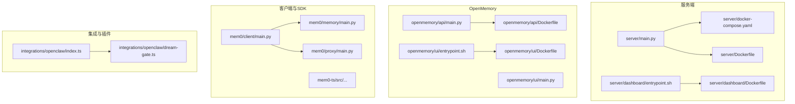
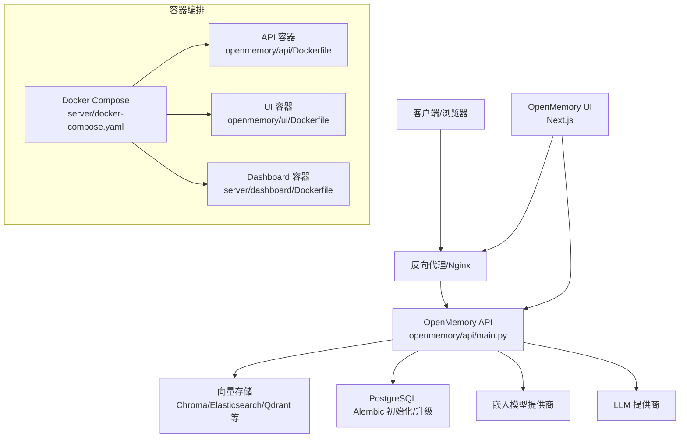
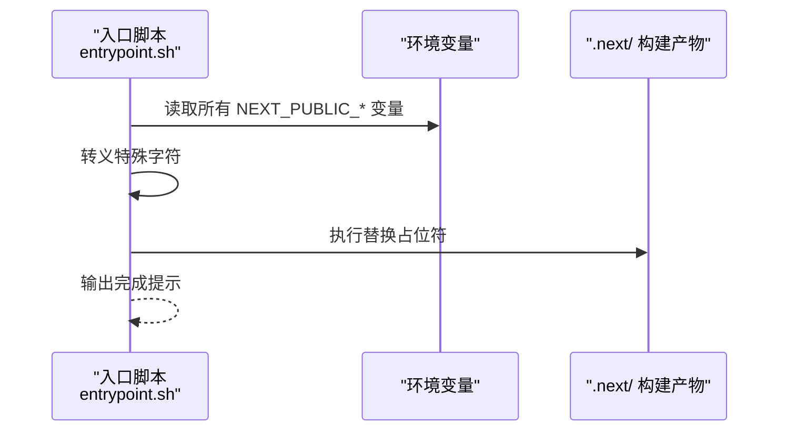
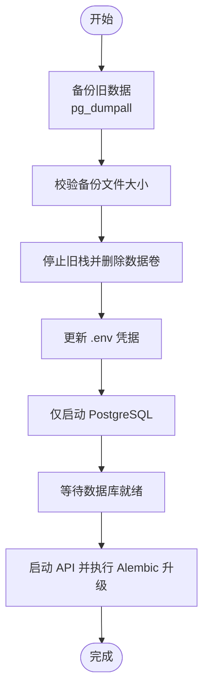
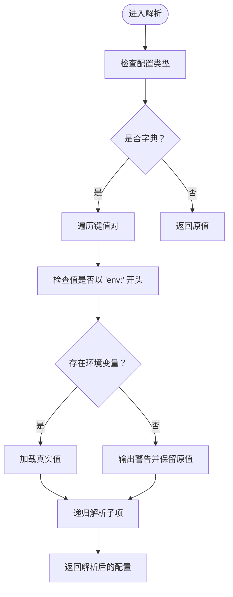
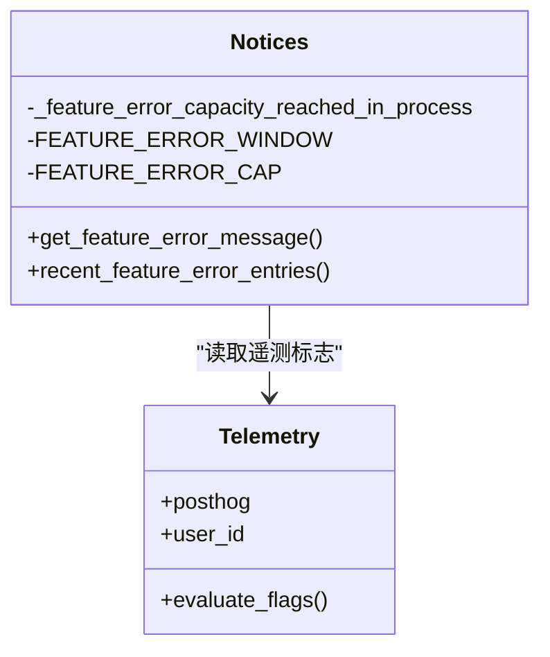
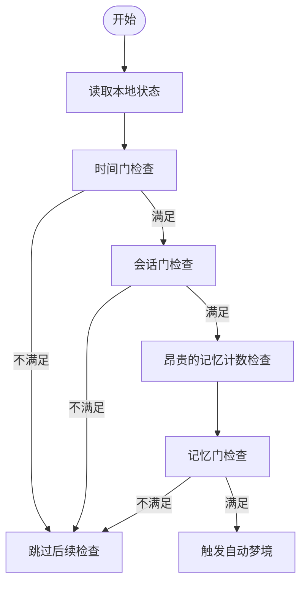
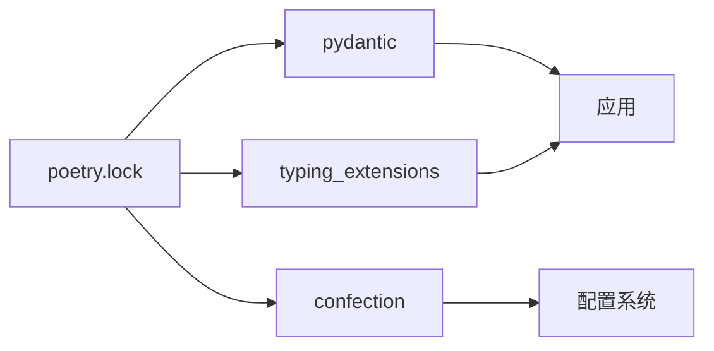

# 部署故障排除

<cite>
**本文引用的文件**
- [server/docker-compose.yaml](file://server/docker-compose.yaml)
- [server/Dockerfile](file://server/Dockerfile)
- [server/dashboard/Dockerfile](file://server/dashboard/Dockerfile)
- [openmemory/api/Dockerfile](file://openmemory/api/Dockerfile)
- [openmemory/ui/Dockerfile](file://openmemory/ui/Dockerfile)
- [server/dashboard/entrypoint.sh](file://server/dashboard/entrypoint.sh)
- [openmemory/ui/entrypoint.sh](file://openmemory/ui/entrypoint.sh)
- [docs/migration/server-pgvector-upgrade.mdx](file://docs/migration/server-pgvector-upgrade.mdx)
- [openmemory/api/app/utils/memory.py](file://openmemory/api/app/utils/memory.py)
- [mem0/memory/notices.py](file://mem0/memory/notices.py)
- [tests/memory/test_notices.py](file://tests/memory/test_notices.py)
- [integrations/openclaw/dream-gate.ts](file://integrations/openclaw/dream-gate.ts)
- [integrations/openclaw/index.ts](file://integrations/openclaw/index.ts)
- [server/main.py](file://server/main.py)
- [openmemory/api/main.py](file://openmemory/api/main.py)
- [mem0/client/main.py](file://mem0/client/main.py)
- [mem0/memory/main.py](file://mem0/memory/main.py)
- [mem0/proxy/main.py](file://mem0/proxy/main.py)
- [poetry.lock](file://poetry.lock)
</cite>

## 目录
1. [简介](#简介)
2. [项目结构](#项目结构)
3. [核心组件](#核心组件)
4. [架构总览](#架构总览)
5. [详细组件分析](#详细组件分析)
6. [依赖分析](#依赖分析)
7. [性能考虑](#性能考虑)
8. [故障排除指南](#故障排除指南)
9. [结论](#结论)
10. [附录](#附录)

## 简介
本指南面向部署与运维工程师，系统性梳理容器启动失败、数据库连接错误、网络配置问题等常见部署问题的诊断与解决流程；同时覆盖日志分析、错误码解读、调试工具使用、依赖冲突与版本兼容性、环境差异、性能瓶颈识别、资源耗尽与内存泄漏诊断、权限与防火墙、DNS 解析、回滚策略与紧急恢复等主题。文档以仓库中的实际配置与实现为依据，提供可操作的排障步骤与可视化图示。

## 项目结构
该仓库包含多语言后端（Python）、前端（Next.js）以及容器化部署脚本。关键部署相关目录与文件如下：
- 服务端与仪表盘：server、server/dashboard
- OpenMemory 前后端：openmemory/api、openmemory/ui
- 客户端 SDK：mem0、mem0-ts
- 集成与插件：integrations
- 文档与迁移：docs、docs/migration

**图表来源**
- [server/main.py](file://server/main.py)
- [server/docker-compose.yaml](file://server/docker-compose.yaml)
- [server/Dockerfile](file://server/Dockerfile)
- [server/dashboard/Dockerfile](file://server/dashboard/Dockerfile)
- [server/dashboard/entrypoint.sh](file://server/dashboard/entrypoint.sh)
- [openmemory/api/main.py](file://openmemory/api/main.py)
- [openmemory/api/Dockerfile](file://openmemory/api/Dockerfile)
- [openmemory/ui/entrypoint.sh](file://openmemory/ui/entrypoint.sh)
- [openmemory/ui/Dockerfile](file://openmemory/ui/Dockerfile)
- [mem0/client/main.py](file://mem0/client/main.py)
- [mem0/memory/main.py](file://mem0/memory/main.py)
- [mem0/proxy/main.py](file://mem0/proxy/main.py)
- [integrations/openclaw/index.ts](file://integrations/openclaw/index.ts)
- [integrations/openclaw/dream-gate.ts](file://integrations/openclaw/dream-gate.ts)

**章节来源**
- [server/docker-compose.yaml](file://server/docker-compose.yaml)
- [server/Dockerfile](file://server/Dockerfile)
- [server/dashboard/Dockerfile](file://server/dashboard/Dockerfile)
- [openmemory/api/Dockerfile](file://openmemory/api/Dockerfile)
- [openmemory/ui/Dockerfile](file://openmemory/ui/Dockerfile)
- [server/dashboard/entrypoint.sh](file://server/dashboard/entrypoint.sh)
- [openmemory/ui/entrypoint.sh](file://openmemory/ui/entrypoint.sh)

## 核心组件
- 服务端应用：基于 Python 的主入口负责路由、认证、数据库初始化与 Alembic 升级等。
- OpenMemory API：提供向量检索与记忆管理接口，支持多种向量存储与嵌入模型。
- OpenMemory UI：Next.js 前端，通过环境变量占位符替换机制注入运行时配置。
- 客户端 SDK：Python 与 TypeScript 双栈客户端，封装记忆增删改查与代理访问。
- 集成与插件：OpenClaw 插件通过“廉价门”与“记忆门”控制自动梦境触发，具备本地状态检查与日志记录。

**章节来源**
- [server/main.py](file://server/main.py)
- [openmemory/api/main.py](file://openmemory/api/main.py)
- [mem0/client/main.py](file://mem0/client/main.py)
- [mem0/memory/main.py](file://mem0/memory/main.py)
- [mem0/proxy/main.py](file://mem0/proxy/main.py)
- [integrations/openclaw/dream-gate.ts](file://integrations/openclaw/dream-gate.ts)
- [integrations/openclaw/index.ts](file://integrations/openclaw/index.ts)

## 架构总览
下图展示容器化部署中各组件的交互关系与数据流：

**图表来源**
- [server/docker-compose.yaml](file://server/docker-compose.yaml)
- [openmemory/api/main.py](file://openmemory/api/main.py)
- [openmemory/api/Dockerfile](file://openmemory/api/Dockerfile)
- [openmemory/ui/Dockerfile](file://openmemory/ui/Dockerfile)
- [server/dashboard/Dockerfile](file://server/dashboard/Dockerfile)

## 详细组件分析

### 组件一：容器启动与环境变量注入
- Next.js 前端在构建期会内联 NEXT_PUBLIC_* 占位符，容器启动时通过入口脚本扫描环境变量并替换 .next/ 中的占位符，确保运行时值正确注入。
- 入口脚本对特殊字符进行转义处理，避免替换过程出现异常。

**图表来源**
- [server/dashboard/entrypoint.sh](file://server/dashboard/entrypoint.sh)
- [openmemory/ui/entrypoint.sh](file://openmemory/ui/entrypoint.sh)

**章节来源**
- [server/dashboard/entrypoint.sh](file://server/dashboard/entrypoint.sh)
- [openmemory/ui/entrypoint.sh](file://openmemory/ui/entrypoint.sh)

### 组件二：数据库迁移与升级
- PostgreSQL 版本升级需要先导出旧数据，再停止旧栈并删除数据卷，最后在新栈中仅启动数据库，待其就绪后再启动 API 并执行 Alembic 升级。
- 迁移文档明确要求将凭据从 compose 文件迁移到 .env，并强调必须设置密码。

**图表来源**
- [docs/migration/server-pgvector-upgrade.mdx](file://docs/migration/server-pgvector-upgrade.mdx)

**章节来源**
- [docs/migration/server-pgvector-upgrade.mdx](file://docs/migration/server-pgvector-upgrade.mdx)

### 组件三：配置解析与环境变量注入
- 配置解析模块支持在配置值中使用“env:VAR”语法，启动时从环境变量加载真实值；若未找到则保留原值并输出警告，便于定位缺失项。

**图表来源**
- [openmemory/api/app/utils/memory.py](file://openmemory/api/app/utils/memory.py)

**章节来源**
- [openmemory/api/app/utils/memory.py](file://openmemory/api/app/utils/memory.py)

### 组件四：通知与遥测错误上报
- 内存模块包含通知与遥测功能，用于在特定条件下生成错误消息或日志条目，并维护事件窗口内的错误统计，防止过度上报。
- 测试用例覆盖了时间窗、容量限制与错误类型等场景。

**图表来源**
- [mem0/memory/notices.py](file://mem0/memory/notices.py)
- [tests/memory/test_notices.py](file://tests/memory/test_notices.py)

**章节来源**
- [mem0/memory/notices.py](file://mem0/memory/notices.py)
- [tests/memory/test_notices.py](file://tests/memory/test_notices.py)

### 组件五：OpenClaw 自动梦境触发门控
- “廉价门”检查时间间隔与会话数，均为本地文件读取，避免昂贵的外部调用。
- “记忆门”在通过廉价门后检查记忆数量阈值，决定是否触发自动梦境。

**图表来源**
- [integrations/openclaw/dream-gate.ts](file://integrations/openclaw/dream-gate.ts)
- [integrations/openclaw/index.ts](file://integrations/openclaw/index.ts)

**章节来源**
- [integrations/openclaw/dream-gate.ts](file://integrations/openclaw/dream-gate.ts)
- [integrations/openclaw/index.ts](file://integrations/openclaw/index.ts)

## 依赖分析
- Python 依赖锁定文件展示了包版本与可选依赖的约束，有助于排查依赖冲突与版本不兼容问题。
- 关注 Pydantic、typing_extensions 等关键依赖的版本范围与 Python 版本标记。

**图表来源**
- [poetry.lock](file://poetry.lock)

**章节来源**
- [poetry.lock](file://poetry.lock)

## 性能考虑
- 向量检索与嵌入计算通常为 CPU/内存密集型任务，建议在部署前评估硬件规格与并发负载。
- OpenClaw 的门控设计通过本地状态快速过滤，减少对外部 API 的调用频率，从而降低延迟与成本。
- 使用缓存与连接池优化数据库与外部服务交互；监控慢查询与高占用时段，结合通知模块的日志条目定位瓶颈。

[本节为通用指导，无需列出具体文件来源]

## 故障排除指南

### 一、容器启动失败
- 检查容器镜像构建日志，确认 Dockerfile 中的工作目录、入口命令与环境变量是否正确。
- 对于 Next.js 前端，确认入口脚本已成功替换 NEXT_PUBLIC_* 占位符；若替换失败，检查环境变量名与 .next/ 文件是否存在。
- 若容器启动即退出，查看容器日志，定位初始化阶段的异常（如数据库连接、配置解析）。

**章节来源**
- [server/dashboard/Dockerfile](file://server/dashboard/Dockerfile)
- [openmemory/ui/Dockerfile](file://openmemory/ui/Dockerfile)
- [server/dashboard/entrypoint.sh](file://server/dashboard/entrypoint.sh)
- [openmemory/ui/entrypoint.sh](file://openmemory/ui/entrypoint.sh)

### 二、数据库连接错误
- 确认 .env 中的数据库凭据完整且与 compose 编排一致；升级 PostgreSQL 时需先备份并按迁移文档顺序启动数据库，再启动 API。
- 在 API 启动时执行 Alembic 升级前，确保数据库已就绪且无空表冲突。
- 如出现连接超时，检查网络连通性、防火墙规则与容器间网络别名。

**章节来源**
- [docs/migration/server-pgvector-upgrade.mdx](file://docs/migration/server-pgvector-upgrade.mdx)
- [server/docker-compose.yaml](file://server/docker-compose.yaml)

### 三、网络配置问题
- 确保反向代理（Nginx）正确转发请求至 API/UI 服务；检查域名解析与证书配置。
- 对于跨服务调用，验证容器网络与服务名解析；必要时启用服务发现或静态 hosts 映射。
- 若涉及外部 LLM/嵌入服务，检查出站代理与 DNS 解析。

[本节为通用指导，无需列出具体文件来源]

### 四、日志分析与错误码解读
- 查看容器日志与应用日志，关注通知模块生成的错误条目与遥测标志；结合时间窗与容量限制判断是否为限流或容量告警。
- 对于 OpenClaw 插件，留意“自动梦境”触发相关的日志与门控失败原因（时间、会话、记忆数量）。

**章节来源**
- [mem0/memory/notices.py](file://mem0/memory/notices.py)
- [integrations/openclaw/index.ts](file://integrations/openclaw/index.ts)

### 五、调试工具使用
- 使用容器内置 shell 进入正在运行的容器，手动执行配置解析与环境变量替换逻辑，验证 .env 是否被正确注入。
- 对于数据库问题，使用 psql 或 pg_dumpall 进行连接测试与数据导出。
- 利用性能分析工具（如火焰图）定位热点函数，结合通知模块日志确认瓶颈类型。

[本节为通用指导，无需列出具体文件来源]

### 六、依赖冲突与版本兼容性
- 使用 poetry.lock 中的版本约束核对本地安装环境，避免不同 Python 版本导致的依赖不匹配。
- 关注 Pydantic 与 typing_extensions 的版本范围，确保与目标 Python 版本兼容。

**章节来源**
- [poetry.lock](file://poetry.lock)

### 七、环境差异
- 将敏感配置统一放入 .env，避免硬编码在 compose 文件中；确保开发、预发、生产环境的 .env 一致性。
- 对于配置解析模块，注意“env:VAR”语法的使用与缺失变量的警告输出。

**章节来源**
- [openmemory/api/app/utils/memory.py](file://openmemory/api/app/utils/memory.py)

### 八、性能瓶颈识别
- 观察慢查询与高占用时段，结合通知模块的日志条目定位瓶颈；优先优化昂贵的外部调用（如记忆门检查）。
- 通过门控设计减少不必要的调用，提升整体吞吐。

**章节来源**
- [integrations/openclaw/dream-gate.ts](file://integrations/openclaw/dream-gate.ts)

### 九、资源耗尽与内存泄漏
- 监控容器内存与 CPU 使用率，识别异常峰值；结合通知模块的错误统计判断是否达到容量上限。
- 对长时间运行的服务定期重启或滚动更新，缓解潜在内存泄漏风险。

[本节为通用指导，无需列出具体文件来源]

### 十、权限问题、防火墙与 DNS
- 确认容器对数据库与外部服务的访问权限；检查防火墙放行端口与安全组规则。
- 验证 DNS 解析可用性，必要时使用内网 DNS 或 hosts 文件。

[本节为通用指导，无需列出具体文件来源]

### 十一、回滚策略、热修复与紧急恢复
- 数据库回滚：遵循迁移文档的备份与还原流程，先停服务再导入旧数据，确保数据一致性。
- 配置回滚：将 .env 与配置文件恢复到上一个稳定版本，重新构建并启动容器。
- 紧急恢复：快速切换到备用实例或降级功能，优先保障核心接口可用。

**章节来源**
- [docs/migration/server-pgvector-upgrade.mdx](file://docs/migration/server-pgvector-upgrade.mdx)

## 结论
本指南基于仓库中的实际配置与实现，提供了从容器启动、数据库迁移、网络配置到日志分析、性能优化与紧急恢复的全链路排障路径。建议在日常运维中建立标准化的环境变量管理、配置解析与日志规范，配合门控与通知机制，持续监控与迭代，以降低部署风险并提升稳定性。

## 附录
- 快速检查清单
  - 环境变量是否完整写入 .env
  - Dockerfile 与入口脚本是否正确
  - 数据库是否先于 API 启动
  - Alembic 升级是否成功
  - 日志中是否有通知模块错误条目
  - 依赖版本是否与 poetry.lock 一致
  - OpenClaw 门控是否正常工作

[本节为通用指导，无需列出具体文件来源]