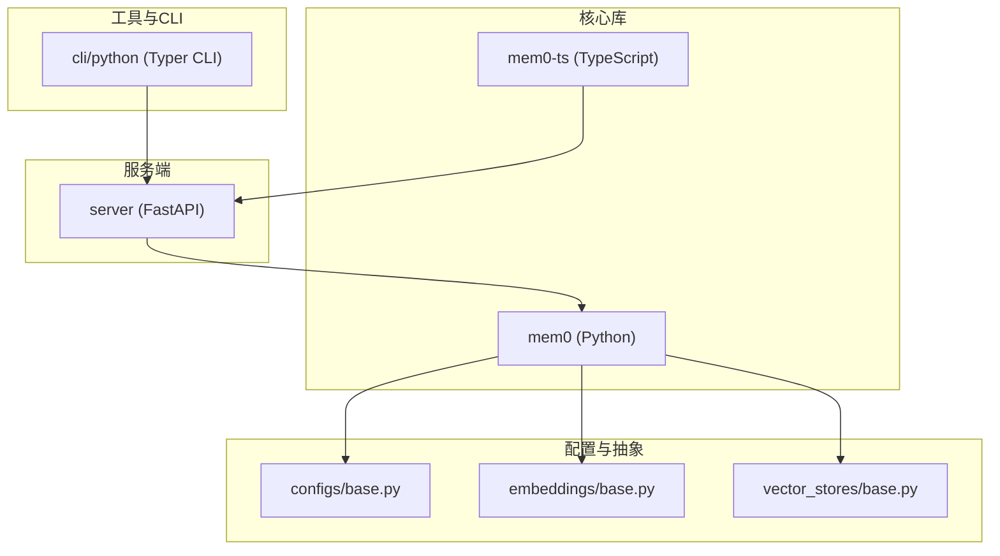
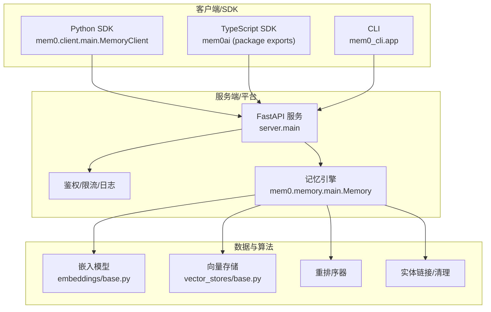
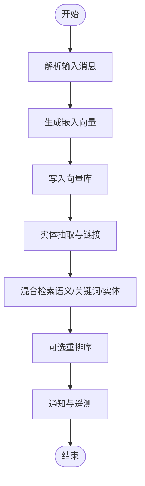
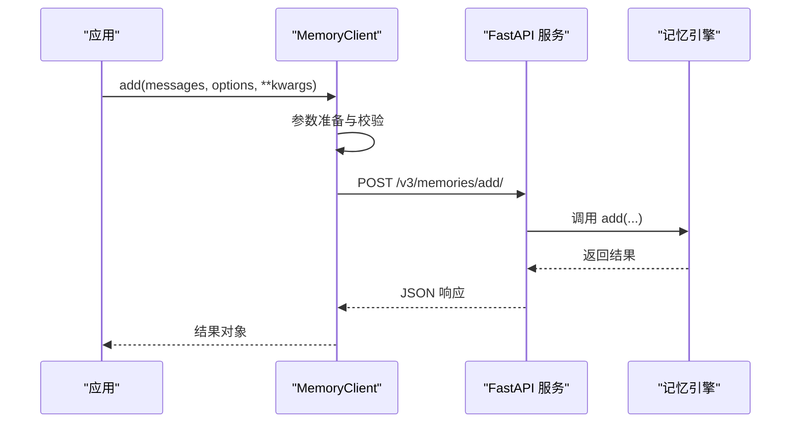
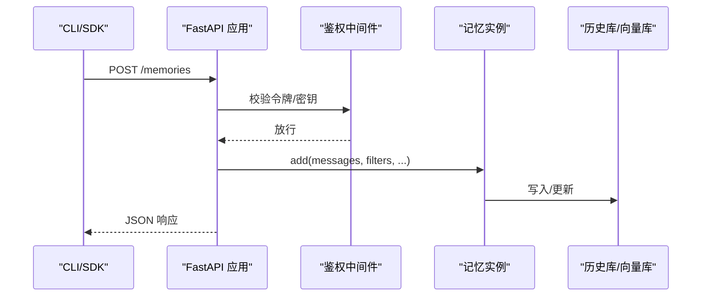
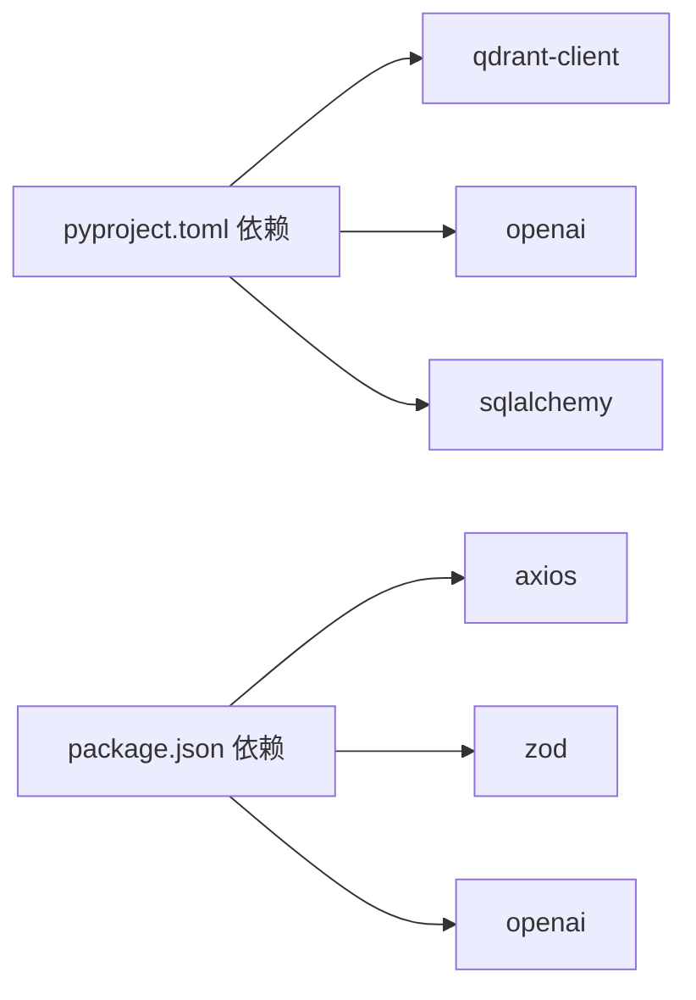

# 项目概述

<cite>
**本文引用的文件**
- [README.md](file://README.md)
- [docs/introduction.mdx](file://docs/introduction.mdx)
- [docs/core-concepts/memory-types.mdx](file://docs/core-concepts/memory-types.mdx)
- [docs/platform/overview.mdx](file://docs/platform/overview.mdx)
- [mem0/__init__.py](file://mem0/__init__.py)
- [mem0-ts/package.json](file://mem0-ts/package.json)
- [pyproject.toml](file://pyproject.toml)
- [mem0/memory/main.py](file://mem0/memory/main.py)
- [mem0/client/main.py](file://mem0/client/main.py)
- [server/main.py](file://server/main.py)
- [cli/python/src/mem0_cli/app.py](file://cli/python/src/mem0_cli/app.py)
- [mem0/configs/base.py](file://mem0/configs/base.py)
- [mem0/embeddings/base.py](file://mem0/embeddings/base.py)
- [mem0/vector_stores/base.py](file://mem0/vector_stores/base.py)
</cite>

## 目录
1. [引言](#引言)
2. [项目结构](#项目结构)
3. [核心组件](#核心组件)
4. [架构总览](#架构总览)
5. [详细组件分析](#详细组件分析)
6. [依赖分析](#依赖分析)
7. [性能考量](#性能考量)
8. [故障排查指南](#故障排查指南)
9. [结论](#结论)
10. [附录](#附录)

## 引言
Mem0 是面向 AI 助手与智能体的“长时记忆层”，通过可扩展的记忆算法与多层级存储，实现跨会话、跨任务、跨用户的上下文延续与个性化体验。它支持多模态、混合检索（语义+关键词+实体）、时间推理、实体链接等先进能力，并提供库版 SDK、自托管服务端与云端托管平台三种使用形态，覆盖从个人测试到企业生产的全场景。

Mem0 的核心价值主张：
- 多层级记忆：对话、会话、用户与组织级记忆分层存储与融合检索，避免信息过载或遗忘不足
- 开发者友好：统一 API、跨语言 SDK（Python/TypeScript）、CLI、REST API 与丰富集成生态
- 可观测与治理：告警提示、性能阈值检测、实体清理、审计日志与企业级权限控制
- 生产就绪：云端托管即开即用，自托管可按需扩展，支持高可用与弹性伸缩

## 项目结构
仓库采用多模块并行的组织方式，包含核心 Python 库、TypeScript SDK、自托管服务端、CLI 工具、平台文档与示例等。下图展示主要模块与其职责：

图表来源
- [mem0/__init__.py](file://mem0/__init__.py)
- [mem0-ts/package.json](file://mem0-ts/package.json)
- [pyproject.toml](file://pyproject.toml)
- [server/main.py](file://server/main.py)
- [cli/python/src/mem0_cli/app.py](file://cli/python/src/mem0_cli/app.py)
- [mem0/configs/base.py](file://mem0/configs/base.py)
- [mem0/embeddings/base.py](file://mem0/embeddings/base.py)
- [mem0/vector_stores/base.py](file://mem0/vector_stores/base.py)

章节来源
- [README.md](file://README.md)
- [docs/introduction.mdx](file://docs/introduction.mdx)

## 核心组件
- 记忆引擎（Python）：负责事实抽取、向量化、混合检索、实体链接、时间推理、通知与遥测等核心逻辑
- 客户端（Python/TypeScript）：封装 REST API 调用，提供统一的 add/search/update/delete 等操作
- 自托管服务端（FastAPI）：提供 REST 接口、鉴权、速率限制、请求日志与配置热更新
- CLI：终端命令行工具，支持初始化、添加、搜索、列出、删除等常用操作
- 抽象层：嵌入模型、向量数据库、重排序器等接口定义，便于替换与扩展

章节来源
- [mem0/memory/main.py](file://mem0/memory/main.py)
- [mem0/client/main.py](file://mem0/client/main.py)
- [server/main.py](file://server/main.py)
- [cli/python/src/mem0_cli/app.py](file://cli/python/src/mem0_cli/app.py)
- [mem0/configs/base.py](file://mem0/configs/base.py)
- [mem0/embeddings/base.py](file://mem0/embeddings/base.py)
- [mem0/vector_stores/base.py](file://mem0/vector_stores/base.py)

## 架构总览
Mem0 的整体架构由“客户端/SDK 层”、“服务端/平台层”和“数据与算法层”组成。客户端通过统一 API 与服务端交互；服务端负责鉴权、路由、调用记忆引擎并持久化；数据与算法层包含嵌入、向量存储、重排序与实体链接等组件。

图表来源
- [mem0/client/main.py](file://mem0/client/main.py)
- [mem0-ts/package.json](file://mem0-ts/package.json)
- [cli/python/src/mem0_cli/app.py](file://cli/python/src/mem0_cli/app.py)
- [server/main.py](file://server/main.py)
- [mem0/memory/main.py](file://mem0/memory/main.py)
- [mem0/embeddings/base.py](file://mem0/embeddings/base.py)
- [mem0/vector_stores/base.py](file://mem0/vector_stores/base.py)

## 详细组件分析

### 记忆引擎（Python）
- 设计理念：以“单次新增提取 + 无更新覆盖”的方式积累记忆，强调事实优先与实体链接增强召回
- 关键流程：
  - 输入校验与消息解析（支持多模态）
  - 向量化与写入向量库
  - 实体抽取与链接（提升检索质量）
  - 混合检索（语义+关键词+实体）与重排序
  - 通知与遥测（首次运行、性能慢查询、规模阈值、时间相关使用提示）
- 多层级记忆：通过 user_id、agent_id、run_id 等标识进行会话范围划分与持久化

图表来源
- [mem0/memory/main.py](file://mem0/memory/main.py)

章节来源
- [mem0/memory/main.py](file://mem0/memory/main.py)
- [docs/core-concepts/memory-types.mdx](file://docs/core-concepts/memory-types.mdx)

### 客户端（Python）
- 统一 API：add/get/get_all/search/update/delete/delete_all/history/users/delete_users/reset/batch_* 等
- 参数规范：统一使用 filters 进行实体过滤，支持 top_k、threshold、explain 等检索参数
- 错误处理：基于装饰器的统一错误处理与状态码映射
- 遥测：记录客户端事件，支持匿名别名合并

图表来源
- [mem0/client/main.py](file://mem0/client/main.py)
- [server/main.py](file://server/main.py)

章节来源
- [mem0/client/main.py](file://mem0/client/main.py)

### 自托管服务端（FastAPI）
- 路由与接口：/memories、/search、/memories/{id}、/memories/{id}/history、/memories、/reset、/configure 等
- 安全与治理：JWT/API Key/管理员密钥鉴权、速率限制、敏感配置脱敏、请求日志持久化
- 配置热更新：支持动态设置/获取配置，校验捆绑提供方（LLM/Embedder）

图表来源
- [server/main.py](file://server/main.py)

章节来源
- [server/main.py](file://server/main.py)

### CLI（终端工具）
- 命令体系：add/search/get/list/update/delete/config/entity/event 等
- 输出模式：支持文本/JSON/Table，便于自动化与脚本集成
- 验证与提示：API Key 校验、管道输入读取、代理模式识别

章节来源
- [cli/python/src/mem0_cli/app.py](file://cli/python/src/mem0_cli/app.py)

### 抽象层与可插拔组件
- 嵌入模型抽象：统一 embed/embed_batch 接口，子类可覆盖批量优化
- 向量存储抽象：统一 create_col/insert/search/delete/update/get/list/reset 等接口，支持 keyword_search 扩展
- 配置模型：MemoryConfig/LlmConfig/EmbedderConfig/VectorStoreConfig/RerankerConfig

章节来源
- [mem0/embeddings/base.py](file://mem0/embeddings/base.py)
- [mem0/vector_stores/base.py](file://mem0/vector_stores/base.py)
- [mem0/configs/base.py](file://mem0/configs/base.py)

## 依赖分析
- Python 包依赖：qdrant-client、pydantic、openai、posthog、sqlalchemy、protobuf 等
- 可选依赖：多种向量库、LLM 提供商、NLP/搜索扩展包
- TypeScript 包依赖：axios、openai、uuid、zod 等，导出入口区分 oss 与社区版本
- 平台与生态：支持 LangChain、CrewAI、Vercel AI SDK、MCP 等集成

图表来源
- [pyproject.toml](file://pyproject.toml)
- [mem0-ts/package.json](file://mem0-ts/package.json)

章节来源
- [pyproject.toml](file://pyproject.toml)
- [mem0-ts/package.json](file://mem0-ts/package.json)

## 性能考量
- 单次新增提取：减少更新/删除开销，降低写放大
- 实体链接与混合检索：提升召回质量与相关性
- 批量与并行：向量库与嵌入模型的批量接口优化
- 检索阈值与 top_k：通过阈值与返回数量控制成本
- 通知与告警：慢查询、规模阈值、时间相关使用提示，帮助定位性能瓶颈

## 故障排查指南
- 常见问题
  - API Key 无效或过期：检查 MEM0_API_KEY 或重新初始化
  - 缺少实体标识：add/search 必须至少提供 user_id/agent_id/run_id 其中之一
  - 向量库不支持关键词检索：部分存储不支持 keyword_search，将降级为纯语义检索
  - 权限不足：列出全部记忆需要管理员角色或特定密钥
- 建议步骤
  - 使用 CLI 或 SDK 的 --output=json 获取完整响应与错误详情
  - 查看服务端日志与请求 ID，定位具体失败环节
  - 检查配置是否正确（默认 LLM/Embedder、向量库连接）
  - 使用通知与遥测功能确认是否存在慢查询或规模阈值触发

章节来源
- [mem0/client/main.py](file://mem0/client/main.py)
- [server/main.py](file://server/main.py)
- [cli/python/src/mem0_cli/app.py](file://cli/python/src/mem0_cli/app.py)

## 结论
Mem0 将“可扩展的记忆算法”“多层级记忆管理”“开发者友好的接口与工具链”三者结合，形成从个人到团队再到企业的完整产品路径。通过平台托管、自托管与开源库三种形态，满足不同阶段对易用性、可控性与定制性的需求。建议在原型阶段优先使用库版与 CLI，在团队与生产环境考虑自托管或平台托管，并结合文档与示例快速落地个性化 AI 交互场景。

## 附录
- 许可证：Apache 2.0
- 社区与支持：Discord、X（原 Twitter）、官方文档与示例
- 版本与发布：Python 包与 npm 包版本独立管理，遵循 semver

章节来源
- [README.md](file://README.md)
- [docs/platform/overview.mdx](file://docs/platform/overview.mdx)