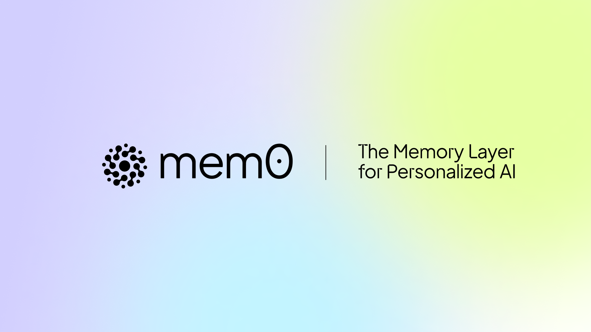

<p align="center">
  
</p>

<p align="center">
  <a href="https://mem0.ai/slack">
    
  </a>
  <a href="https://mem0.ai/discord">
    
  </a>
  <a href="https://x.com/mem0ai">
    
  </a>
  <a href="https://www.ycombinator.com/companies/mem0"></a>
  <a href="https://www.npmjs.com/package/mem0ai"></a>
  <a href="https://pypi.python.org/pypi/mem0ai"></a>
  <a href="https://mem0.ai/email"></a>
</p>

# Mem0: The Memory Layer for Personalized AI

Mem0 provides an intelligent, adaptive memory layer for Large Language Models (LLMs), enhancing personalized AI experiences by retaining and utilizing contextual information across diverse applications. This enhanced memory capability is crucial for applications ranging from customer support and healthcare diagnostics to autonomous systems and personalized content recommendations, allowing AI to remember user preferences, adapt to individual needs, and continuously improve over time.

## 🚀 Quickstart

### Installation

The Mem0 package can be installed directly from pip command in the terminal.

```bash
pip install mem0ai
```

### Basic Usage (Open Source)

Mem0 supports various LLMs, details of which can be found in our docs, checkout [Supported LLMs](https://docs.mem0.ai/llms). By default, Mem0 is equipped with ```gpt-4o```, and to use it, you need to set the keys in the environment variable.

```python
import os
os.environ["OPENAI_API_KEY"] = "sk-xxx"
```

Now, you can simply initialize the memory.

```python
from mem0 import Memory

m = Memory()
```

You can perform the following task on the memory.
1. Add: adds memory
2. Update: update memory of a given memory_id
3. Search: fetch memories based on a query
4. Get: return memories for a certain user/agent/session
5. History: describes how a memory has changed over time for a specific memory ID

```python
# 1. Add: Store a memory from any unstructured text
result = m.add("I am working on improving my tennis skills. Suggest some online courses.", user_id="alice", metadata={"category": "hobbies"})

# Created memory --> 'Improving her tennis skills.' and 'Looking for online suggestions.'
```

```python
# 2. Update: update the memory
result = m.update(memory_id=<memory_id_1>, data="Likes to play tennis on weekends")

# Updated memory --> 'Likes to play tennis on weekends.' and 'Looking for online suggestions.'
```

```python
# 3. Search: search related memories
related_memories = m.search(query="What are Alice's hobbies?", user_id="alice")

# Retrieved memory --> 'Likes to play tennis on weekends'
```

```python
# 4. Get all memories
all_memories = m.get_all()
memory_id = all_memories[0]["id"] # get a memory_id

# All memory items --> 'Likes to play tennis on weekends.' and 'Looking for online suggestions.'
```

```python
# 5. Get memory history for a particular memory_id
history = m.history(memory_id=<memory_id_1>)

# Logs corresponding to memory_id_1 --> {'prev_value': 'Working on improving tennis skills and interested in online courses for tennis.', 'new_value': 'Likes to play tennis on weekends' }
```

### Mem0 Platform

```python
from mem0 import MemoryClient
client = MemoryClient(api_key="your-api-key") # get api_key from https://app.mem0.ai/

# Store messages 
messages = [
    {"role": "user", "content": "Hi, I'm Alex. I'm a vegetarian and I'm allergic to nuts."},
    {"role": "assistant", "content": "Hello Alex! I've noted that you're a vegetarian and have a nut allergy. I'll keep this in mind for any food-related recommendations or discussions."}
]
result = client.add(messages, user_id="alex")
print(result)

# Retrieve memories
all_memories = client.get_all(user_id="alex")
print(all_memories)

# Search memories
query = "What do you know about me?"
related_memories = client.search(query, user_id="alex")

# Get memory history
history = client.history(memory_id="m1")
print(history)
```

> [!TIP]
> If you are looking for a hosted version and don't want to setup the infrastucture yourself, checkout [Mem0 Platform Docs](https://docs.mem0.ai/platform/quickstart) to get started in minutes.

## 🔑 Core Features

- **Multi-Level Memory**: User, Session, and AI Agent memory retention
- **Adaptive Personalization**: Continuous improvement based on interactions
- **Developer-Friendly API**: Simple integration into various applications
- **Cross-Platform Consistency**: Uniform behavior across devices
- **Managed Service**: Hassle-free hosted solution

## 📖 Documentation

For detailed usage instructions and API reference, visit our documentation at [docs.mem0.ai](https://docs.mem0.ai).

## 🔧 Advanced Usage

For production environments, you can use Qdrant as a vector store:

```python
from mem0 import Memory

config = {
    "vector_store": {
        "provider": "qdrant",
        "config": {
            "host": "localhost",
            "port": 6333,
        }
    },
}

m = Memory.from_config(config)
```

## 🗺️ Roadmap

- Integration with various LLM providers
- Support for LLM frameworks
- Integration with AI Agents frameworks
- Customizable memory creation/update rules
- Hosted platform support

## 💰 Pricing

Choose the Mem0 plan that best fits your needs:

### Open Source (Self-hosted)
Perfect for developers and small teams who want full control over their infrastructure.

### Pro (Hosted)
Ideal for growing businesses that need a reliable, managed solution with generous free usage. Try the platform [here](https://app.mem0.ai)

### Enterprise (Hosted)
Designed for large organizations with advanced security, compliance, and scalability needs.

| Feature | Open Source | Pro | Enterprise |
|---------|-------------|-----|------------|
| Hosting | Self-hosted | Hosted | Hosted |
| API Calls | Unlimited | 100K free/month | Custom limits |
| Support | Community | Email | Dedicated support |
| Updates | Manual | Automatic | Automatic |
| SSO | ❌ | ❌ | ✅ |
| Audit Logs | ❌ | ❌ | ✅ |
| Custom Integrations | ❌ | ❌ | ✅ |
| SLA | ❌ | ❌ | ✅ |
| Advanced Analytics | ❌ | Basic | Advanced |
| Multi-region Deployment | ❌ | ❌ | ✅ |

[Contact us](mailto:taranjeet@mem0.ai) for Enterprise pricing and custom solutions.

## Star History

[](https://star-history.com/#mem0ai/mem0&Date)

## 🙋‍♂️ Support
Join our Slack or Discord community for support and discussions.
If you have any questions, feel free to reach out to us using one of the following methods:

- [Join our Discord](https://mem0.ai/discord)
- [Join our Slack](https://mem0.ai/slack)
- [Join our newsletter](https://mem0.ai/email)
- [Follow us on Twitter](https://x.com/mem0ai)
- [Email us](mailto:founders@mem0.ai)

## 📝 License

This project is licensed under the Apache 2.0 License - see the [LICENSE](LICENSE) file for details.

> [!NOTE]
> The Mem0 repository now also includes the Embedchain project. We continue to maintain and support Embedchain ❤️. You can find the Embedchain codebase in the [embedchain](https://github.com/mem0ai/mem0/tree/main/embedchain) directory.