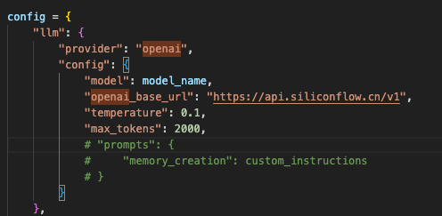
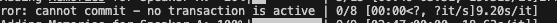
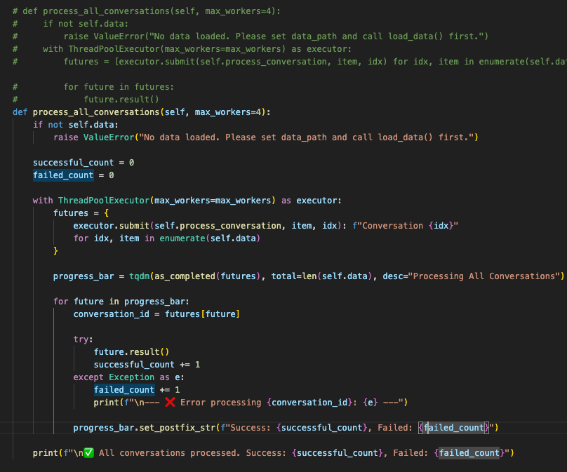
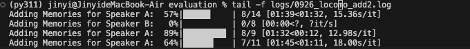

# 1. 修改评估过程

## memoryclient -> memory class

本地评估需要将memory client class切换到memory class，但是官方没提供代码，所以这里需要修改。

但是，client请求的参数和本地memory类请求的方式略有差异，这里记录如下，这些差异可能会导致性能结果上的差异。

1. prompt不能对齐，无法得知server端对prompt的处理细节
TypeError: OpenAIConfig.__init__() got an unexpected keyword argument 'prompts'

-> 可能的问题：json格式输出异常发生频率较高。

还有一些我新增的enhancement

1. 输出格式做了优化
2. 原本的评测没有对error做处理，直接退出，很不可靠。我做了优化，retry处理

## 运行脚本

nohup python run_experiments.py --technique_type mem0 --method add > logs/0926_locomo_add.log 2>&1 &

nohup python run_experiments.py --technique_type mem0 --method search > logs/0926_locomo_search.log 2>&1 &

# 2. 细节优化
1. 输出进度条优化
2. 对异常处理的优化，重试间隔建议random.randint(20, 60)

# 3. 线程安全 <-本地add操作并发复杂，经常奔溃报错
代码中存在嵌套并发：外层使用ThreadPoolExecutor处理多个对话，内层process_conversation函数中又为每个对话的两位参与者创建了两个threading.Thread。
所有这些并发的线程（来自线程池的worker线程和手动创建的线程）共享同一个self.memory实例。如果Memory.from_config(config)创建的实例及其内部组件（特别是与Qdrant数据库的连接和操作）不是线程安全的，那么在高并发下极有可能出现数据竞争、数据损坏或程序崩溃等问题。需关注。

**解决方案：**

## retry来解决

## 在最外层处理all conversation的时候没有异常处理机制，这里做优化
当一个任务失败时，我们捕获异常，打印出哪个任务失败了以及失败的原因，然后循环会继续处理下一个已完成的任务。

## 移除内部的线程并发

