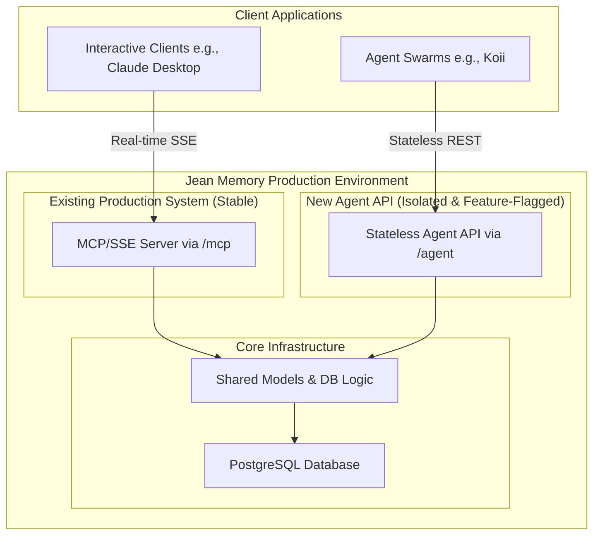

# Jean Memory: System Architecture

This document provides a high-level overview of the Jean Memory system architecture, highlighting the isolation of the new Agent API from the existing MCP/SSE server.

## Core Principle: Isolation

The primary architectural principle is **isolation**. The new Agent API is designed to be a completely separate module that coexists with the stable, production MCP server. They do not share code, routes, or application logic. Their only shared resource is the underlying database, which they interact with through separate, purpose-built endpoints.

This ensures that the development and deployment of new agent-facing features will **never interfere** with the existing functionality used by clients like the Claude desktop app.

## Architecture Diagram

The following diagram illustrates the two parallel systems:

### Diagram Legend:

-   **MCP/SSE Server:** The existing, stable server that handles real-time connections from interactive clients.
-   **Stateless Agent API:** The new, feature-flagged API we have built. It is designed for programmatic use by automated agent systems and handles transactional, stateless requests.
-   **Client Applications:** Shows the separation of concerns. The Claude app continues to talk to the MCP server, while new business clients like Koii will integrate with the new Agent API. 