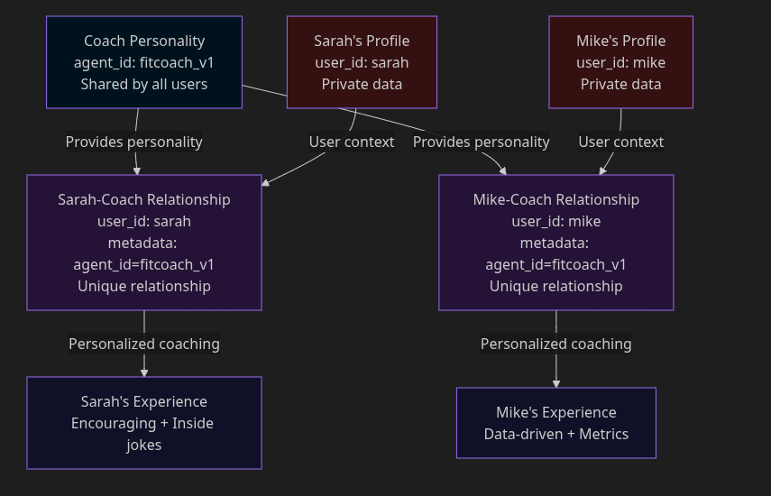

# Build AI with Distinct Personalities

While building memory systems for AI apps, you need to juggle between agent and user memories. The user delivers information from their side, but there's often value inside the agent's responses as well.

Unlike other memory APIs, we built one that allows you the flexibility to store memory from all sources. User and agent memories in Mem0 are handled by:

- **user_id** - Memories about specific users
- **agent_id** - Memories from the agent itself

In this guide, you'll see how these parameters work together, along with practical examples to help you build a fitness coach that remembers user workouts while maintaining a consistent coaching personality.

---

## User Memories

Let's start by tracking individual user workouts. We'll use **`user_id`** to keep each person's data separate.

```python
from openai import OpenAI
from mem0 import MemoryClient
import os

openai_client = OpenAI(api_key=os.getenv("OPENAI_API_KEY"))
mem0_client = MemoryClient()

# Sarah logs her workout
mem0_client.add(
    "Completed 5K run in 28 minutes - felt great!",
    user_id="sarah"
)

# Mike logs his workout
mem0_client.add(
    "Bench press: 185 lbs x 10 reps, 3 sets",
    user_id="mike"
)

```

Now when we coach Sarah, we retrieve only her workout history:

```python
# Get Sarah's workout history
sarah_history = mem0_client.search(
    "What exercises has Sarah done recently?",
    filters={"user_id": "sarah"}
)

# Generate coaching advice
response = openai_client.chat.completions.create(
    model="gpt-4",
    messages=[
        {"role": "system", "content": "You're a supportive fitness coach."},
        {"role": "user", "content": f"Based on this history: {sarah_history}, suggest the next workout."}
    ]
)

print(response.choices[0].message.content)

```

**Output:**

```
Great job on that 5K! Your endurance is building nicely. Let's add some
strength work to complement your running. Try 3 sets of bodyweight squats
(15 reps each) to strengthen your legs and improve your running power.

```

<Info>
**Expected output:** Sarah gets running advice based on her 5K, not Mike's bench press data. The **`user_id`** filter ensures memories are isolated—each user only sees their own workout history.
</Info>

This works perfectly! Each user has private workout history, and Sarah never sees Mike's data.

---

## Adding Coach Personality

Our fitness coach needs a consistent personality - supportive, motivational, and celebrates small wins. Let's see what happens if we try storing this with **`user_id`**:

```python
# Adding coach personality for Sarah
mem0_client.add(
    "I'm a supportive fitness coach who celebrates every achievement and uses athlete-focused language",
    user_id="sarah"
)

# Adding the same personality for Mike
mem0_client.add(
    "I'm a supportive fitness coach who celebrates every achievement and uses athlete-focused language",
    user_id="mike"
)

# For 1,000 users, we'd repeat this 1,000 times...

```

This approach has some limitations:

1. **Duplication**: We're storing the same coaching personality 1,000 times for 1,000 users
2. **Hard to update**: Want to change the coaching style? Update 1,000 memories
3. **Mixed with user data**: Coach personality and user workouts are stored together, making queries complex

<Warning>
Storing agent personality with **`user_id`** doesn't scale. For 10,000 users, you'd duplicate the same personality 10,000 times. Updating the coaching style means updating 10,000 separate memories. This wastes storage and makes maintenance impossible.
</Warning>

What if the coach could have a personality that's shared across all users?

---

## Agent Memories

Here's where **`agent_id`** comes in. We can store the coach's personality once and share it across all users:

```python
# Store coach personality ONCE with agent_id
mem0_client.add(
    "I'm FitCoach - a supportive fitness coach who celebrates every achievement. "
    "I use motivational language, focus on progress over perfection, and help users build sustainable habits.",
    agent_id="fitcoach_v1"
)

# Sarah's workout (still private)
mem0_client.add(
    "Completed 5K run in 28 minutes",
    user_id="sarah"
)

# Mike's workout (still private)
mem0_client.add(
    "Bench press: 185 lbs x 10 reps, 3 sets",
    user_id="mike"
)

```

Now when coaching Sarah, we retrieve both the agent's personality AND her workout history:

```python
# Get both coach personality and Sarah's workouts
coaching_context = mem0_client.search(
    "coaching context for Sarah",
    filters={
        "OR": [
            {"agent_id": "fitcoach_v1"},  # Coach personality
            {"user_id": "sarah"}          # Sarah's workout history
        ]
    }
)

# Generate personalized coaching
response = openai_client.chat.completions.create(
    model="gpt-4",
    messages=[
        {"role": "system", "content": str(coaching_context)},
        {"role": "user", "content": "What should I focus on in my next workout?"}
    ]
)

print(response.choices[0].message.content)

```

**Output:**

```
Amazing work on that 5K! 🎉 You're crushing your running goals!

Now let's build some complementary strength. I recommend adding bodyweight
squats to your routine - they'll make you an even stronger runner. Start
with 3 sets of 15 reps, and remember: progress over perfection!

```

Notice how the response has the motivational tone (from **`agent_id`**) combined with personalized advice based on Sarah's 5K run (from **`user_id`**).

The coach personality is now:

- ✅ Stored once, shared by all users
- ✅ Easy to update (change one memory, affects all users)
- ✅ Cleanly separated from user workout data

<Info>
**Expected behavior:** The response combines the motivational tone (from **`agent_id`**) with Sarah's specific 5K progress (from **`user_id`**). One agent personality, infinite users—update the agent once, and all users get the new coaching style.
</Info>

---

## Combining Both: Relationship Memories

There's a third type of memory - one that captures the relationship between a specific user and the coach. To store these, use `metadata` to track which agent the relationship is with:

```python
# Coach personality (shared across all users)
mem0_client.add(
    "I'm FitCoach - supportive and motivational",
    agent_id="fitcoach_v1"
)

# Sarah's workout data (private to Sarah)
mem0_client.add(
    "Goal: Run a half marathon by June. Currently runs 5K comfortably.",
    user_id="sarah"
)

# Sarah-Coach relationship (stored as user memory with agent context in metadata)
mem0_client.add(
    "Sarah and I have an inside joke: 'No pain, no protein shake!' "
    "She responds best to gentle encouragement after tough workouts.",
    user_id="sarah",
    metadata={"agent_id": "fitcoach_v1", "type": "relationship"}
)

# Mike-Coach relationship (different from Sarah's)
mem0_client.add(
    "Mike prefers data-driven feedback with specific numbers and percentages. "
    "Less motivational talk, more concrete metrics.",
    user_id="mike",
    metadata={"agent_id": "fitcoach_v1", "type": "relationship"}
)

```

Now when coaching Sarah, retrieve her data including relationship with this specific coach:

```python
# Get Sarah's memories including relationship with fitcoach_v1
sarah_context = mem0_client.search(
    "How should I coach Sarah today?",
    user_id="sarah",
    filters={"metadata": {"agent_id": "fitcoach_v1"}}
)

# Get coach personality
coach_personality = mem0_client.search(
    "coaching personality",
    agent_id="fitcoach_v1"
)

# Combine both contexts
full_context = str(coach_personality) + "\\n" + str(sarah_context)

response = openai_client.chat.completions.create(
    model="gpt-4",
    messages=[
        {"role": "system", "content": full_context},
        {"role": "user", "content": "Just finished today's workout!"}
    ]
)

print(response.choices[0].message.content)

```

**Output:**

```
Awesome work today! 💪 No pain, no protein shake, right? 😄

You're making real progress toward that half marathon goal. Keep this
momentum going - your consistency is your superpower!

```

When coaching Mike with the same approach:

```python
# Get Mike's memories including relationship with fitcoach_v1
mike_context = mem0_client.search(
    "How should I coach Mike today?",
    user_id="mike",
    filters={"metadata": {"agent_id": "fitcoach_v1"}}
)

coach_personality = mem0_client.search(
    "coaching personality",
    agent_id="fitcoach_v1"
)

full_context = str(coach_personality) + "\\n" + str(mike_context)

# ... same coaching code ...

```

**Output:**

```
Solid session. Your bench press shows 8% improvement over last week
(171 lbs avg to 185 lbs). Target: 200 lbs by end of month.
On track at current rate (+3.2% weekly).

```

Same coach, completely different experience based on each user's relationship preferences stored in metadata.

<Note>
**Relationship memories** are stored with **`user_id`** (they're private to each user) but include `agent_id` in metadata to track which agent the relationship is with. This lets you retrieve the user's preferences for how this specific agent should interact with them.
</Note>

---

## Putting It All Together

Here's a complete example showing all three memory layers working together:

```python
from openai import OpenAI
from mem0 import MemoryClient
import os

# Initialize clients
openai_client = OpenAI(api_key=os.getenv("OPENAI_API_KEY"))
mem0_client = MemoryClient()

# Layer 1: Agent personality (shared)
mem0_client.add(
    "I'm FitCoach - supportive, motivational, celebrates small wins",
    agent_id="fitcoach_v1",
    metadata={"type": "personality"}
)

# Layer 2: User profile (private)
mem0_client.add(
    "Sarah's goal: Run half marathon by June. Currently comfortable at 5K distance.",
    user_id="sarah",
    metadata={"type": "profile"}
)

# Layer 3: Relationship (stored as user memory with agent context in metadata)
mem0_client.add(
    "Sarah responds best to encouragement. Inside joke: 'No pain, no protein shake!'",
    user_id="sarah",
    metadata={"agent_id": "fitcoach_v1", "type": "relationship"}
)

# Log today's workout
mem0_client.add(
    "Completed 8K run in 45 minutes - new personal record!",
    user_id="sarah",
    metadata={"type": "workout", "date": "2025-01-23"}
)

# Generate coaching response
# Get Sarah's context (includes all her memories)
sarah_context = mem0_client.search(
    "Generate coaching advice for Sarah",
    user_id="sarah"
)

# Get coach personality
coach_personality = mem0_client.search(
    "coaching personality",
    agent_id="fitcoach_v1"
)

# Combine contexts
full_context = str(coach_personality) + "\\n" + str(sarah_context)

response = openai_client.chat.completions.create(
    model="gpt-4",
    messages=[
        {"role": "system", "content": full_context},
        {"role": "user", "content": "Just finished my run today!"}
    ]
)

print(response.choices[0].message.content)

```

**Output:**

```
🎉 YES! 8K is a HUGE milestone! You just crushed your previous distance!

Remember when you could barely do 5K? Look at you now! That half marathon
in June is looking more achievable every single day. No pain, no protein
shake - and today, you EARNED that shake! 💪

Next week, let's aim for 9K. You're ready for it!

```

The response combines:

- ✅ Motivational tone (agent personality)
- ✅ Specific goal reference (Sarah's profile)
- ✅ Inside joke (relationship memory)
- ✅ Progress tracking (workout history)

---



**Three memory layers:**

1. **Agent memories** (blue) - Shared personality and capabilities
2. **User memories** (red) - Private workout data and goals
3. **Relationship memories** (purple) - User memories with agent context stored in metadata

---

## When to Use What

### Use **`user_id`** only (most apps)

**Best for:** Apps that just need to track user-specific data without AI personality

**Examples:**

- Todo lists
- Note-taking apps
- Personal finance trackers
- Support ticket history

```python
mem0_client.add(
    "Bought groceries for $127.43",
    user_id="sarah"
)

```

---

### Use **`agent_id`** only (rare)

**Best for:** AI tools that work the same for everyone, no user-specific data

**Examples:**

- Calculator bots
- Language translators
- Company policy assistants (same policies for all)

```python
mem0_client.add(
    "I can calculate: arithmetic, algebra, basic calculus. I cannot solve differential equations.",
    agent_id="calculator_v1"
)

```

---

### Use both **`user_id`** and **`agent_id`** (AI with personality)

**Best for:** AI agents with persistent personalities that remember individual users

**Examples:**

- Fitness coaches (this guide!)
- Educational tutors
- AI companions
- Therapy/mental health bots
- Game NPCs with character development

```python
# Agent personality (shared across all users)
mem0_client.add(
    "Coaching personality and style",
    agent_id="agent_name"
)

# User data (private)
mem0_client.add(
    "User's goals and progress",
    user_id="user_name"
)

# Relationship (user memory with agent context in metadata)
mem0_client.add(
    "User's relationship with this specific agent",
    user_id="user_name",
    metadata={"agent_id": "agent_name", "type": "relationship"}
)

```

---

<Tip>
**When to combine user_id + agent_id:** Use both when your AI has a consistent personality that should work the same for everyone (agent_id), while also tracking individual user data (user_id). Most personal AI assistants, coaches, and tutors fit this pattern.
</Tip>

---

## Best Practices

### 1. Use clear naming conventions

```python
# Good: Descriptive and versioned
agent_id="fitcoach_v1"
user_id="sarah_123"

# Bad: Generic and unclear
agent_id="agent1"
user_id="user_abc"

```

### 2. Tag memories with metadata

```python
# For relationship memories, store agent context in metadata
mem0_client.add(
    content,
    user_id="sarah",
    metadata={
        "agent_id": "fitcoach_v1",
        "type": "relationship",
        "version": "v1"
    }
)

```

### 3. Test data isolation

Ensure users never see each other's data:

```python
# Get Mike's memories
mike_memories = mem0_client.get_all(filters={"user_id": "mike"})

# Get Sarah's memories
sarah_memories = mem0_client.get_all(filters={"user_id": "sarah"})

# Verify no overlap
assert len(set(mike_memories) & set(sarah_memories)) == 0, "Data leak detected!"

```

### 4. Version your agents

Allows A/B testing different coaching styles:

```python
# Version 1: Gentle and encouraging
mem0_client.add(
    "I'm supportive and celebrate small wins",
    agent_id="fitcoach_v1"
)

# Version 2: Data-driven and metric-focused
mem0_client.add(
    "I provide concrete metrics and percentage improvements",
    agent_id="fitcoach_v2"
)

# Assign users to different versions by storing version in metadata
mem0_client.add(
    "Sarah's workout preferences and relationship with coach",
    user_id="sarah",
    metadata={"agent_id": "fitcoach_v1"}
)
mem0_client.add(
    "Mike's workout preferences and relationship with coach",
    user_id="mike",
    metadata={"agent_id": "fitcoach_v2"}
)

```

---

## What You Built

A fitness coach with three-layer memory architecture:

- **Agent personality (agent_id)** - Shared coaching style across all users, updated once
- **User profiles (user_id)** - Private workout history, goals, and progress for each person
- **Relationship memories (user_id + metadata)** - Personalized interaction preferences per user-agent pair
- **Data isolation** - Sarah never sees Mike's workouts, guaranteed by user_id filtering

This pattern scales from 10 to 10,000 users without duplicating agent personality.

---

## Summary

With Mem0's **`user_id`** and **`agent_id`** parameters, you can build AI agents that maintain consistent personalities across all users while remembering individual user data privately. Store relationship preferences with **`user_id`** and track agent context in metadata.

Most apps only need **`user_id`**. Add **`agent_id`** when your AI needs a consistent personality that evolves independently from user data—fitness coaches, tutors, therapy bots, and game NPCs all fit this pattern.

<CardGroup cols={2}>
  <Card title="Control What Gets Stored" icon="filter" href="/cookbooks/essentials/controlling-memory-ingestion">
    Filter low-signal conversations before they pollute long-term memory.
  </Card>
  <Card title="Organize Support Memories" icon="tag" href="/cookbooks/essentials/tagging-and-organizing-memories">
    Categorize customer context so teams can retrieve the right facts fast.
  </Card>
</CardGroup>
