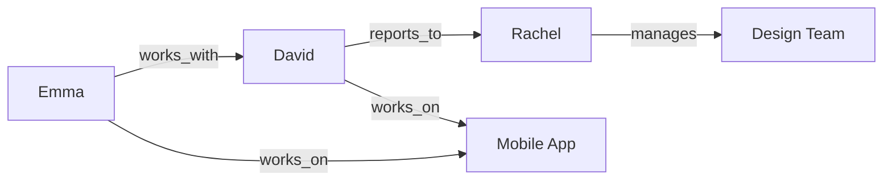

Most AI agents use vector stores for RAG operations - they work great for semantic search and retrieving relevant context. But there's a gap when queries require understanding connections between entities.

Mem0 brings graph memory into the picture to fill this gap. In this cookbook, we'll create a company knowledge base with Mem0, using both vector and graph stores. You'll learn when each one helps along the way.

---

## Vector and Graph Stores

When you add a memory to Mem0, it goes into a **vector store** by default. Vector stores are excellent at semantic search - finding memories that match the meaning of your query.

**Graph stores** work differently. They extract **entities** (people, projects, teams) and **relationships between them** (works_with, reports_to, member_of). This lets you answer questions that need connecting information across multiple memories.

We will go through examples in this cookbook while building a company's knowledge base along the way.

---

## Starting Simple

Since we're building a company knowledge base, let's add some employee information:

```python
from mem0 import MemoryClient

client = MemoryClient(api_key="your-api-key")
# Add employee info
client.add("Emma is a software engineer in Seattle", user_id="company_kb")
client.add("David is a product manager in Austin", user_id="company_kb")

```

Now let's search for Emma's role:

```python
results = client.search("What does Emma do?", filters={"user_id": "company_kb"})
print(results['results'][0]['memory'])

```

**Output:**

```
Emma is a software engineer in Seattle

```

<Info>
**Expected output:** Vector search returned Emma's role instantly. When queries ask for facts directly stored in one memory, vector semantic search is perfect—fast and accurate.
</Info>

This works perfectly. Vector search found the memory that semantically matches "What does Emma do?" and returned Emma's role.

---

## Adding Team Structure

Let's add some information about how the team works together:

```python
client.add("Emma works with David on the mobile app redesign", user_id="company_kb")
client.add("David reports to Rachel, who manages the design team", user_id="company_kb")

```

Now we have two pieces of information stored:

1. Emma works with David
2. David reports to Rachel

Let's try asking something that needs both pieces:

```python
results = client.search(
    "Who is Emma's teammate's manager?",
    filters={"user_id": "company_kb"}
)

for r in results['results']:
    print(r['memory'])

```

**Output:**

```
Emma works with David on the mobile app redesign
David reports to Rachel, who manages the design team

```

Vector search returned both memories, but it didn't connect them. You'd need to manually figure out:

- Emma's teammate is David (from memory 1)
- David's manager is Rachel (from memory 2)
- So the answer is Rachel

<Warning>
Vector search can't traverse relationships. It returns relevant memories, but you must connect the dots manually. For "Who is Emma's teammate's manager?", vector search gives you the pieces—not the answer. This breaks down as queries get more complex (3+ hops).
</Warning>

---

## Enter Graph Memory

Let's add the same information with graph memory enabled:

```python
client.add(
    "Emma works with David on the mobile app redesign",
    user_id="company_kb",
    enable_graph=True
)

client.add(
    "David reports to Rachel, who manages the design team",
    user_id="company_kb",
    enable_graph=True
)

```

When you set `enable_graph=True`, Mem0 extracts entities and relationships:

- `emma --[works_with]--> david`
- `david --[reports_to]--> rachel`
- `rachel --[manages]--> design_team`

Now the same query works differently:

```python
results = client.search(
    "Who is Emma's teammate's manager?",
    filters={"user_id": "company_kb"},
    enable_graph=True
)

print(results['results'][0]['memory'])
print("\\nRelationships found:")
for rel in results.get('relations', []):
    print(f"  {rel['source']}, {rel['target']} ({rel['relationship']})")

```

**Output:**

```
David reports to Rachel, who manages the design team

Relationships found:
  emma, david (works_with)
  david, rachel (reports_to)

```

<Info>
**Expected behavior:** Graph memory returns the direct answer—"David reports to Rachel"—plus the relationship chain that got there. No manual connecting needed. The graph traversed: Emma → works_with → David → reports_to → Rachel.
</Info>

Graph memory traversed the relationships automatically: Emma works with David, David reports to Rachel, so Rachel is the answer.

---

## How It Connects

Here's what the graph looks like behind the scenes:



Graph memory lets you discover relations and memories which are tricky to do with direct vector stores.

Vector search would need the exact words in your query to match. Graph memory follows the connections.

---

## When to Use Each

Use **vector store** (default) when:

- Searching documents by semantic similarity
- Looking up facts that don't need relationships
- Building FAQs or knowledge bases where each item stands alone

Use **graph memory** when:

- Tracking organizational hierarchies (who reports to whom)
- Understanding project teams (who collaborates with whom)
- Building CRMs (which contacts connect to which companies)
- Product recommendations (what items are bought together)

For our company knowledge base, we'll use both:

- Vector for individual facts: "Emma specializes in React"
- Graph for relationships: "Emma works with David"

---

## Putting It Together

Let's build a small company knowledge base with both approaches:

```python
# Facts about individuals - vector store is fine
client.add("Emma specializes in React and TypeScript", user_id="company_kb")
client.add("David has 5 years of product management experience", user_id="company_kb")

# Relationships - use graph memory
client.add(
    "Emma and David work together on the mobile app",
    user_id="company_kb",
    enable_graph=True
)

client.add(
    "David reports to Rachel",
    user_id="company_kb",
    enable_graph=True
)

client.add(
    "Rachel runs weekly team syncs every Tuesday",
    user_id="company_kb",
    enable_graph=True
)

```

Now we can ask different types of questions:

```python
# Direct fact - vector search
results = client.search("What are Emma's skills?", filters={"user_id": "company_kb"})
print(results['results'][0]['memory'])

```

**Output:**

```
Emma specializes in React and TypeScript

```

```python
# Multi-hop relationship - graph search
results = client.search(
    "What meetings does Emma's project manager's boss run?",
    filters={"user_id": "company_kb"},
    enable_graph=True
)
print(results['results'][0]['memory'])

```

**Output:**

```
Rachel runs weekly team syncs every Tuesday

```

Graph memory connected: Emma works with David, David reports to Rachel, Rachel runs team syncs.

<Tip>
Enable graph memory when your queries need multi-hop traversal: org charts (who reports to whom), project teams (who collaborates), CRMs (which contacts connect to companies). For single-fact lookups, stick with vector search—it's faster and cheaper.
</Tip>

---

## The Tradeoff

Graph memory adds processing time and cost. When you call `client.add()` with `enable_graph=True`, Mem0 makes extra LLM calls to extract entities and relationships.

<Note>
**Cost consideration:** Graph memory extraction adds ~2-3 extra LLM calls per `add()` operation to identify entities and relationships. Use it selectively—enable graph for organizational structure and long-term relationships, skip it for temporary notes and simple facts.
</Note>

Use graph memory when the relationship traversal adds real value. For most use cases, vector search is sufficient and faster.

```python
# Long-term organizational structure - worth using graph
client.add(
    "Emma mentors two junior engineers on the frontend team",
    user_id="company_kb",
    enable_graph=True
)

# Temporary notes - skip graph, not worth the cost
client.add(
    "Emma is out sick today",
    user_id="company_kb",
    run_id="daily_notes"
)

```

---

## Enabling Graph Memory

You can enable graph memory in two ways:

**Per-call** (recommended to start):

```python
client.add("Emma works with David", user_id="company_kb", enable_graph=True)
client.search("team structure", filters={"user_id": "company_kb"}, enable_graph=True)

```

**Project-wide** (if most of your data has relationships):

```python
client.project.update(enable_graph=True)

# Now every add uses graph automatically
client.add("Emma mentors Jordan", user_id="company_kb")

```

---

## What You Built

A hybrid company knowledge base that combines both architectures:

- **Vector search** - Fast semantic lookups for individual facts (Emma's skills, David's experience)
- **Graph memory** - Multi-hop relationship traversal (Emma's teammate's manager, project hierarchies)
- **Selective enablement** - Graph only for long-term organizational structure, vector for everything else
- **Cost optimization** - Skip graph extraction for temporary notes and simple facts

This pattern scales from 10-person startups to enterprise org charts with thousands of employees.

---

## Summary

Vector stores handle most memory operations efficiently—semantic search works great for finding relevant information. Add graph memory when your queries need to understand how entities connect across multiple hops.

The key is knowing which tool fits your query pattern: direct questions work with vectors, multi-hop relationship queries need graphs.

<CardGroup cols={2}>
  <Card title="Partition Memories by Entity" icon="layers" href="/cookbooks/essentials/entity-partitioning-playbook">
    Scope memories across users, agents, apps, and sessions to balance personalization and reuse.
  </Card>
  <Card title="Export Everything Safely" icon="download" href="/cookbooks/essentials/exporting-memories">
    Learn how to migrate or audit stored memories with structured exports.
  </Card>
</CardGroup>
