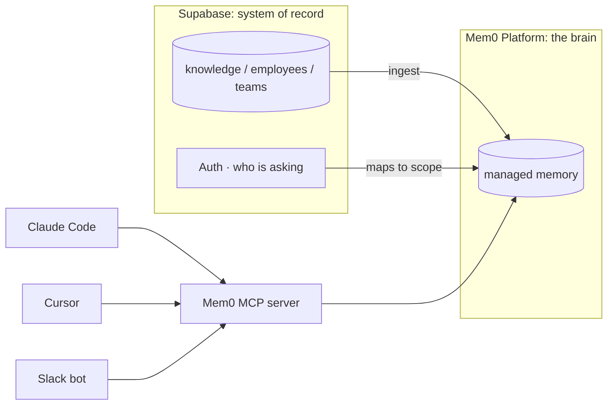

<Info icon="server">
**Uses:** Mem0 **Platform** (`MemoryClient`) · **System of record:** Supabase (Postgres + Auth) · **Access layer:** the hosted Mem0 MCP server. **You'll build:** a company brain your whole org (and every agent) writes to and queries, ending with a new-hire onboarding demo.
</Info>

Companies lose knowledge constantly: why you picked Postgres over Mongo, who owns billing, the deploy rule only one engineer remembers. A **company brain** captures this and answers questions about it, for every employee and every agent, and keeps it after people leave.

We'll build one on **Mem0 Platform** (the managed memory layer, so there's no vector DB to run) with **Supabase as the system of record** (where your employees, teams, and source documents actually live) and the **Mem0 MCP server** as the wire that lets Claude Code, Cursor, or a Slack bot all reach the same brain.

<Note>
**How Platform and Supabase divide the work.** Mem0 Platform manages storage and extraction server-side, you do **not** point it at your own database. Supabase is your app's source of truth and identity provider; we *ingest* knowledge from Supabase into the brain and use Supabase Auth to decide who's asking. (If you want to self-host the vector store instead, that's the OSS path, see the [Supabase vector store reference](/components/vectordbs/dbs/supabase).)
</Note>

## Architecture



Memory splits by entity. An individual is a **`user_id`** (their Supabase Auth id). Shared knowledge lives on an **`agent_id`**: the company-wide brain is `org:acme`, and each team is its own agent, e.g. `team:payments`. A person's own facts route to their `user_id`; company and team facts route to the agent. This split is what lets one search return "my" context alongside the shared org knowledge.

## Prerequisites

- **Python 3.9+**
- A **Mem0 Platform API key**, [app.mem0.ai/dashboard/api-keys](https://app.mem0.ai/dashboard/api-keys?utm_source=oss&utm_medium=cookbook-company-brain). (Platform runs extraction and embeddings for you, so there's no OpenAI key to manage.)
- A **Supabase** project, [supabase.com](https://supabase.com)

About 20 minutes.

---

## Step 1: Get your Mem0 Platform API key

Sign in at [app.mem0.ai](https://app.mem0.ai) and copy a key from **Dashboard → API Keys**. The key is scoped to your org and project; Mem0 resolves both server-side, so you never pass IDs by hand.

## Step 2: Create the Supabase system of record

In the Supabase **SQL editor**, create the tables your company already thinks in: people, teams, and a `knowledge` table the brain will ingest from. Identity reuses Supabase Auth's built-in `auth.users`.

```sql
-- Employees extend Supabase Auth's users; identity is auth.users.id (uuid)
create table public.employees (
  id     uuid primary key references auth.users (id) on delete cascade,
  name   text not null,
  team   text not null
);

-- The company knowledge the brain ingests. `scope` decides who can recall it.
create table public.knowledge (
  id             bigint generated always as identity primary key,
  scope          text not null,                    -- the shared agent this belongs to: 'org:acme' | 'team:payments'
  content        text not null,
  author         uuid references auth.users (id),   -- who recorded it (their user_id); null for org seed data
  created_at     timestamptz default now(),
  mem0_synced_at timestamptz                        -- null until ingested into the brain
);
create index on public.knowledge (mem0_synced_at, created_at);

-- Seed a little company knowledge to ingest.
insert into public.knowledge (scope, content) values
  ('org:acme', 'We chose Postgres over MongoDB for the core product for strong transactional guarantees and relational joins.'),
  ('org:acme', 'All production deploys go out Tuesday and Thursday; never on Fridays.'),
  ('org:acme', 'Customer data must stay in the EU region for GDPR compliance.'),
  ('org:acme', 'Billing is owned by the Payments team, and Alice is the Payments tech lead.'),
  ('team:payments', 'Stripe is our processor; webhooks are verified with PAYMENTS_WEBHOOK_SECRET.');
```

Grab your project URL and **service-role** key from **Settings → API** (the ingestion job runs server-side and needs to read every scope).

## Step 3: Project setup

```bash
mkdir company-brain && cd company-brain
pip install "mem0ai>=2.0.17" supabase requests   # 2.0.17+ for agent_custom_instructions
```

```bash
export MEM0_API_KEY="m0-..."
export SUPABASE_URL="https://<project-ref>.supabase.co"
export SUPABASE_SERVICE_KEY="<service-role-key>"
```

## Step 4: Configure the brain

Create **`brain.py`**. This constructs the Platform client and teaches it what to remember. The key is the **two** instruction sets: `custom_instructions` governs a person's own (`user_id`) memories, and `agent_custom_instructions` governs shared (`agent_id`) memories, phrased in the third person so company facts read "The company…", not "The user's organization…". `custom_categories` files each memory under a useful label.

```python
# brain.py
import os
from mem0 import MemoryClient

client = MemoryClient(api_key=os.environ["MEM0_API_KEY"])

# Steer extraction (project-wide). Runs server-side; no LLM key needed here.
client.project.update(
    # Governs a person's OWN memories (user_id).
    custom_instructions=(
        "Extract the individual's own durable preferences, context, and how they work. "
        "Ignore greetings and one-off chatter."
    ),
    # Governs SHARED memories (agent_id); write them in the third person.
    agent_custom_instructions=(
        "Extract durable company/team knowledge in the third person "
        "(\"The company...\", \"The team...\"): decisions and their rationale, ownership "
        "(who owns what), processes, policies, tooling choices, and gotchas. "
        "Ignore greetings, scheduling, and one-off chatter."
    ),
    custom_categories=[
        {"decision": "Architectural or product decisions and why they were made"},
        {"ownership": "Who owns a system, service, or process"},
        {"policy": "Compliance, security, and process rules"},
        {"tooling": "Tools, services, and how they're configured"},
    ],
)

# Scopes. A person is a user_id; shared brains are agent_ids.
COMPANY = "org:acme"                       # agent_id: company-wide shared brain
def team(name):   return f"team:{name}"    # agent_id: a team's shared brain
def person(uid):  return uid               # user_id: an individual (Supabase auth id)
```

Run it once to apply the project settings:

```bash
python -c "import brain; print('brain configured')"
```


## Step 5: Ingest company knowledge from Supabase

This is where Supabase and the brain connect. Create **`ingest.py`**: read un-synced rows from `knowledge`, add each to the Platform brain under its scope, then mark it synced. Platform `add()` is **asynchronous**, it returns an `event_id` you can poll, so we include a small `wait_for` helper.

```python
# ingest.py
import os, time, requests
from supabase import create_client
from brain import client, person

sb = create_client(os.environ["SUPABASE_URL"], os.environ["SUPABASE_SERVICE_KEY"])
MEM0_HEADERS = {"Authorization": f"Token {os.environ['MEM0_API_KEY']}"}

def wait_for(event_id, timeout=30):
    """Platform extraction is async; poll the event until it settles."""
    for _ in range(timeout):
        r = requests.get(f"https://api.mem0.ai/v1/event/{event_id}/", headers=MEM0_HEADERS).json()
        if r.get("status") in ("SUCCEEDED", "FAILED"):
            return r["status"]
        time.sleep(1)
    return "TIMEOUT"

# 1. Read knowledge that hasn't been ingested yet
rows = sb.table("knowledge").select("*").is_("mem0_synced_at", "null").execute().data

for row in rows:
    # 2. Add it. agent_id = the shared scope (org/team); user_id = who recorded it.
    #    Mem0 routes shared facts to the agent and personal facts to the individual,
    #    so pass both when there's an author.
    add_kwargs = {
        "agent_id": row["scope"],
        "metadata": {"source": "supabase", "knowledge_id": row["id"]},
    }
    if row["author"]:
        add_kwargs["user_id"] = person(row["author"])
    res = client.add([{"role": "user", "content": row["content"]}], **add_kwargs)
    # 3. Platform returns an event_id; wait for extraction to finish
    event_id = res.get("event_id") if isinstance(res, dict) else None
    if event_id:
        wait_for(event_id)
    # 4. Mark the row synced so we never double-ingest
    sb.table("knowledge").update({"mem0_synced_at": "now()"}).eq("id", row["id"]).execute()

print(f"Ingested {len(rows)} knowledge items into the company brain.")
```

```bash
python ingest.py
```

```text
Ingested 5 knowledge items into the company brain.
```

Re-running is safe, `mem0_synced_at` gates it, so a nightly cron can keep the brain in step with Supabase.

## Step 6: Ask the brain

Create **`ask.py`**. It searches everything relevant to the asker: their own (`user_id`) memories **plus** the shared company and team (`agent_id`) memories. This has to be an **`OR`**, each memory row belongs to exactly one entity, so a flat filter or an `AND` of a `user_id` and an `agent_id` matches nothing.

```python
# ask.py
import sys
from brain import client, COMPANY, team, person

def ask(question: str, uid: str | None = None, user_team: str | None = None) -> str:
    scopes = [{"agent_id": COMPANY}]              # company-wide brain
    if user_team:
        scopes.append({"agent_id": team(user_team)})   # the asker's team
    if uid:
        scopes.append({"user_id": person(uid)})        # the asker's own memories
    hits = client.search(
        query=question,
        filters={"OR": scopes},   # OR, never AND (one FK per memory row)
        top_k=5,
        rerank=True,
    )
    return "\n".join(f"- {h['memory']}" for h in hits.get("results", hits))

if __name__ == "__main__":
    print(ask(" ".join(sys.argv[1:]) or "When can we deploy?"))
```

```bash
python ask.py "Why did we pick Postgres, and can I deploy on Friday?"
```

```text
- The company chose Postgres over MongoDB for strong transactional guarantees and relational joins
- The company's production deploys go out Tuesday and Thursday, never on Fridays
```

Search returns every relevant memory, so a question resolves across separate facts, here it pulls both the owning team and the person:

```bash
python ask.py "Who should I talk to about billing?"
```

```text
- Billing is owned by the Payments team
- Alice is the Payments tech lead
```

## Step 7: Sharper retrieval

Platform search is hybrid (semantic + keyword) and filterable. Combine a keyword pass with a category filter to answer precise questions:

```python
client.search(
    query="webhook signing secret",
    filters={"agent_id": "team:payments", "categories": {"in": ["tooling"]}},
    keyword_search=True,     # hybrid keyword + semantic
    rerank=True,
    threshold=0.3,
)
```

Filters use keyword operators (`in`, `gte`, `contains`, …) and AND/OR/NOT, so you can scope by date, category, or metadata, for example the company's policies added this quarter:

```python
client.search(
    query="compliance rules",
    filters={"AND": [
        {"agent_id": "org:acme"},
        {"categories": {"in": ["policy"]}},
        {"created_at": {"gte": "2026-01-01"}},
    ]},
)
```

## Step 8: Expose the brain to every agent (MCP)

A brain only your script can reach isn't a company brain. Mem0's **hosted MCP server** lets any agent (Claude Code, Cursor, a Slack bot) query and contribute to the *same* brain. The endpoint is `https://mcp.mem0.ai/mcp`, and the supported way to connect is the `mcp-add` helper, which registers the server and runs Mem0's OAuth login so no key ever lands in a config file.

<Tabs>
<Tab title="Claude Code / Cursor">
```bash
npx mcp-add --url "https://mcp.mem0.ai/mcp" --clients "claude code,cursor"
```
Complete the browser login on first connect. Now the agent has the brain's memory tools (`add_memory`, `search_memories`, and more) available in-editor.
</Tab>
<Tab title="Manual (.mcp.json)">
```json
{
  "mcpServers": {
    "mem0": { "url": "https://mcp.mem0.ai/mcp" }
  }
}
```
Auth happens via Mem0's OAuth flow on first use, don't paste a static token into the file (the hosted gateway may reject a raw `Token` header).
</Tab>
<Tab title="Slack bot">
```python
# A Slack bot is just another MCP client. Point its MCP layer at the same URL,
# authenticate via Mem0's OAuth flow, and pass the company scope on each call.
await mcp.call_tool("search_memories", {
    "query": user_message,
    "agent_id": "org:acme",
})
```
</Tab>
</Tabs>

With this, an engineer asks the brain from their editor and a teammate asks it from Slack, one shared memory behind both.

## Step 9: Onboard a new hire (the payoff)

This is what a company brain is *for*. Dana joins, and her identity comes from **Supabase Auth**, which maps straight to her Mem0 `user_id`. She asks the questions every new hire asks and gets real answers on day one, drawn from the shared company (and her team's) brain, plus anything she's told it herself.

```python
# onboarding.py
from brain import client, person
from ask import ask

# In a real app these come from sb.auth.get_user(jwt) and the employees table.
dana_uid, dana_team = "8f3c...-dana", "payments"

# Dana also tells the brain how *she* works. This is personal, so it goes to her
# user_id, not the shared agent, and stays scoped to her.
client.add(
    [{"role": "user", "content": "I prefer early returns over nested ifs, and I review PRs in the morning."}],
    user_id=person(dana_uid),
)

for q in [
    "Who owns billing and who do I talk to?",   # company (agent) knowledge
    "When are deploys, and are there hard rules?",
    "How do I like to write code?",             # Dana's own (user) knowledge
]:
    print(f"Q: {q}\nA: {ask(q, uid=dana_uid, user_team=dana_team)}\n")
```

```text
Q: Who owns billing and who do I talk to?
A: - Billing is owned by the Payments team; Alice is the Payments tech lead

Q: When are deploys, and are there hard rules?
A: - The company's production deploys go out Tuesday and Thursday, never on Fridays

Q: How do I like to write code?
A: - User prefers early returns over nested ifs
```

The same `ask()` blends the shared company facts with Dana's own preference, because the `OR` filter spans both her `user_id` and the org and team `agent_id`s.

Dana onboarded herself by asking, drawing on the shared brain the rest of the team had been filling.

## Production notes

<Warning>
**`user_id` vs `agent_id`.** An individual is a `user_id`; shared brains (company, team) are `agent_id`s. Keeping them separate is what gives you the third-person "The company…" framing and lets a person's own context sit alongside org knowledge. Put a secret like a webhook key on a **team** agent, never the company agent, or everyone can recall it, and mirror the boundary in Supabase with a Row Level Security policy on `knowledge`.
</Warning>

<Warning>
**Search must `OR` the scopes.** A memory row belongs to exactly one entity, so `filters={"OR": [{"user_id": ...}, {"agent_id": "org:acme"}, {"agent_id": "team:..."}]}`. A flat filter, or an `AND` of a `user_id` and an `agent_id`, returns nothing.
</Warning>

<Warning>
**`add()` is asynchronous.** It returns `{event_id, status: "PENDING"}` and extraction finishes a moment later, poll `GET /v1/event/{event_id}/` (as in Step 5) when you need to know a write has landed before searching for it.
</Warning>

<Note>
**Where the entity ID goes differs by call.** `search()` and `get_all()` take the scope inside `filters={...}` (a top-level `user_id=`/`agent_id=` is rejected). `add()` and `delete_all()` are the opposite, they take it as a top-level keyword: `client.delete_all(agent_id="team:payments")`. Deletes are asynchronous too, so a `get_all` right after a `delete_all` can still show rows for a few seconds.
</Note>

## Where to take it next

- **Auto-feed the brain** from PR descriptions, RFCs, and incident write-ups so it grows without anyone thinking about it, just insert into Supabase `knowledge` and let the cron ingest.
- **Scope by real identity** end to end: verify the Supabase JWT, read `sb.auth.get_user(jwt).user.id` for the `user_id`, look up the person's team, and `OR` their `user_id` with the company and team `agent_id`s on every recall.
- **Give teams a private view** with Supabase RLS so `team:` knowledge is only readable by that team.

---

<CardGroup cols={2}>
  <Card title="Mem0 MCP Server" icon="plug" href="/platform/mem0-mcp">
    Connect any agent or editor to the brain over MCP.
  </Card>
  <Card title="Custom Categories & Instructions" icon="sliders" href="/platform/features/custom-instructions">
    Steer exactly what the brain extracts and how it's filed.
  </Card>
</CardGroup>

<Snippet file="star-on-github.mdx" />
