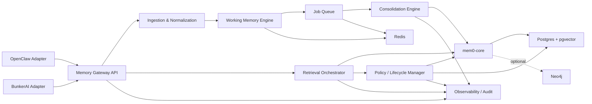
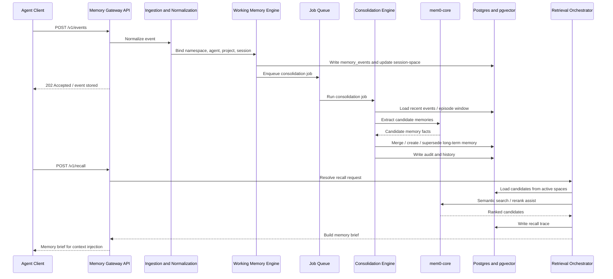
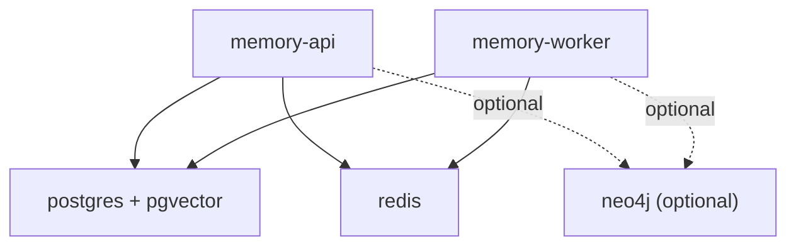
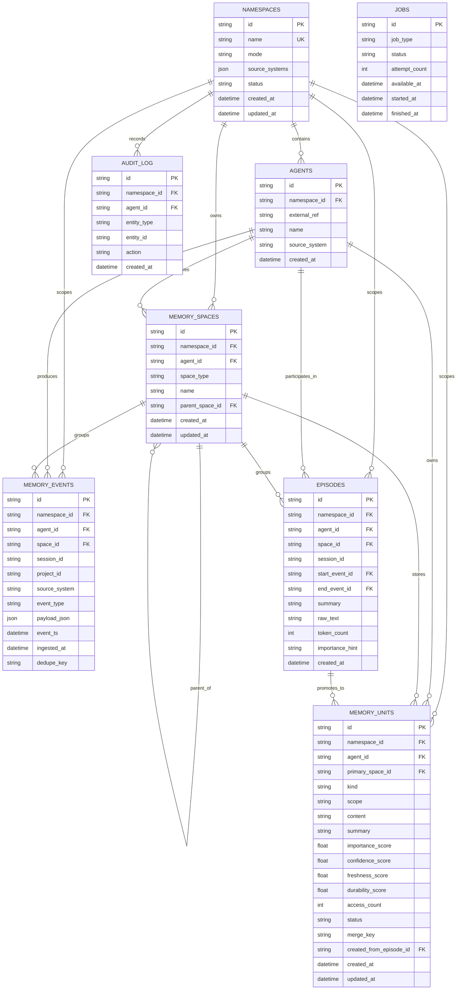
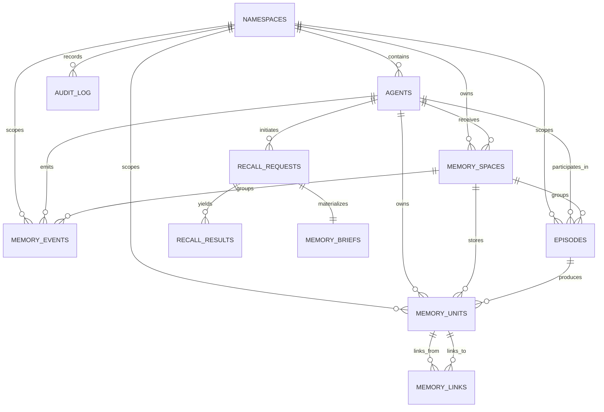
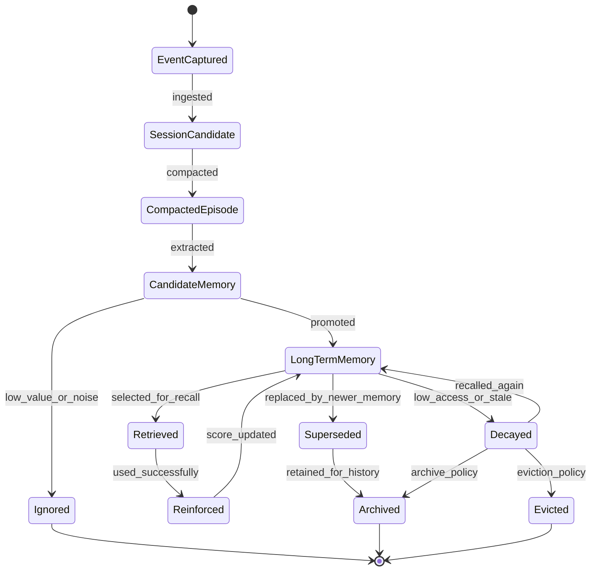

# Agent Memory Runtime System Design v1

Технический дизайн первой версии автономного memory runtime поверх `mem0-core`.

Документ развивает решения из [agent-memory-runtime-v1.md](/Users/slava/Documents/mem0-src/docs/core-concepts/agent-memory-runtime-v1.md) и переводит их в инженерную схему реализации.

## Статус

- Draft v1
- Цель: зафиксировать архитектуру MVP и последовательность реализации
- Горизонт: первая рабочая версия для `OpenClaw` и `BunkerAI`

## 1. Цель системы

Построить отдельный self-hosted memory runtime, который:

- принимает события агентной работы
- ведет short-term и long-term memory
- консолидирует память автономно
- извлекает релевантный memory brief под задачу
- поддерживает shared и isolated режимы для нескольких агентов
- использует `mem0` как базовый engine, но сам владеет orchestration и lifecycle

## 2. Дизайн-принципы

### Главные приоритеты

- качество recall выше latency
- agent-centric memory model
- явная модель memory spaces
- автономная консолидация без human review
- простая self-hosted сборка через Docker

### Принципы реализации

- `mem0` остается ядром extraction / storage / retrieval primitives
- новый runtime отвечает за orchestration
- краткосрочная и долгосрочная память моделируются явно
- retrieval должен быть budget-aware и space-aware
- все важные решения системы должны быть наблюдаемы через audit trail

## 3. Не-цели v1

- distributed multi-region deployment
- enterprise-grade authn/authz perimeter
- heavy UI layer для memory curation
- multimodal-first memory
- online learning с немедленным обновлением моделей ранжирования

## 4. Высокоуровневая архитектура



### 4.1 Sequence Diagram: Full Memory Cycle

Ниже показан целевой процесс полного цикла `event -> consolidation -> recall -> context injection`.



## 5. Логическая декомпозиция

### 5.1 Memory Gateway API

Точка входа для интеграций.

Ответственность:

- прием событий и запросов recall
- управление namespaces и memory spaces
- explicit memory operations
- выдача memory briefs

Форматы:

- REST для сервисов
- MCP facade для агентных клиентов
- позже optional OpenAI-compatible facade

### 5.2 Ingestion & Normalization

Преобразует сырой input в единый event model.

Ответственность:

- нормализация ролей и источников
- привязка к namespace / agent / project / session
- trust and source tagging
- предварительная фильтрация шума
- episode segmentation

Вход:

- сообщения
- tool outputs
- task lifecycle events
- summaries
- explicit memory commands

Выход:

- `MemoryEvent`
- `Episode`

### 5.3 Working Memory Engine

Обслуживает краткосрочную память.

Ответственность:

- session append
- короткий retention
- compaction window
- dedup внутри session
- episode snapshots
- быстрый lookup недавнего контекста

Реализация:

- hot layer в `Postgres`
- краткоживущие индексы и кэш в `Redis`

### 5.4 Consolidation Engine

Фоновая консолидация short-term -> long-term.

Ответственность:

- extraction candidates
- merge / update existing memory
- contradiction detection
- compression of repeated episodes
- promotion into target memory spaces

Инвариант:

- никакой сырой session log не становится long-term memory без промежуточной обработки

### 5.5 Retrieval Orchestrator

Главный слой качества.

Ответственность:

- определение релевантных memory spaces
- multi-pass retrieval
- reranking
- context budgeting
- memory brief assembly

Вход:

- query
- agent_id
- namespace_id
- active session/project
- context budget

Выход:

- `MemoryBrief`
- optional retrieval trace

### 5.6 Lifecycle Manager

Управляет эволюцией памяти.

Ответственность:

- TTL for short-term
- decay scoring
- demotion/promotion
- archival
- eviction
- scheduled compression

### 5.7 Observability & Audit

Ответственность:

- logs
- metrics
- recall traces
- consolidation traces
- lifecycle decisions
- usefulness signals

## 6. Namespace model

Система должна поддерживать два режима:

### 6.1 Isolated mode

Каждая интеграция или агент использует отдельное дерево памяти.

Пример:

- `namespace = openclaw:agent:planner`
- `namespace = bunkerai:agent:researcher`

### 6.2 Shared mode

Когда `OpenClaw` и `BunkerAI` работают как единая система, они пишут и читают из общего namespace.

Пример:

- `namespace = cluster:project-alpha:shared`

При этом внутри namespace все равно сохраняются:

- `agent_id`
- `source_system`
- `session_id`

Это нужно для трассировки и будущих политик retrieval.

## 7. Memory spaces

Внутри namespace действует иерархия memory spaces.

### Базовые space types

- `agent-core`
- `shared-space`
- `project-space`
- `session-space`

### Правила использования

- `agent-core` хранит долговечные свойства агента и процедурную память
- `shared-space` хранит знания, полезные нескольким агентам в кластере
- `project-space` хранит проектный контекст и решения
- `session-space` хранит рабочую оперативную память с коротким retention

### Важно

Одна и та же memory unit может логически быть связана с несколькими spaces, но v1 лучше начинать с одного primary space и optional secondary links.

## 8. Deployment topology v1

### Обязательные сервисы Docker Compose

- `memory-api`
- `memory-worker`
- `postgres`
- `redis`

### Опциональные сервисы

- `neo4j`
- `otel-collector`
- `prometheus`
- `grafana`

### Рекомендуемая схема



## 9. Storage design

### 9.1 Основной принцип

`Postgres` является source of truth для:

- namespaces
- spaces
- episodes
- memory units
- links
- jobs
- audit
- recall traces

`pgvector` используется для embedding retrieval.

`Redis` используется для:

- async job queue
- short-lived caches
- idempotency / locks

`Neo4j` опционален для relation-heavy augmentation.

## 10. Предлагаемая схема таблиц

Ниже логическая схема. Это не финальный SQL, а контракт на сущности.

### 10.1 ER Diagram: Current Implemented Baseline

Ниже диаграмма отражает текущий уже реализованный baseline в коде по состоянию после `Phase E`.



### 10.2 ER Diagram: Target Logical Model

Ниже более широкая целевая модель для следующих фаз проекта.



### `namespaces`

- `id`
- `name`
- `mode` (`isolated` | `shared`)
- `source_systems`
- `created_at`
- `updated_at`
- `status`

### `agents`

- `id`
- `namespace_id`
- `external_ref`
- `name`
- `source_system`
- `created_at`

### `memory_spaces`

- `id`
- `namespace_id`
- `agent_id` nullable
- `space_type`
- `name`
- `parent_space_id` nullable
- `retention_policy_id` nullable
- `created_at`
- `updated_at`

### `memory_events`

- `id`
- `namespace_id`
- `agent_id`
- `space_id`
- `session_id`
- `project_id` nullable
- `source_system`
- `event_type`
- `payload_json`
- `event_ts`
- `ingested_at`
- `dedupe_key`

### `episodes`

- `id`
- `namespace_id`
- `agent_id`
- `space_id`
- `session_id`
- `start_event_id`
- `end_event_id`
- `summary`
- `raw_text`
- `token_count`
- `importance_hint`
- `created_at`

### `memory_units`

- `id`
- `namespace_id`
- `agent_id` nullable
- `primary_space_id`
- `kind`
- `scope`
- `content`
- `summary`
- `embedding`
- `importance_score`
- `confidence_score`
- `freshness_score`
- `durability_score`
- `access_count`
- `last_accessed_at`
- `status`
- `expires_at` nullable
- `created_from_episode_id` nullable
- `supersedes_memory_id` nullable
- `created_at`
- `updated_at`

### `memory_links`

- `id`
- `namespace_id`
- `src_memory_id`
- `dst_memory_id`
- `link_type`
- `weight`
- `created_at`

### `recall_requests`

- `id`
- `namespace_id`
- `agent_id`
- `session_id` nullable
- `query`
- `context_budget_tokens`
- `space_filter_json`
- `created_at`

### `recall_results`

- `id`
- `request_id`
- `memory_id`
- `retrieval_stage`
- `base_score`
- `rerank_score`
- `selected`
- `selection_reason`

### `memory_briefs`

- `id`
- `request_id`
- `brief_markdown`
- `token_count`
- `created_at`

### `lifecycle_policies`

- `id`
- `name`
- `space_type`
- `ttl_seconds` nullable
- `decay_config_json`
- `eviction_config_json`
- `compression_config_json`
- `created_at`

### `jobs`

- `id`
- `job_type`
- `payload_json`
- `status`
- `attempt_count`
- `available_at`
- `started_at`
- `finished_at`
- `error_text`

### `audit_log`

- `id`
- `namespace_id`
- `agent_id` nullable
- `entity_type`
- `entity_id`
- `action`
- `details_json`
- `created_at`

## 11. API contract v1

Ниже минимальный API surface для запуска MVP.

### 11.1 Namespace management

`POST /v1/namespaces`

Создать namespace.

`GET /v1/namespaces/{namespace_id}`

Получить описание namespace.

`POST /v1/namespaces/{namespace_id}/agents`

Зарегистрировать агента внутри namespace.

### 11.2 Event ingestion

`POST /v1/events`

Принять событие агентной работы.

Пример payload:

```json
{
  "namespace_id": "cluster:project-alpha:shared",
  "agent_id": "openclaw-planner",
  "source_system": "openclaw",
  "session_id": "run_123",
  "space_hint": "session-space",
  "event_type": "conversation_turn",
  "timestamp": "2026-04-19T12:00:00Z",
  "messages": [
    {"role": "user", "content": "Continue the migration plan"},
    {"role": "assistant", "content": "I updated the architecture notes"}
  ],
  "metadata": {
    "project_id": "mem-runtime"
  }
}
```

### 11.3 Recall

`POST /v1/recall`

Вернуть memory brief.

Пример payload:

```json
{
  "namespace_id": "cluster:project-alpha:shared",
  "agent_id": "openclaw-planner",
  "session_id": "run_123",
  "query": "What decisions already exist about the memory runtime architecture?",
  "context_budget_tokens": 1200,
  "space_filter": ["agent-core", "project-space", "shared-space", "session-space"]
}
```

Пример ответа:

```json
{
  "brief": {
    "critical_facts": [
      "The system is agent-centric and uses hierarchical memory spaces."
    ],
    "active_project_context": [
      "v1 prioritizes recall quality over low latency."
    ],
    "prior_decisions": [
      "Neo4j is optional in v1; Postgres + pgvector + Redis is the baseline."
    ],
    "standing_procedures": [],
    "recent_session_carryover": []
  },
  "trace_id": "recall_abc123"
}
```

### 11.4 Adapter contracts

`POST /v1/adapters/openclaw/events`

Записать событие через контракт интеграции `OpenClaw`.
`source_system` фиксируется адаптером и не передается снаружи.

`POST /v1/adapters/openclaw/recall`

Сделать recall через контракт интеграции `OpenClaw`.

`POST /v1/adapters/bunkerai/events`

Записать событие через контракт интеграции `BunkerAI`.

`POST /v1/adapters/bunkerai/recall`

Сделать recall через контракт интеграции `BunkerAI`.

Адаптерный слой в текущей реализации:

- валидирует, что namespace поддерживает нужный `source_system`
- валидирует, что агент принадлежит нужному adapter/source-system
- оборачивает базовые `events/recall` ответы в стабильный integration contract
- сохраняет межагентную видимость только для `shared-space`

### 11.5 Explicit memory ops

`POST /v1/memories`

Явно создать memory unit.

`PATCH /v1/memories/{memory_id}`

Обновить memory unit.

`DELETE /v1/memories/{memory_id}`

Удалить memory unit.

`GET /v1/memories/{memory_id}/history`

Посмотреть историю memory unit.

### 11.6 Space inspection

`GET /v1/spaces/{space_id}/memories`

Посмотреть memory units внутри space.

`POST /v1/spaces/{space_id}/compact`

Форсировать compaction / consolidation.

## 12. Async job model

### Типы job'ов v1

- `episode_compaction`
- `memory_consolidation`
- `memory_decay`
- `memory_eviction`
- `memory_compression`
- `brief_refresh`

### Базовый flow

1. API принимает `MemoryEvent`
2. Event пишется в `memory_events`
3. На основе окна событий создается или обновляется `Episode`
4. В очередь ставится `episode_compaction` или `memory_consolidation`
5. Worker вызывает `mem0-core` для extraction / merge / search primitives
6. Результат записывается в `memory_units`
7. Lifecycle jobs по расписанию корректируют веса и архивируют слабую память

## 13. Retrieval pipeline v1

### Этап 1. Scope resolution

Определить, из каких spaces нужно читать:

- всегда `session-space`
- обычно `project-space`
- `agent-core` почти всегда
- `shared-space` только при shared namespace или явном запросе

### Этап 2. Candidate gathering

Собрать кандидатов:

- vector retrieval по query
- metadata filtering по `space_type`, `agent_id`, `project_id`, `session_id`
- recency pass для недавних session memories
- optional linked memory expansion

### Этап 3. Reranking

Итоговый score должен учитывать:

- semantic similarity
- importance_score
- freshness_score
- access history
- same-session / same-project affinity

Пример логики score:

`final_score = semantic * 0.45 + importance * 0.20 + freshness * 0.15 + affinity * 0.10 + usefulness * 0.10`

Точные коэффициенты не фиксируются навсегда, но модель должна позволять их менять конфигом.

### Этап 4. Packing

Не просто вернуть top-k, а собрать brief по слотам:

- `critical_facts`
- `active_project_context`
- `prior_decisions`
- `standing_procedures`
- `recent_session_carryover`

### Этап 5. Trace logging

Каждый recall должен оставлять trace:

- какие spaces были просмотрены
- какие memories были кандидатами
- какие были выбраны
- почему они были включены

## 14. Consolidation pipeline v1

### Цель

Превращать поток событий и эпизодов в устойчивую долгосрочную память.

### Этапы

1. `episode formation`
2. `noise reduction`
3. `candidate extraction`
4. `dedup against existing memory`
5. `merge / update / create decision`
6. `promotion into target space`
7. `history + audit write`

### Правила target space selection

- procedural / agent identity memory -> `agent-core`
- cross-agent useful project knowledge -> `shared-space`
- project-specific knowledge -> `project-space`
- short-lived unresolved context -> остается в `session-space`

## 15. Forgetting and lifecycle

### 15.1 State Diagram: Memory Unit Lifecycle

Ниже показан целевой жизненный цикл одной `memory unit` от момента появления сигнала до усиления, архивирования или вытеснения.



### Session-space

- жесткий TTL
- compaction window
- сжатие хвостов длинных диалогов

### Project-space

- более мягкий decay
- periodic compression
- archival of stale low-value items

### Agent-core

- почти без TTL
- обновление через merge/supersede
- высокий порог на создание и удаление

### Shared-space

- средний retention
- emphasis на dedup и contradiction handling

## 16. Интеграция с существующим кодом

### Что можно переиспользовать напрямую

- `mem0/memory/main.py` как core memory engine
- `mem0/memory/storage.py` подходы к history
- `openclaw/filtering.ts` как источник правил шумоподавления
- `openclaw/config.ts` как сильную базу extraction instructions
- `server/main.py` как reference для минимального REST surface

### Что нужно вынести в новый слой

- namespace model
- memory spaces
- event ingestion contract
- retrieval orchestrator
- lifecycle manager
- queue-driven consolidation
- shared/isolated runtime semantics

## 17. MVP implementation outline

### Sprint 1

- создать новый сервисный каталог для `memory-runtime`
- поднять FastAPI app
- описать конфиг и Docker Compose
- подключить Postgres и Redis
- реализовать `POST /v1/events`
- реализовать `POST /v1/recall` в упрощенном виде

### Sprint 2

- ввести `namespaces`, `agents`, `memory_spaces`
- реализовать working memory persistence
- добавить worker и queue
- реализовать episode formation

### Sprint 3

- реализовать consolidation engine
- реализовать create/update/merge semantics
- построить первую версию `memory_brief`

### Sprint 4

- реализовать lifecycle jobs
- добавить audit trail и recall traces
- интегрировать OpenClaw adapter в TypeScript client/runtime

### Sprint 5

- добавить BunkerAI adapter в клиентский runtime
- расширить shared namespace mode до long-term `memory_units` retrieval
- настроить usefulness signals и базовую автооптимизацию

## 18. Ключевые риски

### 1. Пересохранение шума

Риск:

- runtime будет слишком активно переносить transient context в long-term

Снижение риска:

- сильный episode compaction
- высокий порог promotion
- обязательный merge/dedup layer

### 2. Переусложнение storage с первого дня

Риск:

- попытка сразу сделать обязательный graph layer усложнит MVP

Снижение риска:

- `Neo4j` только как optional enhancement

### 3. Retrieval pollution

Риск:

- mixed spaces начнут засорять друг друга

Снижение риска:

- explicit space-aware retrieval
- separate scoring features for each space

### 4. Слабая explainability

Риск:

- без trace логов трудно улучшать recall

Снижение риска:

- recall trace обязателен уже в v1

## 19. Открытые решения следующего уровня

Следующим пакетом решений нужно будет определить:

- финальный формат `MemoryBrief`
- SQL schema v1
- job runner technology
- конфигурационную модель retention policies
- evolution-политику adapter contracts для `OpenClaw`
- evolution-политику adapter contracts для `BunkerAI`
- где кончается `mem0-core` и начинается `memory-runtime`

## 20. Следующий артефакт

После этого документа логично подготовить три прикладных артефакта:

1. `ADR-001: Why memory-runtime is a separate service over mem0-core`
2. `ADR-002: Why Postgres + pgvector + Redis is the v1 baseline`
3. `Implementation Plan v1` с деревом каталогов, модулями и первым набором задач
