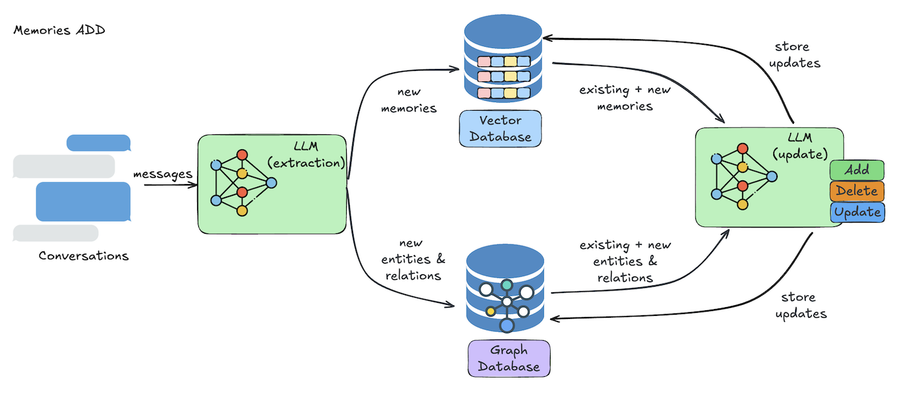

<Snippet file="paper-release.mdx" />

Mem0 provides two core operations for managing memories in AI applications: adding new memories and searching existing ones. This guide covers how these operations work and how to use them effectively in your application.

## Core Operations

Mem0 exposes two main endpoints for interacting with memories:
- The `add` endpoint for ingesting conversations and storing them as memories
- The `search` endpoint for retrieving relevant memories based on queries

### Adding Memories

<Frame caption="Architecture diagram illustrating the process of adding memories.">
  
</Frame>

The add operation processes conversations through several steps:

1. **Information Extraction**
   * An LLM extracts relevant memories from the conversation
   * It identifies important entities and their relationships

2. **Conflict Resolution**
   * The system compares new information with existing data
   * It identifies and resolves any contradictions

3. **Memory Storage**
   * Vector database stores the actual memories
   * Graph database maintains relationship information
   * Information is continuously updated with each interaction

### Searching Memories

<Frame caption="Architecture diagram illustrating the memory search process.">
  
</Frame>

The search operation retrieves memories through a multi-step process:

1. **Query Processing**
   * LLM processes and optimizes the search query
   * System prepares filters for targeted search

2. **Vector Search**
   * Performs semantic search using the optimized query
   * Ranks results by relevance to the query
   * Applies specified filters (user, agent, metadata, etc.)

3. **Result Processing**
   * Combines and ranks the search results
   * Returns memories with relevance scores
   * Includes associated metadata and timestamps

This semantic search approach ensures accurate memory retrieval, whether you're looking for specific information or exploring related concepts.