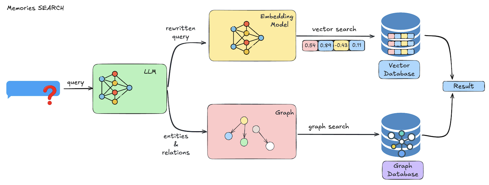

## Overview

The `search` operation allows you to retrieve relevant memories based on a natural language query and optional filters like user ID, agent ID, categories, and more. This is the foundation of giving your agents memory-aware behavior.

Mem0 supports:
- Semantic similarity search
- Metadata filtering (with advanced logic)
- Reranking and thresholds
- Cross-agent, multi-session context resolution

This applies to both:
- **Mem0 Platform** (hosted API with full-scale features)
- **Mem0 Open Source** (local-first with LLM inference and local vector DB)


## Architecture

<Frame caption="Architecture diagram illustrating the memory search process.">
  
</Frame>

When you call `search`, Mem0 performs the following steps:

1. **Query Processing**
   An LLM refines and optimizes your natural language query.

2. **Vector Search**
   Semantic embeddings are used to find the most relevant memories using cosine similarity.

3. **Filtering & Ranking**
   Logical and comparison-based filters are applied. Memories are scored, filtered, and optionally reranked.

4. **Results Delivery**
   Relevant memories are returned with associated metadata and timestamps.

---

## Example: Mem0 Platform

<CodeGroup>
```python Python
from mem0 import MemoryClient

client = MemoryClient(api_key="your-api-key")

query = "What do you know about me?"
filters = {
   "OR": [
      {"user_id": "alice"},
      {"agent_id": {"in": ["travel-assistant", "customer-support"]}}
   ]
}

results = client.search(query, filters=filters)
```

```javascript JavaScript
import { MemoryClient } from "mem0ai";

const client = new MemoryClient({apiKey: "your-api-key"});

const query = "I'm craving some pizza. Any recommendations?";
const filters = {
  AND: [
    { user_id: "alice" }
  ]
};

const results = await client.search(query, {
  filters
});
```
</CodeGroup>

---

## Example: Mem0 Open Source

<CodeGroup>
```python Python
from mem0 import Memory

m = Memory()

# Simple search
related_memories = m.search("Should I drink coffee or tea?", user_id="alice")

# Search with filters
memories = m.search(
    "food preferences",
    user_id="alice",
    filters={"categories": {"contains": "diet"}}
)
```

```javascript JavaScript
import { Memory } from 'mem0ai/oss';

const memory = new Memory();

// Simple search
const relatedMemories = memory.search("Should I drink coffee or tea?", { userId: "alice" });

// Search with filters (if supported)
const memories = memory.search("food preferences", {
    userId: "alice",
    filters: { categories: { contains: "diet" } }
});
```
</CodeGroup>

---

## Using Filters

Filters help narrow down search results. Common use cases:

**Filter by Session Context:**
```python
# Get memories from a specific agent session
m.search("query", user_id="alice", agent_id="chatbot", run_id="session-123")
```

**Filter by Date Range:**
```python
# Platform only - date filtering
client.search("recent memories", filters={
    "AND": [
        {"user_id": "alice"},
        {"created_at": {"gte": "2024-07-01"}}
    ]
})
```

**Filter by Categories:**
```python
# Platform only - category filtering
client.search("preferences", filters={
    "AND": [
        {"user_id": "alice"},
        {"categories": {"contains": "food"}}
    ]
})
```

---

## Tips for Better Search

- **Use natural language**: Mem0 understands intent, so describe what you're looking for naturally
- **Scope with session IDs**: Always provide at least `user_id` to scope search to relevant memories
- **Combine filters**: Use AND/OR logic to create precise queries (Platform)
- **Consider wildcard filters**: Use wildcard filters (e.g., `run_id: "*"`) for broader matches
- **Tune parameters**: Adjust `top_k` for result count, `threshold` for relevance cutoff
- **Enable reranking**: Use `rerank=True` (default) when you have a reranker configured


### More Details

For the full list of filter logic, comparison operators, and optional search parameters, see the
[Search Memory API Reference](/api-reference/memory/search-memories).

## Need help?
If you have any questions, please feel free to reach out to us using one of the following methods:

<Snippet file="get-help.mdx"/>
