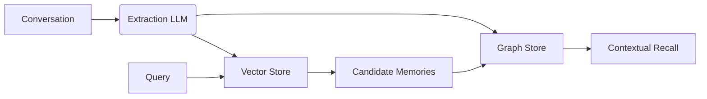

Graph Memory extends Mem0 by persisting nodes and edges alongside embeddings, so recalls stitch together people, places, and events instead of just keywords.

<Info icon="sparkles">
**You’ll use this when…**
- Conversation history mixes multiple actors and objects that vectors alone blur together
- Compliance or auditing demands a graph of who said what and when
- Agent teams need shared context without duplicating every memory in each run
</Info>

## How Graph Memory Maps Context

Mem0 extracts entities and relationships from every memory write, stores embeddings in your vector database, and mirrors relationships in a graph backend. On retrieval, vector search narrows candidates while the graph returns related context alongside the results.



## How It Works

<Steps>
<Step title="Extract people, places, and facts">
Mem0’s extraction LLM identifies entities, relationships, and timestamps from the conversation payload you send to `memory.add`.
</Step>
<Step title="Store vectors and edges together">
Embeddings land in your configured vector database while nodes and edges flow into a Bolt-compatible graph backend (Neo4j, Memgraph, Neptune, or Kuzu).
</Step>
<Step title="Expose graph context at search time">
`memory.search` performs vector similarity (optionally reranked by your configured reranker) and returns the results list. Graph Memory runs in parallel and adds related entities in the `relations` array—it does not reorder the vector hits automatically.
</Step>
</Steps>

## Quickstart (Neo4j Aura)

<Info icon="clock">
**Time to implement:** ~10 minutes · **Prerequisites:** Python 3.10+, Node.js 18+, Neo4j Aura DB (free tier)
</Info>

Provision a free [Neo4j Aura](https://neo4j.com/product/auradb/) instance, copy the Bolt URI, username, and password, then follow the language tab that matches your stack.

<Tabs>
  <Tab title="Python">
<Steps>
<Step title="Install Mem0 with graph extras">
```bash
pip install "mem0ai[graph]"
```
</Step>
<Step title="Export Neo4j credentials">
```bash
export NEO4J_URL="neo4j+s://<your-instance>.databases.neo4j.io"
export NEO4J_USERNAME="neo4j"
export NEO4J_PASSWORD="your-password"
```
</Step>
<Step title="Add and recall a relationship">
```python
import os
from mem0 import Memory

config = {
    "graph_store": {
        "provider": "neo4j",
        "config": {
            "url": os.environ["NEO4J_URL"],
            "username": os.environ["NEO4J_USERNAME"],
            "password": os.environ["NEO4J_PASSWORD"],
            "database": "neo4j",
        }
    }
}

memory = Memory.from_config(config)

conversation = [
    {"role": "user", "content": "Alice met Bob at GraphConf 2025 in San Francisco."},
    {"role": "assistant", "content": "Great! Logging that connection."},
]

memory.add(conversation, user_id="demo-user")

results = memory.search(
    "Who did Alice meet at GraphConf?",
    user_id="demo-user",
    limit=3,
    rerank=True,
)

for hit in results["results"]:
    print(hit["memory"])
```
</Step>
</Steps>
  </Tab>
  <Tab title="TypeScript">
<Steps>
<Step title="Install the OSS SDK">
```bash
npm install mem0ai
```
</Step>
<Step title="Load Neo4j credentials">
```bash
export NEO4J_URL="neo4j+s://<your-instance>.databases.neo4j.io"
export NEO4J_USERNAME="neo4j"
export NEO4J_PASSWORD="your-password"
```
</Step>
<Step title="Enable graph memory and query it">
```typescript
import { Memory } from "mem0ai/oss";

const config = {
  enableGraph: true,
  graphStore: {
    provider: "neo4j",
    config: {
      url: process.env.NEO4J_URL!,
      username: process.env.NEO4J_USERNAME!,
      password: process.env.NEO4J_PASSWORD!,
      database: "neo4j",
    },
  },
};

const memory = new Memory(config);

const conversation = [
  { role: "user", content: "Alice met Bob at GraphConf 2025 in San Francisco." },
  { role: "assistant", content: "Great! Logging that connection." },
];

await memory.add(conversation, { userId: "demo-user" });

const results = await memory.search(
  "Who did Alice meet at GraphConf?",
  { userId: "demo-user", limit: 3, rerank: true }
);

results.results.forEach((hit) => {
  console.log(hit.memory);
});
```
</Step>
</Steps>
  </Tab>
</Tabs>

<Info icon="check">
Expect to see **Alice met Bob at GraphConf 2025** in the output. In Neo4j Browser run `MATCH (p:Person)-[r]->(q:Person) RETURN p,r,q LIMIT 5;` to confirm the edge exists.
</Info>

<Note>
Graph Memory enriches responses by adding related entities in the `relations` key. The ordering of `results` always comes from vector search (plus any reranker you configure); graph edges do not reorder those hits automatically.
</Note>

## Operate Graph Memory Day-to-Day

<AccordionGroup>
  <Accordion title="Refine extraction prompts">
    Guide which relationships become nodes and edges.

<CodeGroup>
```python Python
import os
from mem0 import Memory

config = {
    "graph_store": {
        "provider": "neo4j",
        "config": {
            "url": os.environ["NEO4J_URL"],
            "username": os.environ["NEO4J_USERNAME"],
            "password": os.environ["NEO4J_PASSWORD"],
        },
        "custom_prompt": "Please only capture people, organisations, and project links.",
    }
}

memory = Memory.from_config(config_dict=config)
```

```typescript TypeScript
import { Memory } from "mem0ai/oss";

const config = {
  enableGraph: true,
  graphStore: {
    provider: "neo4j",
    config: {
      url: process.env.NEO4J_URL!,
      username: process.env.NEO4J_USERNAME!,
      password: process.env.NEO4J_PASSWORD!,
    },
    customPrompt: "Please only capture people, organisations, and project links.",
  }
};

const memory = new Memory(config);
```
</CodeGroup>
  </Accordion>
  <Accordion title="Raise the confidence threshold">
    Keep noisy edges out of the graph by demanding higher extraction confidence.

```python
config["graph_store"]["config"]["threshold"] = 0.75
```
  </Accordion>
  <Accordion title="Toggle graph writes per request">
    Disable graph writes or reads when you only want vector behaviour.

```python
memory.add(messages, user_id="demo-user", enable_graph=False)
results = memory.search("marketing partners", user_id="demo-user", enable_graph=False)
```
  </Accordion>
  <Accordion title="Organize multi-agent graphs">
    Separate or share context across agents and sessions with `user_id`, `agent_id`, and `run_id`.

<CodeGroup>
```typescript TypeScript
memory.add("I prefer Italian cuisine", { userId: "bob", agentId: "food-assistant" });
memory.add("I'm allergic to peanuts", { userId: "bob", agentId: "health-assistant" });
memory.add("I live in Seattle", { userId: "bob" });

const food = await memory.search("What food do I like?", { userId: "bob", agentId: "food-assistant" });
const allergies = await memory.search("What are my allergies?", { userId: "bob", agentId: "health-assistant" });
const location = await memory.search("Where do I live?", { userId: "bob" });
```
</CodeGroup>
  </Accordion>
</AccordionGroup>

<Note>
Monitor graph growth, especially on free tiers, by periodically cleaning dormant nodes: `MATCH (n) WHERE n.lastSeen < date() - duration('P90D') DETACH DELETE n`.
</Note>

## Troubleshooting

<AccordionGroup>
  <Accordion title="Neo4j connection refused">
    Confirm Bolt connectivity is enabled, credentials match Aura, and your IP is allow-listed. Retry after confirming the URI format is `neo4j+s://...`.
  </Accordion>
  <Accordion title="Neptune Analytics rejects requests">
    Ensure the graph identifier matches the vector dimension used by your embedder and that the IAM role allows `neptune-graph:*DataViaQuery` actions.
  </Accordion>
  <Accordion title="Graph store outage fallback">
    Catch the provider error and retry with `enable_graph=False` so vector-only search keeps serving responses while the graph backend recovers.
  </Accordion>
</AccordionGroup>

## Decision Points

- Select the graph store that fits your deployment (managed Aura vs. self-hosted Neo4j vs. AWS Neptune vs. local Kuzu).
- Decide when to enable graph writes per request; routine conversations may stay vector-only to save latency.
- Set a policy for pruning stale relationships so your graph stays fast and affordable.

## Provider setup

Choose your backend and expand the matching panel for configuration details and links.

<AccordionGroup>
  <Accordion title="Neo4j Aura or self-hosted">
    Install the APOC plugin for self-hosted deployments, then configure Mem0:

```typescript
import { Memory } from "mem0ai/oss";

const config = {
    enableGraph: true,
    graphStore: {
        provider: "neo4j",
        config: {
            url: "neo4j+s://<HOST>",
            username: "neo4j",
            password: "<PASSWORD>",
        }
    }
};

const memory = new Memory(config);
```

Additional docs: [Neo4j Aura Quickstart](https://neo4j.com/docs/aura/), [APOC installation](https://neo4j.com/docs/apoc/current/installation/).
  </Accordion>
  <Accordion title="Memgraph (Docker)">
    Run Memgraph Mage locally with schema introspection enabled:

```bash
docker run -p 7687:7687 memgraph/memgraph-mage:latest --schema-info-enabled=True
```

Then point Mem0 at the instance:

```python
from mem0 import Memory

config = {
    "graph_store": {
        "provider": "memgraph",
        "config": {
            "url": "bolt://localhost:7687",
            "username": "memgraph",
            "password": "your-password",
        },
    },
}

m = Memory.from_config(config_dict=config)
```

Learn more: [Memgraph Docs](https://memgraph.com/docs).
  </Accordion>
  <Accordion title="Amazon Neptune Analytics">
    Match vector dimensions between Neptune and your embedder, enable public connectivity (if needed), and grant IAM permissions:

```python
from mem0 import Memory

config = {
    "graph_store": {
        "provider": "neptune",
        "config": {
            "endpoint": "neptune-graph://<GRAPH_ID>",
        },
    },
}

m = Memory.from_config(config_dict=config)
```

Reference: [Neptune Analytics Guide](https://docs.aws.amazon.com/neptune/latest/analytics/).
  </Accordion>
  <Accordion title="Amazon Neptune DB (with external vectors)">
    Create a Neptune cluster, enable the public endpoint if you operate outside the VPC, and point Mem0 at the host:

```python
from mem0 import Memory

config = {
    "graph_store": {
        "provider": "neptunedb",
        "config": {
            "collection_name": "<VECTOR_COLLECTION_NAME>",
            "endpoint": "neptune-graph://<HOST_ENDPOINT>",
        },
    },
}

m = Memory.from_config(config_dict=config)
```

Reference: [Accessing Data in Neptune DB](https://docs.aws.amazon.com/neptune/latest/userguide/).
  </Accordion>
  <Accordion title="Kuzu (embedded)">
    Kuzu runs in-process, so supply a path (or `:memory:`) for the database file:

```python
config = {
    "graph_store": {
        "provider": "kuzu",
        "config": {
            "db": "/tmp/mem0-example.kuzu"
        }
    }
}
```

Kuzu will clear its state when using `:memory:` once the process exits. See the [Kuzu documentation](https://kuzudb.com/docs/) for advanced settings.
  </Accordion>
</AccordionGroup>

<CardGroup cols={2}>
  <Card
    title="Enhanced Metadata Filtering"
    description="Blend field-level filters with graph context to zero in on the right memories."
    icon="funnel"
    href="/open-source/features/metadata-filtering"
  />
  <Card
    title="Reranker-Enhanced Search"
    description="Layer rerankers on top of vectors and graphs for the cleanest results."
    icon="sparkles"
    href="/open-source/features/reranker-search"
  />
</CardGroup>
