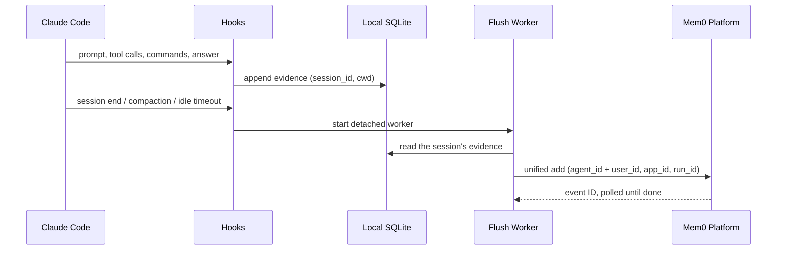
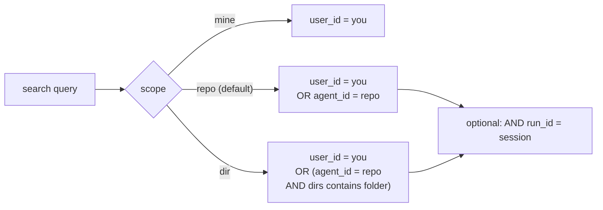

# Claude Code Plugin: Memory Scoping (v0.3.0)

The plugin remembers two kinds of things: facts about a **repo** (shared with everyone who works in that repo) and facts about **you** (private, follow you into every repo). Search always returns both, and you can narrow the repo half down to a folder or a single session.

## Memory scopes

- **Personal (user_id):** only you can read it. It has no repo attached, so it follows you everywhere.
- **Repo (agent_id):** anyone with access to that repo reads it. It has no user attached, so nobody's private facts leak into it.
- **Folder (app_id):** a repo memory also remembers the folder it was written in. Searching from a parent folder sees everything under it. Searching from a subfolder does **not** see the parent.
- **Session (run_id):** every memory carries the session ID, so one session can be recovered after compaction or handed to another agent.

## The four IDs

| ID | Meaning | How it is filled in | Example |
|----|---------|---------------------|---------|
| `user_id` | You. Personal lane. | `MEM0_CODE_USER_ID` env var, else the plugin asks once and stores it locally. Never derived from the repo. | `kartik` |
| `agent_id` | The repository. Shared lane. | `owner-repo` slug from `git remote origin`. No remote: `local-<folder>-<10 char hash of the path>`. Not a git repo: same local form for the starting folder. | `mem0ai-mem0` or `local-scratch-3f9a1c0b2e` |
| `app_id` | Which folder inside the repo. | Repo slug plus the folder relative to the git root. At the root it is just the slug. | `mem0ai-mem0/integrations/claude-code-plugin` |
| `run_id` | The Claude Code session. | The `session_id` Claude Code passes to every hook. No session ID, no write. | `8f2c...` |

### How the repo and subdirectory are recognized

1. Claude Code hands every hook the session's `cwd`. The plugin resolves symlinks (`/tmp/x` becomes `/private/tmp/x`).
2. `git rev-parse --show-toplevel` from that `cwd` gives the **repo root**. This is what makes a monorepo one repo: whichever subfolder you start in, git walks up to the same root.
3. `git config remote.origin.url` on the root gives the remote. `git@github.com:mem0ai/mem0.git` becomes the slug `mem0ai-mem0`. That slug is `agent_id`.
4. The **subdirectory** is `cwd` minus the root: `integrations/claude-code-plugin`. `app_id` = `slug/subdirectory`, and the folder chain `["integrations", "integrations/claude-code-plugin"]` is stored in `metadata.dirs` so parents can find it.
5. No remote: `agent_id` = `local-<root folder name>-<sha256 of the root path>[:10]`. No git at all: the starting folder is treated as the root.

> **Why `agent_id` for the repo and not `app_id`?** Because the Platform lets us search with `agent_id` only (no `user_id`), which is exactly what "shared with the whole repo, owned by nobody" needs.

## How a memory gets written



One add call per flush. The call carries both `agent_id` (repo) and `user_id` (personal) along with separate extraction instructions for each lane. The Platform classifies each extracted memory as project or personal internally.

| Field | Value |
|-------|-------|
| `agent_id` | Repo slug (`mem0ai-mem0`) |
| `user_id` | Your user ID (`kartik`) |
| `app_id` | `slug/dir` at the directory level |
| `run_id` | Session ID |
| `metadata` | `author`, `dirs` (folder chain), `branch`, `git_sha`, `source` |
| `agent_custom_instructions` | Tells the Platform what repo facts to keep and drop |
| `custom_instructions` | Tells the Platform what personal facts to keep and drop |
| `custom_categories` | `project_knowledge`, `decisions_and_constraints`, `workflows`, `problems_and_fixes`, `results` |

### What each instruction lane keeps and drops

| | Repo lane (`agent_custom_instructions`) | Personal lane (`custom_instructions`) |
|-|----------------------------------------|--------------------------------------|
| **Keeps** | Conventions, commands that work, gotchas, failed commands and their fix | Your preferences and habits |
| **Drops** | "This session worked in repo X", tokens, secrets, personal preferences | "The user has no preferences", repo facts, commands |

### Flush triggers

| Trigger | When | Force? |
|---------|------|--------|
| Session end | Claude Code fires `session-end` hook | Yes, flushes all unflushed events |
| Pre-compact | Claude Code fires `pre-compact` hook | Yes |
| Periodic | After `stop` hook, if 5+ exchanges, 10+ messages, or 40K+ chars accumulated | No, waits for threshold |
| Idle timeout | After `stop` hook, if no periodic checkpoint triggered but unflushed events exist | Yes, after 5 min delay (configurable via `MEM0_CODE_IDLE_FLUSH_SECONDS`) |

The idle timeout solves the case where a user walks away without ending the session. A background worker sleeps for the configured delay, then flushes whatever remains. If the session continues before the timeout, the worker finds nothing to flush and exits.

### Subagent (sidekick) handling

Subagent assignments and responses are captured in two ways:

1. **Transcript extraction:** `_agent_assignment()` and `_agent_response()` capture subagent activity from the main transcript.
2. **Sidekick outcome:** when a `sidekick_stop` event carries a `final_message`, it is appended to the extraction messages as a "Sidekick outcome:" block (unless the message is already present in the extraction, avoiding duplicates).

Both contribute to the extraction sent to the Platform.

## How search works



Every search is **personal OR repo**. Narrowing only ever shrinks the repo half.

| Scope | Filter sent to the Platform | Who sees what |
|-------|---------------------------|---------------|
| `mine` | `{"user_id": U}` | Only your personal facts. |
| `repo` (default) | `{"OR": [{"agent_id": P}, {"user_id": U}]}` | Your facts plus everything anyone learned in this repo. |
| `dir` | `{"OR": [{"AND": [{"agent_id": P}, {"metadata": {"dirs": {"contains": "services/billing"}}}]}, {"user_id": U}]}` | Your facts plus repo facts written in this folder or any folder below it. At the repo root this collapses to `repo`. |
| `run_id` | `{"AND": [<repo filter>, {"run_id": S}]}` | One session only. Used for handoff and post-compaction recovery. |

**Directory rule:** parent includes children, child never includes the parent. `services/` sees `services/billing` and `services/billing/src/workers`. `services/billing` does not see root memories. This works because every repo memory stores its whole folder chain in `metadata.dirs` and the Platform's `contains` on a list means "is a member."

## Architecture

```
integrations/claude-code-plugin/
├── adapters/claude/
│   ├── hook.py            Harness glue: maps Claude Code lifecycle events to engine calls
│   └── hooks/hooks.json   Hook registration for Claude Code
├── core/
│   ├── memory_core.py     Engine: evidence storage, checkpointing, extraction, search
│   ├── flush_worker.py    Detached background worker for async extraction
│   ├── mcp_server.py      MCP server exposing search_memories tool
│   ├── memory_cli.py      CLI backing the /mem0:* skills
│   └── telemetry.py       Usage telemetry
├── agents/
│   └── sidekick.md        Sidekick agent prompt
├── skills/                /mem0:* skill definitions
├── tests/
│   └── test_memory_core.py  147 contract + behavior tests
└── docs/
    ├── README.md          This file
    └── CONTRACT.md        Engine/harness contract specification
```

The `core/` and `adapters/claude/` split separates the engine from harness glue. A new per-harness plugin copies `core/` unchanged and writes a new adapter. See [CONTRACT.md](CONTRACT.md) for the full specification.

## Platform facts we depend on (verified live)

- `agent_id` search without `user_id` works.
- `app_id` supports exact match and `in`, not `contains` or wildcards. That is why the folder chain lives in metadata.
- `metadata.<list> contains X` is membership. `icontains` on metadata returns HTTP 400.
- The list endpoint (`/v2/memories/`) mishandles `OR` with an empty `user_id` branch; the search endpoint does not.

## Configuration

| Env var | Default | Purpose |
|---------|---------|---------|
| `MEM0_API_KEY` | (none) | Mem0 Platform API key |
| `MEM0_CODE_USER_ID` | (prompted) | Your user identifier |
| `MEM0_CODE_DATA_DIR` | `~/.mem0-code` | Where the SQLite database, pending packets, and logs live |
| `MEM0_CODE_AUTO_FLUSH` | `true` | Enable automatic flush on session end and compaction |
| `MEM0_CODE_IDLE_FLUSH_SECONDS` | `300` | Seconds of inactivity before auto-flushing unflushed events (0 to disable) |
| `MEM0_CODE_MIN_QUERY_CHARS` | `20` | Minimum prompt length to trigger first-prompt search |
| `MEM0_CODE_TOP_K` | `3` | Number of memories to return per search |
| `MEM0_CODE_MIN_SCORE` | `0.3` | Minimum relevance score for search results |
| `MEM0_CODE_SYNC_FLUSH` | `0` | Set to `1` to flush synchronously (for debugging) |
| `MEM0_CODE_SEARCH_ONCE_PER_SESSION` | `false` | Only search once per session |
| `MEM0_API_URL` | `https://api.mem0.ai` | Platform API base URL |
