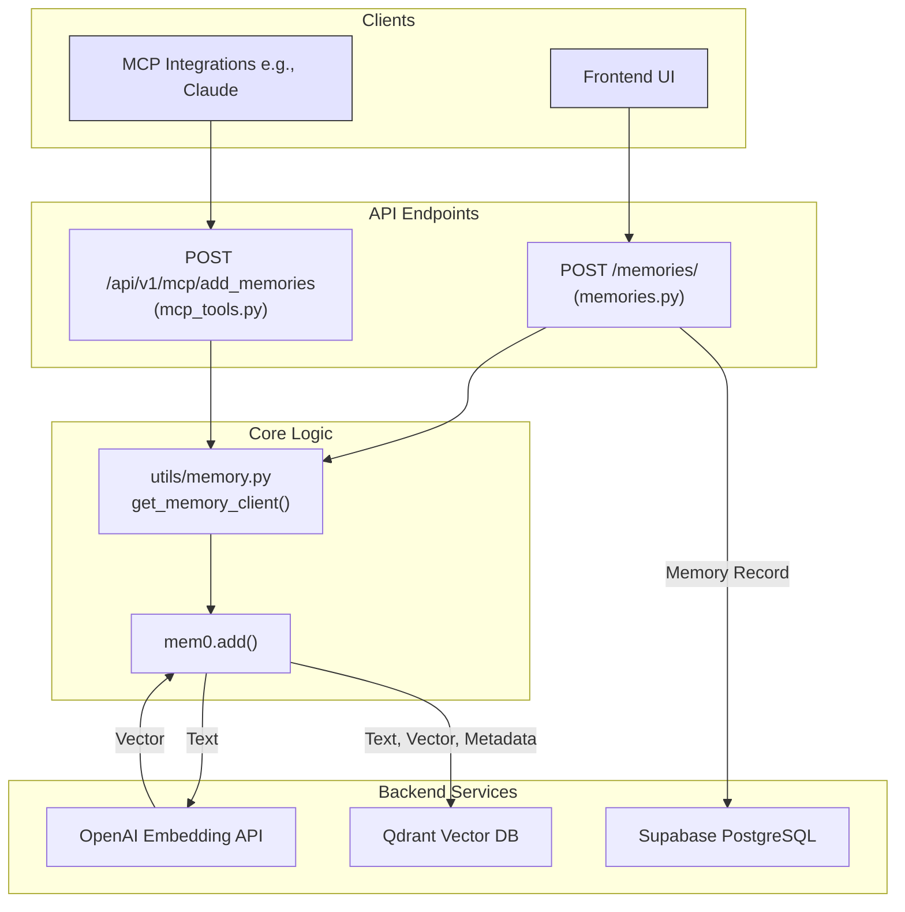

# Memory Ingestion Pipeline and Data Flow

This document provides a detailed, code-verified overview of the memory ingestion pipeline. It outlines how raw text from different sources is processed, vectorized, and stored within the platform's architecture.

## Core Ingestion Components

The entire ingestion process is centralized around a few key components:

1.  **`mem0` Python Client**: The core library responsible for handling the logic of vectorization and storage.
2.  **`get_memory_client()` Utility** (`app/utils/memory.py`): This function acts as a factory, configuring and initializing a `mem0.Memory` instance. It reads environment variables (`QDRANT_HOST`, `OPENAI_API_KEY`, etc.) to connect to the necessary downstream services.
3.  **OpenAI Embeddings**: The `text-embedding-3-small` model is used to convert raw text into numerical vector representations.
4.  **Qdrant Vector Database**: The primary storage for memory vectors, enabling semantic search.
5.  **Supabase PostgreSQL**: The primary storage for relational data, including user information and memory metadata for memories created via the UI.

## Ingestion Pipelines

There are two distinct entry points for ingesting memories, both of which converge on the same core processing logic.

### 1. Manual UI Ingestion

This pipeline is triggered when a user creates a memory through the frontend interface.

*   **Endpoint**: `POST /memories/`
*   **Source File**: `app/routers/memories.py`
*   **Function**: `create_memory`
*   **Input**: A JSON object matching the `CreateMemoryRequestData` schema, containing the memory `text` and optional `metadata`.

**Data Flow:**

1.  The frontend UI sends a request to the `POST /memories/` endpoint.
2.  The `create_memory` function is invoked.
3.  It calls `get_memory_client()` to get a pre-configured `mem0` instance.
4.  The `memory_client.add(text, ...)` method is called.
    *   `mem0` sends the raw text to the **OpenAI Embedding API**.
    *   `mem0` receives the vector embedding from OpenAI.
    *   `mem0` upserts the memory (original text, vector, and metadata) into the **Qdrant** collection. Qdrant assigns a unique ID to this new point.
5.  The `create_memory` function then creates a `Memory` object and saves it to the **Supabase PostgreSQL** database. This relational record holds the memory's content, user ID, and other metadata, linking it to the user's account.
6.  A `MemoryResponse` is returned to the client, confirming the creation.

### 2. Integration-Driven (MCP) Ingestion

This pipeline is triggered when an external tool or integration, such as Claude or Cursor, adds a memory via the MCP (Multi-Contributor Platform) tools API.

*   **Endpoint**: `POST /api/v1/mcp/add_memories`
*   **Source File**: `app/routers/mcp_tools.py`
*   **Function**: `add_memories_http`
*   **Input**: A JSON object containing `text`.

**Data Flow:**

1.  An external application sends a request to the `POST /api/v1/mcp/add_memories` endpoint.
2.  The `add_memories_http` function is invoked.
3.  It calls `get_user_and_app()` to resolve the user and the source application (e.g., "claude").
4.  It calls `get_memory_client()` to get a pre-configured `mem0` instance.
5.  The `memory_client.add(text, ...)` method is called, along with metadata identifying the source (e.g., `{"source_app": "openmemory_http", "mcp_client": "claude"}`).
    *   This triggers the same `mem0` process: the text is sent to the **OpenAI Embedding API**, and the resulting vector is stored in **Qdrant** alongside the text and metadata.
6.  A success status is returned to the calling application.

## Visual Diagram

