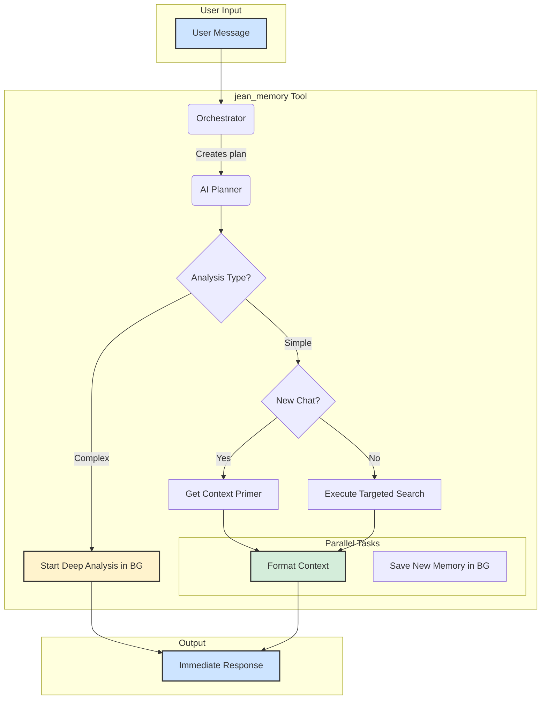

# Smart Context Orchestration: Architecture Guide

This document outlines the architecture and logic of the `jean_memory` tool, the intelligent, all-in-one orchestration layer for Jean Memory.

## 🚀 Core Mission

The `jean_memory` tool is designed to fulfill Jean's core mission: ensuring AI applications understand users consistently by providing persistent, cross-platform memory that surfaces relevant personal context when needed.

It moves beyond simple memory retrieval to true **Context Engineering**. The goal is not to dump a large volume of information into the context window, but to surgically inject the *right* information at the *right* time, making the AI assistant feel truly personal and aware.

## 🏗️ High-Level Architecture: A Tiered, Asynchronous System

The system is built on a tiered-logic model that prioritizes the user's intent. It can handle simple greetings, targeted questions, and complex analytical requests with different strategies, ensuring both speed and power.



### The Three Tiers of Logic

1.  **Tier 1: Deep Analysis (Asynchronous)**: The system *first* checks if the user's query requires a deep, complex analysis (e.g., "summarize my work..."). If so, it immediately responds with an acknowledgement (e.g., "I've started a deep analysis...") and triggers a background task to perform the intensive `deep_memory_query`. The result is saved as a new memory for later retrieval. This prevents timeouts and provides a responsive user experience.

2.  **Tier 2: New Conversation Primer**: If the query is not a deep analysis and it's the first message in a new chat (`is_new_conversation: true`), the system runs a "Context Primer." It performs a few pre-defined searches to fetch the user's core directives, preferences, and current focus, giving the AI a high-level summary to start the conversation intelligently.

3.  **Tier 3: Targeted Contextual Search**: If it's a continuing conversation with a standard query, the system uses the AI Planner to perform a surgical strike. It analyzes the message, generates a precise set of search queries, and retrieves only the most relevant memories for that specific turn.

### Always-On: Memory Saving

Regardless of the tier, every single user message is analyzed by the AI planner to determine if it contains new, memorable information (including "always remember" directives). If it does, a background task saves that information to the user's memory store, ensuring the knowledge base is always growing.

## 🧠 The AI Planner: `_ai_create_context_plan`

This function is the heart of the entire system. It uses a sophisticated prompt to guide a Gemini model to think like a "world-class context engineer" and create a JSON-based action plan.

The prompt forces the model to structure its thinking, deciding on:
-   `user_intent`: What is the user trying to do?
-   `context_needed`: What abstract categories of information are required? Critically, this can now include `deep_analysis`.
-   `search_queries`: How, specifically, should we search for that information?
-   `should_save_memory`: Does this message contain a new, durable fact about the user?
-   `save_with_priority`: Is this an "always remember" directive?
-   `memorable_content`: If so, what is that core fact?

This structured approach is what allows the system to intelligently decide whether to perform a simple search or escalate to a deep analysis without asking the user.

## 📝 The Structured Context Block

For Tiers 2 and 3, the final output of the `jean_memory` tool is not a conversational response, but a clean, structured block of text designed to be easily parsed by the primary AI (e.g., Claude).

**Example Output:**
```
---
[Jean Memory Context]
User's Core Directives: "User prefers to be addressed as Captain."
User's Core Preferences: Loves dogs; enjoys learning French.
User's Current Focus: Planning a trip to Florida.
---
```

This architecture provides a robust, scalable, and intelligent foundation that can handle a wide variety of user requests efficiently and effectively. 