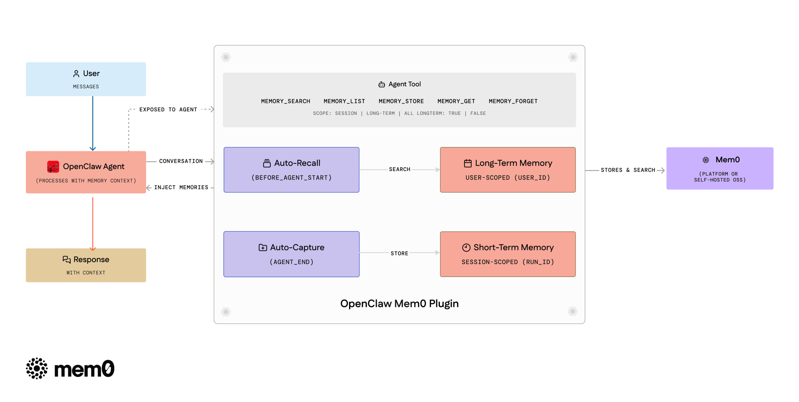

# @mem0/openclaw-mem0

Long-term memory for [OpenClaw](https://github.com/openclaw/openclaw) agents, powered by [Mem0](https://mem0.ai).

Your agent forgets everything between sessions. This plugin fixes that. It watches conversations, extracts what matters, and brings it back when relevant — automatically.

## How it works

<p align="center">
  
</p>

**Auto-Recall** — Before the agent responds, the plugin searches Mem0 for memories that match the current message and injects them into context.

**Auto-Capture** — After the agent responds, the plugin sends the exchange to Mem0. Mem0 decides what's worth keeping — new facts get stored, stale ones updated, duplicates merged.

Both run silently. No prompting, no configuration, no manual calls.

### Short-term vs long-term memory

Memories are organized into two scopes:

- **Session (short-term)** — Auto-capture stores memories scoped to the current session via Mem0's `run_id` / `runId` parameter. These are contextual to the ongoing conversation and automatically recalled alongside long-term memories.

- **User (long-term)** — The agent can explicitly store long-term memories using the `memory_store` tool (with `longTerm: true`, the default). These persist across all sessions for the user.

During **auto-recall**, the plugin searches both scopes and presents them separately — long-term memories first, then session memories — so the agent has full context.

The agent tools (`memory_search`, `memory_list`) accept a `scope` parameter (`"session"`, `"long-term"`, or `"all"`) to control which memories are queried. The `memory_store` tool accepts a `longTerm` boolean (default: `true`) to choose where to store.

All new parameters are optional and backward-compatible — existing configurations work without changes.

## Setup

```bash
openclaw plugins install @mem0/openclaw-mem0
```

### Platform (Mem0 Cloud)

Get an API key from [app.mem0.ai](https://app.mem0.ai), then add to your `openclaw.json`:

```json5
// plugins.entries
"openclaw-mem0": {
  "enabled": true,
  "config": {
    "apiKey": "${MEM0_API_KEY}",
    "userId": "your-user-id"
  }
}
```

### Open-Source (Self-hosted)

No Mem0 key needed. Requires `OPENAI_API_KEY` for default embeddings/LLM.

```json5
"openclaw-mem0": {
  "enabled": true,
  "config": {
    "mode": "open-source",
    "userId": "your-user-id"
  }
}
```

Sensible defaults out of the box. To customize the embedder, vector store, or LLM:

```json5
"config": {
  "mode": "open-source",
  "userId": "your-user-id",
  "oss": {
    "embedder": { "provider": "openai", "config": { "model": "text-embedding-3-small" } },
    "vectorStore": { "provider": "qdrant", "config": { "host": "localhost", "port": 6333 } },
    "llm": { "provider": "openai", "config": { "model": "gpt-4o" } }
  }
}
```

All `oss` fields are optional. See [Mem0 OSS docs](https://docs.mem0.ai/open-source/node-quickstart) for providers.

## Agent tools

The agent gets five tools it can call during conversations:

| Tool | Description |
|------|-------------|
| `memory_search` | Search memories by natural language |
| `memory_list` | List all stored memories for a user |
| `memory_store` | Explicitly save a fact |
| `memory_get` | Retrieve a memory by ID |
| `memory_forget` | Delete by ID or by query |

## CLI

```bash
# Search all memories (long-term + session)
openclaw mem0 search "what languages does the user know"

# Search only long-term memories
openclaw mem0 search "what languages does the user know" --scope long-term

# Search only session/short-term memories
openclaw mem0 search "what languages does the user know" --scope session

# Stats
openclaw mem0 stats
```

## Options

### General

| Key | Type | Default | |
|-----|------|---------|---|
| `mode` | `"platform"` \| `"open-source"` | `"platform"` | Which backend to use |
| `userId` | `string` | `"default"` | Scope memories per user |
| `autoRecall` | `boolean` | `true` | Inject memories before each turn |
| `autoCapture` | `boolean` | `true` | Store facts after each turn |
| `topK` | `number` | `5` | Max memories per recall |
| `searchThreshold` | `number` | `0.3` | Min similarity (0–1) |

### Platform mode

| Key | Type | Default | |
|-----|------|---------|---|
| `apiKey` | `string` | — | **Required.** Mem0 API key (supports `${MEM0_API_KEY}`) |
| `orgId` | `string` | — | Organization ID |
| `projectId` | `string` | — | Project ID |
| `enableGraph` | `boolean` | `false` | Entity graph for relationships |
| `customInstructions` | `string` | *(built-in)* | Extraction rules — what to store, how to format |
| `customCategories` | `object` | *(12 defaults)* | Category name → description map for tagging |

### Open-source mode

Works with zero extra config. The `oss` block lets you swap out any component:

| Key | Type | Default | |
|-----|------|---------|---|
| `customPrompt` | `string` | *(built-in)* | Extraction prompt for memory processing |
| `oss.embedder.provider` | `string` | `"openai"` | Embedding provider (`"openai"`, `"ollama"`, etc.) |
| `oss.embedder.config` | `object` | — | Provider config: `apiKey`, `model`, `baseURL` |
| `oss.vectorStore.provider` | `string` | `"memory"` | Vector store (`"memory"`, `"qdrant"`, `"chroma"`, etc.) |
| `oss.vectorStore.config` | `object` | — | Provider config: `host`, `port`, `collectionName`, `dimension` |
| `oss.llm.provider` | `string` | `"openai"` | LLM provider (`"openai"`, `"anthropic"`, `"ollama"`, etc.) |
| `oss.llm.config` | `object` | — | Provider config: `apiKey`, `model`, `baseURL`, `temperature` |
| `oss.historyDbPath` | `string` | — | SQLite path for memory edit history |

Everything inside `oss` is optional — defaults use OpenAI embeddings (`text-embedding-3-small`), in-memory vector store, and OpenAI LLM. Override only what you need.

## License

Apache 2.0
