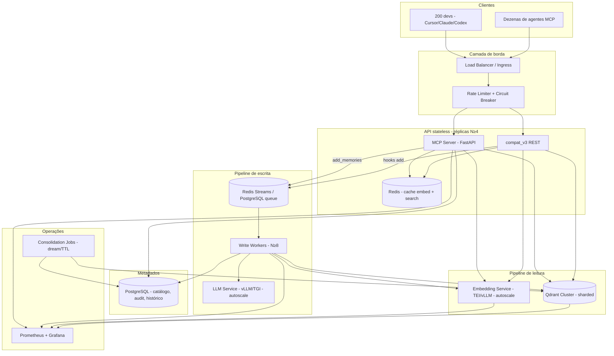

# Arquitetura alvo self-hosted — Mem0/OpenMemory em escala

Proposta para **200 devs**, **dezenas de agentes MCP** e **centenas de milhões de memórias**, endereçando os gargalos do deploy padrão (`docker-compose.yml`: Qdrant single-node, Ollama local, SQLite, write worker embutido).

## Princípios de design

| Princípio | Problema que resolve |
|-----------|----------------------|
| **Separar leitura de escrita** | Embedding + busca não competem com extração LLM |
| **Particionar por tenant** | Uma coleção de 300M → N coleções de ~1–10M |
| **Escalar horizontalmente o stateless** | API/MCP/workers replicáveis; estado nos backends |
| **Embedding como serviço dedicado** | Ollama compartilhado deixa de ser gargalo |
| **Fila durável distribuída** | SQLite + 2 workers → PostgreSQL/Redis + N workers |
| **Cache agressivo na leitura** | Agentes repetem queries similares |
| **Governança de memória** | Volume alto degrada qualidade, não só latência |

---

## Visão geral



---

## 1. Camada MCP / API (stateless)

### O que muda em relação ao compose atual

| Hoje | Alvo |
|------|------|
| 1 container, 4 workers Uvicorn | **4–16 réplicas** atrás de load balancer |
| Embedding inline (Ollama no host) | Chamada HTTP a **Embedding Service** |
| Write worker embutido no mesmo processo | **Workers desacoplados** (Deployment separado) |
| SQLite local | **PostgreSQL** compartilhado |

### Componentes

```
┌─────────────────────────────────────────────────────────┐
│  mem0-mcp-api (Deployment, replicas: 4–16)              │
│  ├── FastAPI (MCP SSE + Streamable HTTP)                │
│  ├── compat_v3 (/v3/memories/*)                         │
│  ├── discovery, provision, stats                        │
│  └── SEM write_worker embutido                          │
└─────────────────────────────────────────────────────────┘
```

### Rate limiting e circuit breaker (borda)

Protege o cluster quando 200 devs disparam buscas em rajada (context-loader = 2–4 queries/sessão):

| Limite | Valor sugerido | Escopo |
|--------|----------------|--------|
| Busca | 30 req/min | por `project` + `hostname` |
| Escrita (enqueue) | 60 req/min | por `project` |
| Burst | 10 req/10s | por IP/cliente MCP |
| Circuit breaker | abrir após 50% erro em 30s | Embedding / Qdrant |

Implementação: **Envoy/Istio**, **Kong**, ou middleware FastAPI + Redis sliding window.

### Redução de chamadas MCP (complementar à infra)

- **Cache de sessão no plugin**: 1 busca consolidada no início da sessão, não a cada mensagem
- **Debounce de context-loader**: TTL de 5–15 min por `(project, topic_hash)`
- **Batch embedding**: agrupar queries similares no Embedding Service (`search_batch` já existe no Qdrant client)

---

## 2. Serviço de embedding dedicado

**Gargalo #1**: Ollama único, embed síncrono antes de cada busca.

### Arquitetura

```
┌──────────────────────────────────────────┐
│  embedding-service (Deployment)          │
│  Backend: TEI / vLLM / Infinity          │
│  Modelo: nomic-embed-text / bge-m3       │
│  GPU: 1–4× A10/L4 (ou CPU cluster)       │
│  HPA: scale on GPU util / queue depth    │
└──────────────────────────────────────────┘
         ↑ HTTP/gRPC batch
    mem0-mcp-api + write-workers
```

### Sizing (ordem de grandeza)

| Carga alvo | Throughput embed | Hardware |
|------------|------------------|----------|
| 20 QPS sustentado | ~20 embed/s | 1× GPU L4 |
| 50 QPS pico | ~50 embed/s | 2× GPU ou batching agressivo |
| 100+ QPS | batch + cache | 4× GPU + Redis cache |

### Cache de embedding (Redis)

```
chave:  embed:v1:{model}:{sha256(normalized_query)}
TTL:    1–24h (queries de agentes repetem muito)
hit rate esperado: 40–70% em uso real de IDE
```

Fluxo de `search_memory`:

1. Normalizar query (trim, lowercase, collapse whitespace)
2. **Cache hit** → pular embed (~0,5 ms)
3. **Cache miss** → Embedding Service → gravar cache
4. Qdrant search com vetor

---

## 3. Qdrant cluster — particionamento e índices

**Gargalo #3**: coleção única de 300M, filtro `project` sem índice payload.

### Estratégia de particionamento (recomendada)

**Uma coleção Qdrant por `project`** (ou por grupo de projetos pequenos):

```
project "mem0-shared"     → collection: mem0__mem0_shared      (~5M vetores)
project "team-platform"   → collection: mem0__team_platform    (~2M vetores)
project "legacy-monolith" → collection: mem0__legacy_monolith  (~80M vetores) ← shard interno
```

| Regra | Limite |
|-------|--------|
| Vetores por coleção (ideal) | **≤ 10–20M** |
| Acima disso | Sharding Qdrant (2–4 shards) ou subdividir projeto |
| Coleção única global | **Evitar** — reservar só para buscas cross-project raras |

Resolução em runtime (novo componente lógico no API):

```python
# Pseudocódigo — router de coleção
def collection_for(project: str) -> str:
    return f"mem0__{sanitize(project)}"
```

Compatível com ADR-003 (escopo por `project`), mas **inverte** a coleção única atual.

### Cluster Qdrant

```
┌─────────────────────────────────────────────────┐
│  Qdrant Cluster (3+ nodes)                        │
│  ├── Node 1: replicas + shards A,B              │
│  ├── Node 2: replicas + shards C,D              │
│  └── Node 3: replicas (quorum)                  │
│  Storage: NVMe local ou object storage (Qdrant)   │
└─────────────────────────────────────────────────┘
```

### Índices payload (obrigatório em cada coleção)

Além dos atuais (`user_id`, `agent_id`, `run_id`), criar:

| Campo | Tipo | Uso |
|-------|------|-----|
| `project` | keyword | fallback / migração |
| `type` | keyword | filtros do plugin (`decision`, `convention`) |
| `created_at` | datetime | TTL, pruning |
| `hash` | keyword | dedup |

### Sizing storage (300M vetores, 768 dims)

| Item | Estimativa |
|------|------------|
| Vetores densos | ~900 GB |
| Índice HNSW (+30–50%) | ~300–450 GB |
| Payload + BM25 sparse | ~200–400 GB |
| **Total** | **~1,5–2 TB** (com réplicas ×2–3) |

**RAM**: manter **30–50%** do índice quente em memória por node → cluster com **256–512 GB RAM** distribuídos.

### Busca híbrida (opcional, fase 2)

O MCP local hoje faz só busca vetorial. Para qualidade em escala:

- Habilitar slot BM25 no Qdrant (já suportado em `mem0/vector_stores/qdrant.py`)
- Pipeline completo v3 (semântica + keyword + entity) **só na API**, não no path crítico do MCP se latência for prioridade
- Ou: híbrido com `top_k` interno 60, retorno 20 (como o SDK Python)

---

## 4. Pipeline de escrita desacoplado

**Gargalo #2**: `max_concurrency=2`, LLM local, fila SQLite.

### Nova topologia

```
MCP add_memories ──► Redis Stream / PG queue ──► Write Worker Pool (8–32 pods)
                                                      │
                                                      ├── LLM Service (vLLM, autoscale)
                                                      ├── Embedding Service
                                                      └── Qdrant (upsert na coleção do project)
```

### Fila durável

| Opção | Prós | Contras |
|-------|------|---------|
| **Redis Streams** | Baixa latência, consumer groups | Volatilidade se mal configurado |
| **PostgreSQL + SKIP LOCKED** | Já no stack, ACID, audit natural | Throughput menor que Redis |
| **Híbrido** | PG como source of truth, Redis como buffer | Mais complexo |

Recomendação: **PostgreSQL como fila** (evoluir `WriteQueueJob` existente) + **Redis** opcional como buffer de pico.

### Write workers

```
┌────────────────────────────────────────────┐
│  mem0-write-worker (Deployment)            │
│  replicas: 8–32                            │
│  max_concurrency por pod: 4–8              │
│  HPA: scale on queue depth                 │
│  Dead letter: jobs failed após N tentativas│
└────────────────────────────────────────────┘
```

| Parâmetro | Valor alvo |
|-----------|------------|
| `max_concurrency` / pod | 4–8 |
| `max_attempts` | 5 (com backoff exponencial) |
| Throughput | 20–100 writes/s processados |
| Ack ao MCP | imediato (`queued` + `job_id`) — mantém ADR-004 |

### LLM Service separado

- **vLLM** ou **TGI** com modelo adequado à extração (ex.: Llama 3.1 8B, Qwen2.5)
- Autoscaling por fila ou GPU utilization
- **Nunca** compartilhar GPU com embedding no mesmo node (contention)

---

## 5. PostgreSQL no lugar de SQLite

**Gargalo #4**: SQLite com centenas de conexões MCP.

### Schemas (evolução dos modelos existentes)

| Tabela | Função |
|--------|--------|
| `projects` | Catálogo (já existe via migrations) |
| `write_queue_jobs` | Fila durável (já existe) |
| `write_audit_logs` | Auditoria (já existe) |
| `memories` | Metadados espelhados do Qdrant (UI, histórico) |
| `memory_access_logs` | Analytics, billing interno |
| `collection_registry` | Mapeamento `project → qdrant_collection` |

### Connection pooling

```
PgBouncer (transaction mode)
  pool_size: 100–200
  max_client_conn: 1000
```

API e workers conectam via PgBouncer, não direto no PostgreSQL.

---

## 6. Redis — cache e coordenação

```
┌─────────────────────────────────────┐
│  Redis Cluster (3 primaries)        │
│  ├── embed cache (TTL 1–24h)        │
│  ├── search result cache (TTL 5m)   │
│  ├── rate limit counters            │
│  └── optional: write buffer stream  │
└─────────────────────────────────────┘
```

**Search result cache** (opcional, fase 2):

```
chave: search:v1:{project}:{sha256(query)}:{top_k}:{filter_hash}
TTL:   5 min
invalidar: on write ao mesmo project
```

---

## 7. Governança de memória (300M+)

Performance e **qualidade** degradam juntas sem lifecycle management.

### Jobs batch (CronJobs / workers dedicados)

| Job | Frequência | Ação |
|-----|------------|------|
| **Consolidation (dream)** | semanal / por project | merge duplicatas, resolve contradições |
| **TTL prune** | diário | remove memórias > N meses sem acesso |
| **Dedup por hash** | contínuo | MD5 já existe no SDK; reforçar no write path |
| **Cold tier** | mensal | projetos inativos → snapshot S3 + drop coleção |

### Políticas por project

```yaml
project: mem0-shared
  max_memories: 10_000_000
  ttl_days: 365
  consolidation: weekly
  pinned_categories: [decision, security]
```

---

## 8. Observabilidade

Métricas essenciais (Prometheus + Grafana):

| Métrica | Alerta |
|---------|--------|
| `mcp_search_latency_p99` | > 500 ms |
| `embed_cache_hit_rate` | < 30% |
| `embed_queue_depth` | > 100 |
| `write_queue_lag_seconds` | > 300 s |
| `qdrant_search_latency_p99` | > 200 ms |
| `qdrant_collection_size` | > 20M vetores/coleção |
| `llm_worker_error_rate` | > 5% |

Tracing: **OpenTelemetry** do MCP → embed → Qdrant (correlação por `job_id` / `request_id`).

---

## 9. Segurança e rede

| Camada | Medida |
|--------|--------|
| MCP | mTLS ou API key por equipe; substituir "trust-on-LAN" |
| Rede | VPC privada; Qdrant/PostgreSQL/Redis sem exposição pública |
| Secrets | Vault / K8s Secrets; rotação de `API_KEY` |
| Audit | `write_audit_logs` + log de buscas (sem conteúdo sensível) |

---

## 10. Topologia de deploy (Kubernetes)

```
namespace: mem0-prod
├── Deployment  mem0-mcp-api          (4–16 replicas, CPU-bound)
├── Deployment  mem0-write-worker   (8–32 replicas)
├── Deployment  embedding-service   (1–4 replicas, GPU)
├── Deployment  llm-service         (2–8 replicas, GPU)
├── StatefulSet qdrant              (3+ nodes, NVMe PVC)
├── StatefulSet postgresql          (primary + replica)
├── StatefulSet redis               (cluster mode)
├── Ingress       mcp.internal.company.com
├── CronJob       memory-consolidation
├── CronJob       memory-ttl-prune
└── HPA           api, workers, embedding (por métricas custom)
```

Alternativa on-prem sem K8s: **Docker Swarm** ou **Nomad** com os mesmos serviços; Qdrant e PostgreSQL em VMs dedicadas.

---

## 11. Fluxos detalhados

### Leitura (`search_memory`)

```
1. MCP recebe (query, project)
2. Rate limit check (Redis)
3. Resolve collection = collection_for(project)
4. Cache embed lookup
   └─ miss → Embedding Service (batch se possível)
5. Qdrant query_points(collection, vector, filter, limit=20)
6. [opcional] Cache search result
7. JSON response (~50–200 ms com cache quente)
```

### Escrita (`add_memories`)

```
1. MCP valida (text, project)
2. Enqueue PostgreSQL/Redis → job_id
3. Audit log (PostgreSQL, async)
4. Return {"status": "queued", "job_id"}  (< 20 ms)
5. Worker dequeues
6. LLM extraction (LLM Service)
7. Embed facts (Embedding Service, batch)
8. Qdrant upsert (coleção do project)
9. Invalidate search cache do project
10. Mark job done / retry com backoff
```

---

## 12. Sizing consolidado (300M memórias, 200 devs)

| Componente | Spec mínima produção | Spec confortável |
|------------|---------------------|------------------|
| **Qdrant** | 3 nodes, 64 GB RAM, 1 TB NVMe cada | 5 nodes, 128 GB, 2 TB |
| **Embedding** | 2× GPU L4 | 4× GPU A10 |
| **LLM** | 2× GPU A10 (8B) | 4× GPU A100 (70B se qualidade crítica) |
| **API MCP** | 4 pods × 2 CPU / 4 GB | 12 pods × 4 CPU / 8 GB |
| **Write workers** | 8 pods × 2 CPU | 24 pods × 4 CPU |
| **PostgreSQL** | 16 CPU, 64 GB, 500 GB SSD | 32 CPU, 128 GB, 1 TB + replica |
| **Redis** | 3 nodes, 16 GB cada | 3 nodes, 32 GB |
| **Rede** | 10 Gbps interno | 25 Gbps |

**Latência alvo (p99)**:

| Operação | Alvo |
|----------|------|
| `search_memory` (cache quente) | < 100 ms |
| `search_memory` (cache frio) | < 300 ms |
| `add_memories` (ack) | < 50 ms |
| Write processado (p95 fila) | < 60 s |

---

## 13. Plano de migração (4 fases)

### Fase 0 — Fundação (2–4 semanas)

- PostgreSQL + migrar Alembic existente
- PgBouncer
- Extrair write workers para Deployment separado
- Métricas básicas

### Fase 1 — Desacoplamento (4–6 semanas)

- Embedding Service + cache Redis
- Rate limiting na borda
- API replicas atrás de LB
- Remover Ollama do path de leitura

### Fase 2 — Particionamento Qdrant (6–12 semanas)

- `collection_registry` + router por project
- Migrar projetos grandes primeiro (background job)
- Payload indexes em todas as coleções
- Qdrant cluster (3 nodes)

### Fase 3 — Escala e governança (contínuo)

- HPA em API/workers/embedding
- Jobs dream/TTL
- Search híbrida opcional
- Cold tier para projetos inativos

---

## 14. O que reutilizar deste repo

| Componente existente | Reuso |
|---------------------|-------|
| `openmemory/api/app/mcp_server.py` | Manter contrato MCP; trocar backends |
| `write_queue.py` + models | Evoluir para PostgreSQL (já desenhado) |
| `compat_v3.py` | Manter para plugin hooks locais |
| `mem0/vector_stores/qdrant.py` | Estender com `collection_for(project)` |
| `mem0/memory/main.py` pipeline híbrido | Ativar no path REST; opcional no MCP |
| Alembic migrations | Base para PostgreSQL |

---

## 15. Estado de implementação (auditoria 2026-06-18)

Esta seção registra o **alinhamento entre este documento (alvo) e o código real**. As fases foram decompostas em `.docs/tasks/` e implementadas sobre **Docker Compose/Swarm single-host** (ADR-006), não sobre o Kubernetes/cluster/GPU descrito como alvo nas seções 10 e 12. As divergências abaixo são, em sua maioria, **decisões de escopo** do deploy self-hosted — não pendências de qualidade.

### Resumo por fase

| Fase | Grupo em `.docs` | Estado do código |
|------|------------------|------------------|
| 0/1 — Fundação + desacoplamento | `self-hosted-scale-architecture` (8 tasks) | ✅ Fiel ao desenho |
| 2 — Particionamento Qdrant | `particionamento-qdrant-fase2` (9 tasks) | ✅ Mecânica completa; ⚠️ modelo de coleção divergente |
| 3 — Governança | `escala-governanca-fase3` (13 tasks) | ✅ ~95%; faltam cold tier e `max_memories` |

### Implementado e fiel à arquitetura

- **PostgreSQL com dialeto condicional** (SQLite dev / PG prod) — `api/app/database.py:14-35`
- **PgBouncer** transaction-mode — `compose/postgres.yml:19-37`
- **Dequeue `FOR UPDATE SKIP LOCKED`** + concorrência por env — `api/app/utils/write_queue.py:82-110`
- **Write worker desacoplado** via flag `RUN_EMBEDDED_WORKER` — `api/app/workers/__main__.py`, `api/main.py:129-138`
- **Ollama embed/LLM separados** (sem contention) — `compose/inference.yml`
- **Cache Redis** embed + search com **invalidação por escrita** — `api/app/utils/read_cache.py`, `write_worker.py:152`
- **Traefik** reverse proxy + rate limit + circuit breaker + sticky SSE — `compose/proxy.yml`, `docker-compose.scale.yml:69-78`
- **Observabilidade** `/health` + `/metrics` Prometheus + Grafana — `api/app/routers/health.py`, `ops_metrics.py`, `utils/metrics.py`
- **Fase 2**: `PartitionResolver`, dual-write condicional, migration worker com checkpoint, flip/rollback atômico, promoção a shard_key, `/admin/projects/sizes` — `utils/partitioning.py`, `workers/migration_worker.py`, `utils/migration_control.py`, `utils/promotion.py`, `routers/admin.py`
- **Fase 3**: policy resolver (global+override), índice payload `state` + filtro `state=active`, `QuarantineEngine`, fila + governance-worker + scheduler interno, jobs dedup/ttl_prune/consolidate(dream)/purge, `/admin/governance/*`, medição de qualidade — `utils/governance_policy.py`, `utils/quarantine.py`, `workers/governance_worker.py`, `governance/*.py`, `routers/governance.py`

### Divergências e pendências

| # | Item da arquitetura | Estado real | Natureza |
|---|---------------------|-------------|----------|
| D1 | **Uma coleção Qdrant por project** (§3) | Coleção única global + isolamento por **tenant index / custom shard_key**; sem `collection_registry` (`project → collection_name`) | Divergência de modelo. Custom sharding escala até ~100M/coleção; revisitar se o crescimento exigir multi-coleção |
| D2 | **Cold tier** — projetos inativos → snapshot S3 + drop coleção (§7) | ❌ Não implementado | Pendência |
| D3 | **`max_memories` por project** (§7) | ❌ Campo ausente na policy (há `ttl_*`, `quarantine_window`, `protected_categories`) | Pendência |
| D4 | **Topologia Kubernetes** (HPA, StatefulSet, CronJob) (§10) | Docker Compose + Swarm; réplicas **estáticas**, sem autoscaling | Decisão de escopo (self-hosted) |
| D5 | **Embedding/LLM em vLLM/TGI com GPU autoscale** (§2) | Ollama, escala manual | Decisão de escopo |
| D6 | **Qdrant/PostgreSQL/Redis em cluster** (§3, §5, §6) | Todos **single-node** | Decisão de escopo |
| D7 | **mTLS / API key por equipe; secrets em Vault** (§9) | `trust-on-LAN` (`routers/compat_v3.py:20-21`), `API_KEY` único, `.env` plaintext | Pendência de segurança se exposto fora da LAN |
| D8 | **Rate limit 30/60 req/min por project+hostname** (§1) | Traefik global (100 avg / 50 burst) | Granularidade divergente |
| D9 | **OpenTelemetry tracing** (§8) | Apenas Prometheus/Grafana | Pendência de observabilidade |
| D10 | **CronJobs K8s** para governança (§10) | Scheduler interno asyncio (DB-backed) | Equivalente funcional |

---

## Referências no repositório

- Deploy atual: `openmemory/docker-compose.yml`
- MCP server: `openmemory/api/app/mcp_server.py`
- Write worker: `openmemory/api/app/workers/write_worker.py`
- Fila de escrita: `openmemory/api/app/utils/write_queue.py`
- Compat v3 (plugin hooks): `openmemory/api/app/routers/compat_v3.py`
- Qdrant provider: `mem0/vector_stores/qdrant.py`

---

## Resumo

A arquitetura alvo **não escala o compose atual** — **decompõe** os gargalos em serviços especializados:

1. **Embedding** → serviço GPU + cache Redis
2. **300M vetores** → **coleções por project** + cluster Qdrant
3. **Escritas** → fila PostgreSQL + pool de workers + LLM dedicado
4. **Metadados** → PostgreSQL + PgBouncer
5. **MCP** → API stateless com rate limit e menos buscas por sessão
6. **Qualidade** → consolidação e TTL batch

Com isso, o cenário de 200 devs passa de **segundos/minutos de latência** para **sub-segundo na leitura** e **filas de escrita controladas**, mantendo privacidade self-hosted.
