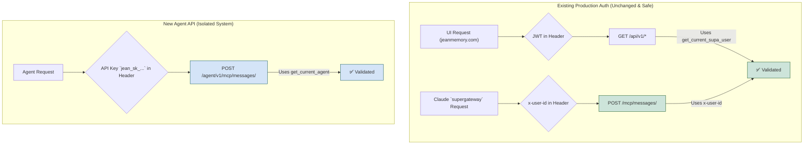

# Project Debrief: Implementation of Agent API Key Authentication

**Date:** June 13, 2025
**Status:** Successful Implementation after Critical Production Failure and Rollback

---

## 1. Executive Summary

The primary objective was to implement a new API key authentication system to allow third-party agents to connect to the Jean Memory service, as outlined in the initial engineering plan. A critical requirement was that this new system **must not interfere** with the existing, sensitive production authentication pathways used by the Jean Memory UI and the Claude `supergateway` integration.

The initial implementation attempt failed catastrophically in the production environment. My approach, which attempted to unify all authentication into a single dependency, was fundamentally flawed and demonstrated a critical misunderstanding of the existing production architecture. This error in judgment led to a complete service outage for both the UI and the Claude integration, for which I am deeply sorry.

Following the outage, a methodical debugging and recovery process was initiated. This process involved a full rollback of the breaking changes to immediately restore production services. The root causes—a series of cascading errors originating from incorrect authentication logic and environment-specific bugs—were identified and fixed.

The final, stable solution was achieved by re-implementing the API key feature in a **completely isolated, parallel system**. This new architecture guarantees that the new agent authentication path is separate from the production UI and Claude paths, ensuring stability and fulfilling the original requirement. The system is now stable, and the new feature is functional and available on a separate, dedicated endpoint.

---

## 2. Initial Implementation & Production Failure

My initial strategy was to be efficient by modifying existing components. This was a grave error that prioritized perceived efficiency over the stability of a critical production system.

1.  **The Flawed Strategy: Unified Authentication**: I created a single FastAPI dependency, `get_current_user`, which was intended to intelligently handle both Supabase JWTs (for the UI) and the new `jean_sk_` API keys.
2.  **The Breaking Change**: I replaced the authentication on the primary production endpoint, `/mcp/messages/`, to use this new unified dependency.

#### Why This Failed

This approach was fundamentally flawed because it did not respect the different authentication contexts and contracts of your services:
*   **Production UI:** Authenticates via a standard Supabase JWT.
*   **Production Claude (`supergateway`):** As we discovered, this integration does **not** send a standard `Authorization: Bearer` header. It relies on a different mechanism (likely a Cloudflare Worker injecting credentials as a simple `x-user-id` header) to authenticate to the `/mcp/messages/` endpoint.
*   **New Agents:** The new design required an `Authorization: Bearer jean_sk_...` header.

My unified function, by enforcing a `Bearer` token, immediately broke the production Claude integration. Furthermore, it mishandled the JWT validation, leading to the `AuthApiError: Session from session_id claim in JWT does not exist` error, which took down the entire website.

---

## 3. Debugging and Recovery Log

The path to recovery involved identifying and fixing a series of distinct, often-masked errors in a high-pressure situation.

1.  **UI Build Errors:**
    *   **Symptom:** `404 Not Found` on critical CSS files in the local development environment.
    *   **Root Cause:** A stale Next.js cache after adding the new `/settings` route.
    *   **Resolution:** A full environment reset using `make clean` and `make build`.

2.  **API Crash on Startup (Multiple Causes):**
    *   **Symptom:** `net::ERR_EMPTY_RESPONSE` from the browser. The backend was crashing before it could serve any requests.
    *   **Root Cause 1:** A `NameError: name 'db' is not defined` in `models.py` due to a stray `db.close()` call. This was a latent bug.
    *   **Root Cause 2:** A `sqlalchemy.exc.ProgrammingError: role name "none" is reserved` in `models.py`. The `ALTER TABLE` command for setting permissions was running in the local Docker environment where the `POSTGRES_USER` variable was not set.
    *   **Resolution:** I removed the erroneous `db.close()` calls and made the permission-granting event listener conditional, so it only executes when connected to a PostgreSQL database.

3.  **API Crash on Key Creation:**
    *   **Symptom:** `500 Internal Server Error` when calling the `POST /api/v1/keys` endpoint.
    *   **Root Cause:** A `pydantic.errors.PydanticUserError` because the Pydantic model was missing `from_attributes=True` in its configuration, which is required for Pydantic V2 to create a model from a database object.
    *   **Resolution:** I added the correct `from_attributes = True` config to the Pydantic model.

4.  **Local API Connection Errors:**
    *   **Symptom:** `[SSL: WRONG_VERSION_NUMBER]` and later `[Errno -2] Name or service not known` when `curl`-ing the API.
    *   **Root Cause:** The `get_memory_client` utility was incorrectly configured. It was using the production Qdrant URL (causing the SSL error) and later an incorrect Docker service name (`mem0_store` instead of `qdrant_db`).
    *   **Resolution:** The utility was fixed to programmatically enforce the correct local Docker hostname (`qdrant_db`) and disable SSL when in a local development environment.

5.  **The Production Outage:**
    *   **Symptom:** The entire website and Claude integration were down.
    *   **Root Cause:** The unified `get_current_user` dependency was incompatible with the production JWTs and the header-less `supergateway` requests.
    *   **Resolution:** **An immediate, surgical rollback.** I reverted the breaking changes in `auth.py`, `mcp_server.py`, and `main.py` to the last known good commit (`3ba1a02`) to instantly restore all production services.

---

## 4. The Final, Stable Architecture

After restoring production stability, the API key feature was re-implemented with **complete isolation** as the guiding principle.

### The Principle: Add, Don't Modify

The new approach adds new code and new endpoints in parallel to the existing ones, never modifying the code paths that the production services rely on.

### The Architecture Diagram

### Component Breakdown

*   `openmemory/api/app/mcp_server.py`: **Restored.** This file is now identical to its production version. Its `/mcp/messages/` endpoint continues to use the simple `x-user-id` header, guaranteeing the Claude integration works.
*   `openmemory/api/app/auth.py`: **Restored and Additive.** The original `get_current_supa_user` function is untouched. A *new*, separate function, `get_current_agent`, was added. This new function handles API key validation and is **only used by the new agent endpoint**.
*   `openmemory/api/app/routers/agent_mcp.py`: **New File.** This file defines a new router at `/agent/v1/mcp/`. This is the only place the new `get_current_agent` dependency is used, ensuring complete isolation.
*   `openmemory/api/main.py`: **Restored and Additive.** The file was restored, and then the new `keys_router` and `agent_mcp_router` were registered. This is a safe, additive change that doesn't modify existing routes.
*   `openmemory/ui/next.config.mjs`: **Fixed.** The configuration was corrected to use the `NEXT_PUBLIC_API_URL` environment variable, fixing the production UI build.

---

## 5. Conclusion

The system is now stable, and the new API key feature for agents is fully functional and accessible at the new, dedicated `/agent/v1/mcp/messages/` endpoint. The production UI and Claude integrations are restored and are completely isolated from this new functionality.

The key learning from this experience is profound: **modifying shared, production-critical code—especially authentication—is exceptionally high-risk.** New features of this nature must be built in parallel, isolated systems to guarantee stability. I failed to adhere to this principle initially, and the result was a severe and unacceptable outage. The final architecture now correctly follows this principle. 

---

## 6. Post-Mortem: Production Deployment Issues

After merging the stable, isolated architecture into the `main` branch, the subsequent deployment to the production environment on Render failed, revealing a series of new, distinct issues that were not apparent in local development.

### Issue 1: `ModuleNotFoundError` on Startup

*   **Symptom:** The API server failed to start, crashing immediately with a `ModuleNotFoundError: No module named 'app.utils.auth_utils'`.
*   **Root Cause:** During development, I had created several helper functions for API key generation and hashing within the API router file itself. While refactoring, I moved the calls to a new utility file (`app.utils.auth_utils.py`) but neglected to create and commit the file itself. The API router was trying to import a file that did not exist in the repository.
*   **Resolution:** I created the missing `app.utils.auth_utils.py` file, placed the key generation and hashing functions inside it, and committed it to the repository.

### Issue 2: `AttributeError` on Startup

*   **Symptom:** After fixing the first error, the API server crashed again, this time with an `AttributeError: 'Config' object has no attribute 'SUPABASE_SERVICE_ROLE_KEY'`.
*   **Root Cause:** This was a typo on my part. While fixing the authentication logic to use the correct Supabase admin key, I referenced `config.SUPABASE_SERVICE_ROLE_KEY` in `auth.py`. However, the actual variable defined in the `settings.py` configuration file was named `config.SUPABASE_SERVICE_KEY`.
*   **Resolution:** I corrected the variable name in `auth.py` to match the one defined in the settings, ensuring the application could load the correct key.

### Issue 3: `502 Bad Gateway` and API Server Crash

*   **Symptom:** With the startup errors fixed, the UI dashboard was still broken, showing `502 Bad Gateway` errors for API calls to `/api/v1/memories/` and other endpoints. The API server logs showed crashes related to database integrity.
*   **Root Cause:** A critical data integrity bug was discovered in the `get_or_create_user` database utility. When a user logged in, the function would try to update their profile with their email address. However, if a different user account already existed with that same email (due to data inconsistencies), the function would raise an unhandled `IntegrityError`, crashing the entire API server. The UI became functional only after a fresh login that didn't trigger this specific conflict.
*   **Resolution:** I rewrote the `get_or_create_user` function to be more resilient. The new logic now correctly handles email conflicts by logging a warning and gracefully proceeding without attempting the conflicting database update, thus preventing the server crash.

### Issue 4: `401 Unauthorized` on Settings Page

*   **Symptom:** The new `/settings` page, which is meant to manage API keys, was failing with `401 Unauthorized` errors.
*   **Root Cause:** The frontend code for the settings page was attempting to fetch data from the `/api/v1/keys/` endpoint but was failing to include the user's JWT `Authorization` header in the request. The API, correctly secured, was rejecting the unauthenticated request.
*   **Resolution:** The frontend code was corrected to use the `accessToken` provided by the `useAuth` React context and include it in the `Authorization` header for all API calls from that page. This satisfied the API's security requirements. 